<div align="center">
  
  
  # 心迹 (ThoughtEcho)
  
  <p>
    <a href="https://github.com/Shangjin-Xiao/ThoughtEcho/blob/main/LICENSE">
      
    </a>
    <a href="https://github.com/Shangjin-Xiao/ThoughtEcho/releases/latest">
  
    </a>
    <!-- TODO: If CI is set up later, uncomment and potentially update the workflow filename -->
    <!--  -->
    <a href="https://github.com/Shangjin-Xiao/ThoughtEcho/stargazers">
      
    </a>
    <a href="https://github.com/Shangjin-Xiao/ThoughtEcho/network/members">
      
    </a>
  </p>

  <h3>🌍 English localization in progress — contributions welcome!</h3>

  <p>
    <b>📝 你的专属灵感摘录本<br>
    让我们一起随心记录，释放 AI 洞察的力量 ✨</b>
  </p>

  <p>
    <b>⚠️ 友情提示：</b>这是一个与 AI 协作完成的项目，我会持续打磨体验，如遇潜在的小 bug 敬请包涵，也欢迎随时反馈。
  </p>
  
  <p>
    <a href="#-english-version"><b>English</b></a> • 
    <a href="#-中文版本"><b>中文</b></a>
  </p>
  
</div>

---

<div id="-中文版本">

## ✨ 当前功能

<div align="center">
  <table>
    <tr>
      <td align="center" width="33%"><b>✍️ 富文本笔记</b><br>支持富文本、多媒体附件与双格式存储</td>
      <td align="center" width="33%"><b>🤖 AI助手</b><br>笔记上下文问答、润色与每日灵感提示</td>
      <td align="center" width="33%"><b>📊 洞察与报告</b><br>AI 周期洞察、年度报告与写作趋势分析</td>
    </tr>
    <tr>
      <td align="center"><b>🏷️ 标签与搜索</b><br>多标签筛选、智能过滤与全文搜索</td>
      <td align="center"><b>🎯 AI卡片生成</b><br>将笔记转换为精美分享卡片</td>
      <td align="center"><b>📦 媒体与备份中心</b><br>流式处理大文件，备份/恢复更安心</td>
    </tr>
    <tr>
      <td align="center"><b>🌍 情境记录</b><br>自动保存位置、天气与时间段信息</td>
      <td align="center"><b>🧠 智能内存管理</b><br>动态调节批量处理，避免内存溢出</td>
      <td align="center"><b>⚡ 快速捕获</b><br>剪贴板检测、一言与每日灵感随手收集</td>
    </tr>
  </table>
</div>

## 📸 应用截图

### 核心功能
| 主页 | 笔记列表 | 添加笔记 |
|:---:|:---:|:---:|
|  | 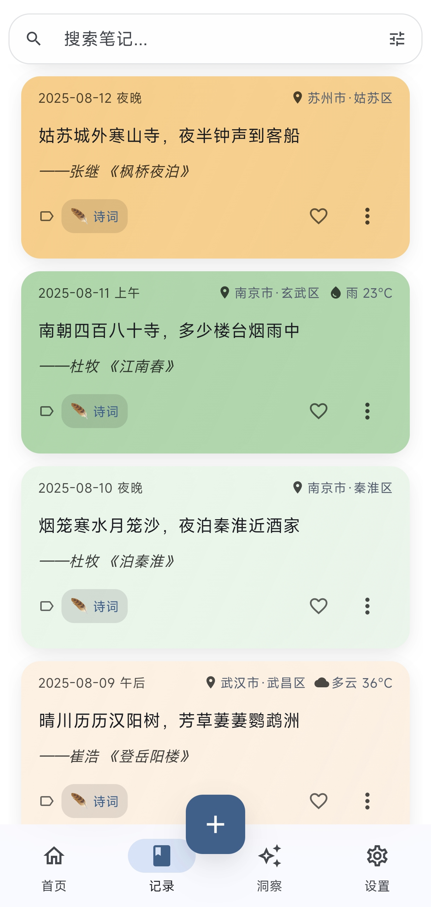 | 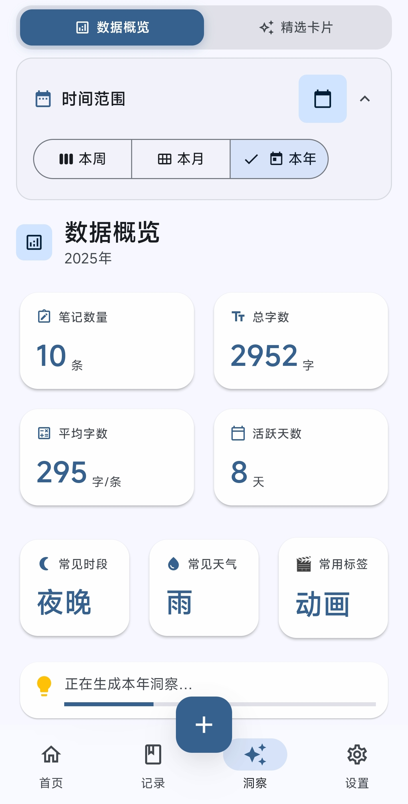 |

### 编辑与AI功能
| 富文本编辑器 | AI问答对话 | 筛选与排序 |
|:---:|:---:|:---:|
|  | 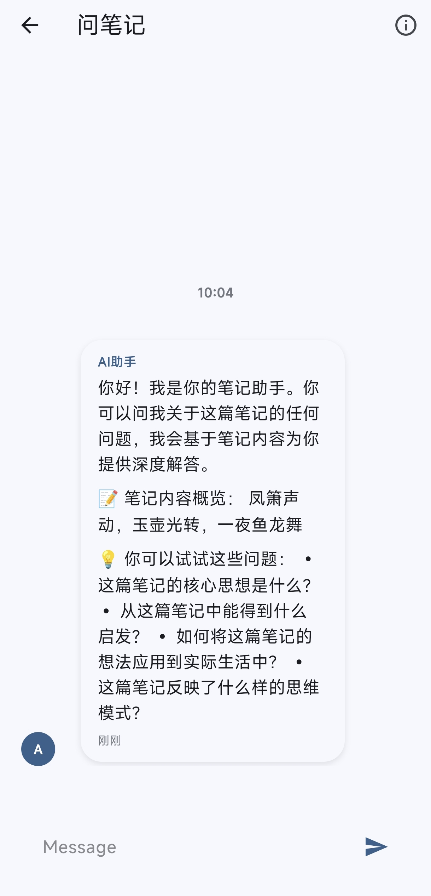 | 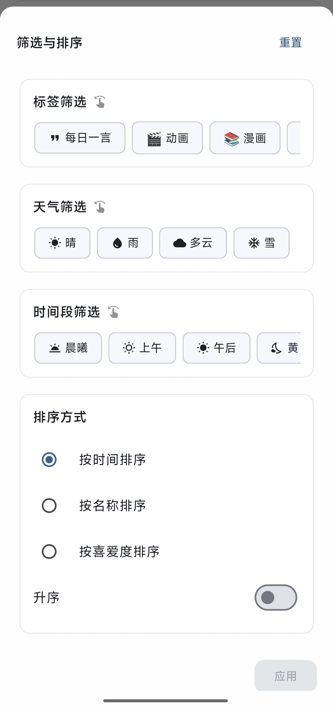 |

### 洞察与报告
| 洞察分析 | 周期报告 | 笔记同步 |
|:---:|:---:|:---:|
| 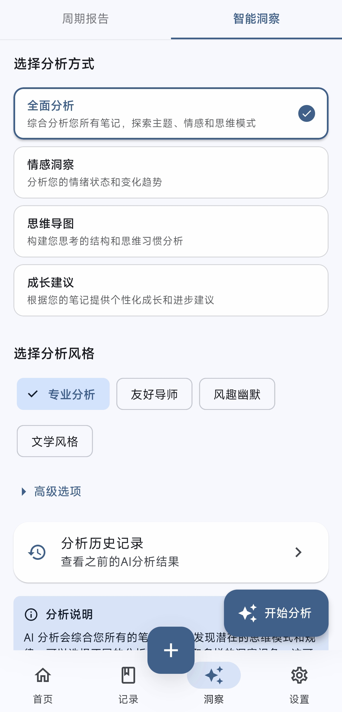 |  | 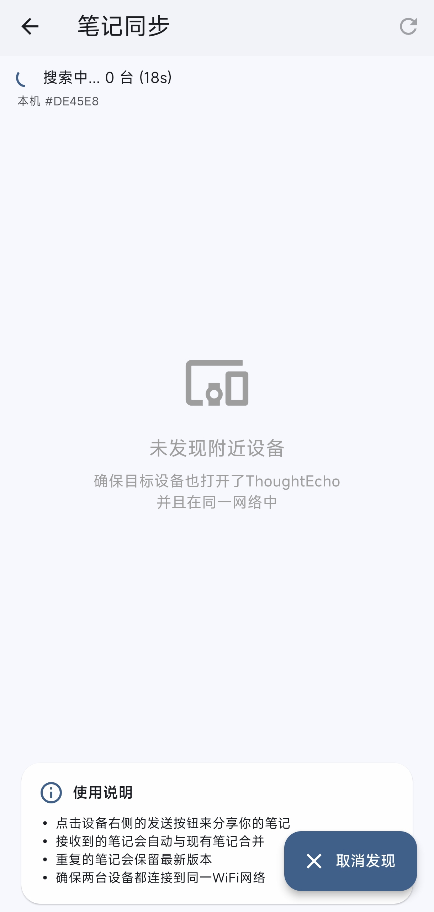 |

### 设置与管理
| 主题设置 | 一言设置 | 偏好设置 |
|:---:|:---:|:---:|
| 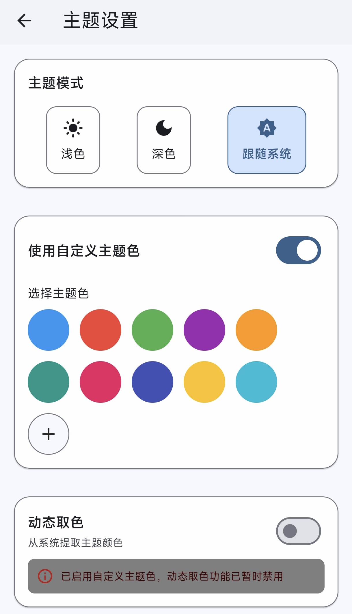 | 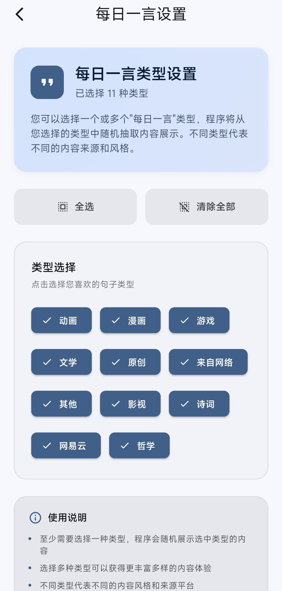 | 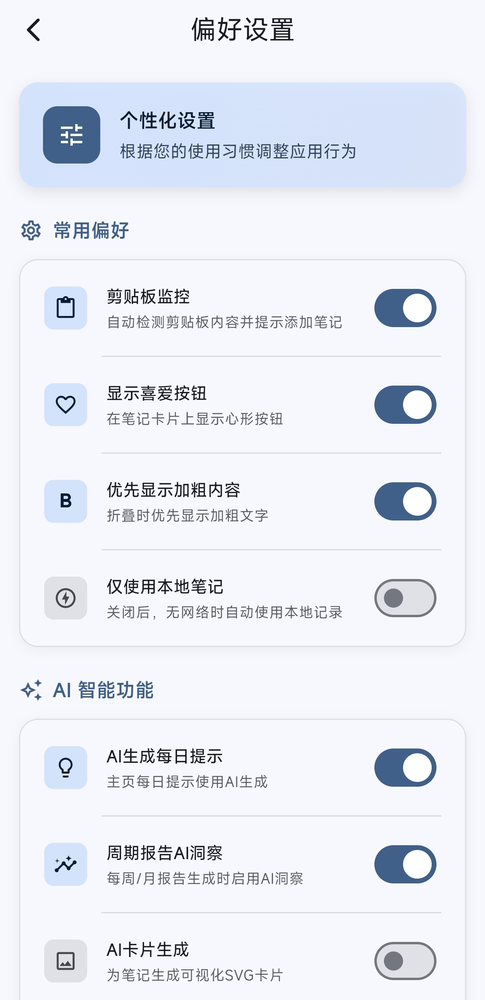 |

### 存储与备份
| 备份恢复 | 存储管理 |
|:---:|:---:|
| 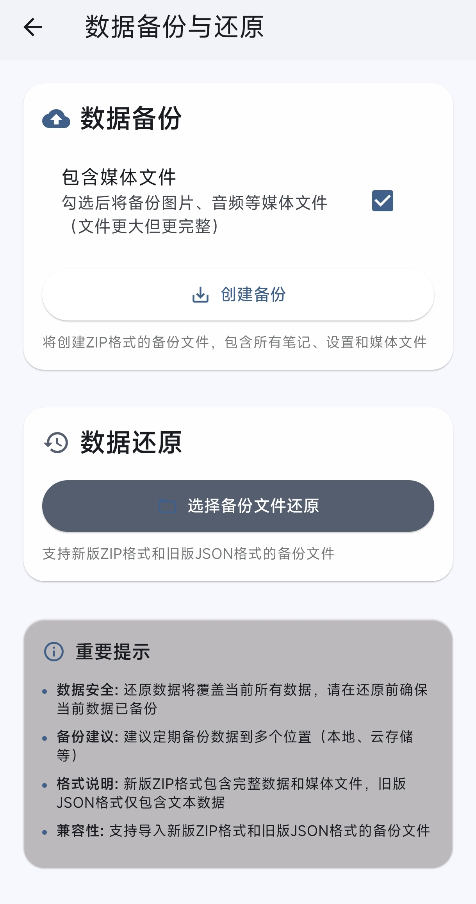 | 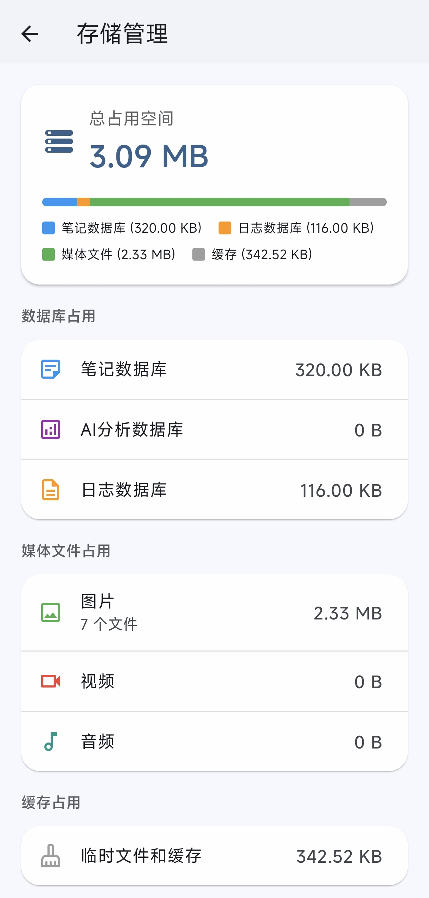 |


## 🛠️ 技术栈

<div align="center">
  <table>
    <tr>
      <td align="center"><b>框架</b></td>
      <td>Flutter (Dart) - 跨平台UI框架</td>
    </tr>
    <tr>
      <td align="center"><b>状态管理</b></td>
      <td>provider, get_it - 依赖注入与状态管理</td>
    </tr>
    <tr>
      <td align="center"><b>本地数据库</b></td>
      <td>sqflite (移动端), sqflite_common_ffi (桌面端)</td>
    </tr>
    <tr>
      <td align="center"><b>富文本编辑</b></td>
      <td>flutter_quill - 支持富文本、图片、音视频</td>
    </tr>
    <tr>
      <td align="center"><b>AI集成</b></td>
      <td>多provider架构 - OpenAI、Anthropic、DeepSeek等</td>
    </tr>
    <tr>
      <td align="center"><b>存储优化</b></td>
      <td>MMKV (高性能), flutter_secure_storage (安全存储)</td>
    </tr>
    <tr>
      <td align="center"><b>多媒体处理</b></td>
      <td>大文件流式处理、智能内存管理、媒体压缩优化</td>
    </tr>
    <tr>
      <td align="center"><b>平台适配</b></td>
      <td>Windows、Android、iOS、Web全平台支持</td>
    </tr>
  </table>
</div>

## 🚀 快速开始

1. **环境准备** 
   
   确保已安装 Flutter 3.x+ 环境。运行 `flutter doctor` 检查配置。

2. **获取代码**
   ```bash
   git clone https://github.com/Shangjin-Xiao/ThoughtEcho.git
   cd ThoughtEcho
   ```

3. **安装依赖**
   ```bash
   flutter pub get
   ```

4. **运行应用**
   ```bash
   flutter run
   ```

5. **AI 功能配置** (可选)
   
   在应用设置中配置 API Key 以启用 AI 功能。

## 🗺️ 发展路线图

<div align="center">
  <table>
    <tr>
      <th>已完成 ✅</th>
      <th>长期规划 💡</th>
    </tr>
    <tr>
      <td>
        • 富文本编辑器与多媒体支持<br>
        • 多AI服务商架构<br>
        • AI卡片生成功能<br>
        • 大文件流式处理<br>
        • 智能内存管理<br>
        • ZIP格式完整备份<br>
        • Material 3现代化界面<br>
        • 多平台数据库适配<br>
        • 位置与天气记录<br>
        • 剪贴板智能检测<br>
        • AI年度报告生成<br>
        • 笔记内容智能分析<br>
        • 性能优化与稳定性提升<br>
        • 用户体验改进<br>
        • 多设备同步功能<br>
        • 桌面端应用支持
      </td>
      <td>
        <b>🔥 智能输入升级</b><br>
        • AI自然语言搜索<br>
        • 语音转文字输入<br>
        • OCR拍照识别摘录<br>
        • AI自动提取作者出处<br><br>
        <b>🌍 用户体验提升</b><br>
        • 国际化多语言支持<br>
        • 仿真3D笔记本界面<br>
        • 智能内容分类<br>
        • 地图选点添加位置<br><br>
        <b>🤖 端侧AI能力</b><br>
        • 离线语音识别<br>
        • 本地OCR处理<br>
        • 端侧智能分析<br>
        • 高级数据可视化<br>
        • 更多AI集成服务
      </td>
    </tr>
  </table>
</div>

> 📝 详细技术分析请查看 [技术分析报告](docs/TECHNOLOGY_ANALYSIS.md)

## 🤝 如何贡献

1. **提交问题或建议**：通过 [GitHub Issues](https://github.com/Shangjin-Xiao/ThoughtEcho/issues) 反馈

2. **贡献代码**：
   - Fork 仓库并创建功能分支 `feature/YourFeature`
   - 提交更改 `git commit -m 'feat: Add feature'`
   - 创建 Pull Request 到主仓库

## 📄 许可证

本项目基于 [MIT 许可证](LICENSE) 发布。

## 🙏 鸣谢

感谢以下服务提供商的支持：
- [一言（Hitokoto）](https://hitokoto.cn/) - 提供每日一言服务
- [Open-Meteo](https://open-meteo.com/) - 提供天气数据服务

</div>

---

<details id="-english-version" open>
<summary><h2>🇬🇧 English Version</h2></summary>

<div align="center">
  
  
  # ThoughtEcho (心迹)
  
  <p>
    <a href="https://github.com/Shangjin-Xiao/ThoughtEcho/blob/main/LICENSE">
      
    </a>
    <a href="https://github.com/Shangjin-Xiao/ThoughtEcho/releases/latest">
      
    </a>
    <a href="https://github.com/Shangjin-Xiao/ThoughtEcho/stargazers">
      
    </a>
    <a href="https://github.com/Shangjin-Xiao/ThoughtEcho/network/members">
      
    </a>
  </p>

  <p>
    <b>📝 Your Personal AI-Powered Inspiration Notebook<br>
    Capture ideas effortlessly, unlock insights with AI ✨</b>
  </p>
  
  <p>
    <b>⚠️ Heads-up:</b> This project was built in collaboration with AI—we're polishing it in the open, so thanks for your patience with any rough edges.
  </p>

  <p>
    <b>🌍 Localization:</b> English translation is actively in progress! We're working hard to provide full English support. Contributions are welcome!
  </p>
</div>

## 🌟 Why ThoughtEcho?

ThoughtEcho is more than just a note-taking app—it's your **personal AI-powered knowledge companion**. Whether you're a writer capturing fleeting ideas, a student organizing study notes, or a professional tracking insights, ThoughtEcho helps you:

- 📝 **Capture** thoughts instantly with rich text, images, audio, and video
- 🤖 **Understand** your notes deeper with AI-powered analysis and Q&A
- 📊 **Discover** patterns in your thinking with intelligent insights and reports
- 🔄 **Sync** seamlessly across all your devices
- 🔒 **Own** your data with local-first storage and secure backups

## ✨ Current Features

<div align="center">
  <table>
    <tr>
      <td align="center" width="33%"><b>✍️ Rich Text Notes</b><br>Rich text, media attachments, dual-format storage</td>
      <td align="center" width="33%"><b>🤖 AI Assistant</b><br>Context-aware Q&A, polishing, daily inspiration prompts</td>
      <td align="center" width="33%"><b>📊 Insights & Reports</b><br>AI periodic insights, annual reports, writing trend analysis</td>
    </tr>
    <tr>
      <td align="center"><b>🏷️ Tags & Search</b><br>Multi-tag filters, smart facets, full-text search</td>
      <td align="center"><b>🎯 AI Card Generation</b><br>Convert notes into beautiful shareable cards</td>
      <td align="center"><b>� Media & Backup Hub</b><br>Stream large files safely with backup/restore peace of mind</td>
    </tr>
    <tr>
      <td align="center"><b>🌍 Context Capture</b><br>Auto-save location, weather, and time-of-day context</td>
      <td align="center"><b>🧠 Intelligent Memory Management</b><br>Adaptive batching to prevent memory spikes</td>
      <td align="center"><b>⚡ Quick Capture</b><br>Clipboard watcher, Hitokoto quotes, daily prompts on tap</td>
    </tr>
  </table>
</div>

## 📸 Application Screenshots

### Core Features
| Homepage | Note List | Add Note |
|:---:|:---:|:---:|
|  |  |  |

### Editing & AI Features
| Rich Text Editor | AI Q&A Chat | Filter & Sort |
|:---:|:---:|:---:|
|  |  |  |

### Insights & Reports
| Insights Analysis | Period Report | Note Sync |
|:---:|:---:|:---:|
|  |  |  |

### Settings & Management
| Theme Settings | Hitokoto Settings | Preferences |
|:---:|:---:|:---:|
|  |  |  |

### Storage & Backup
| Backup & Restore | Storage Management |
|:---:|:---:|
|  |  |


## 🛠️ Tech Stack

<div align="center">
  <table>
    <tr>
      <td align="center"><b>Framework</b></td>
      <td>Flutter (Dart) - Cross-platform UI framework</td>
    </tr>
    <tr>
      <td align="center"><b>State Management</b></td>
      <td>provider, get_it - Dependency injection & state management</td>
    </tr>
    <tr>
      <td align="center"><b>Local Database</b></td>
      <td>sqflite (mobile), sqflite_common_ffi (desktop)</td>
    </tr>
    <tr>
      <td align="center"><b>Rich Text Editor</b></td>
      <td>flutter_quill - Rich text with images, audio, video</td>
    </tr>
    <tr>
      <td align="center"><b>AI Integration</b></td>
      <td>Multi-provider architecture - OpenAI, Anthropic, DeepSeek</td>
    </tr>
    <tr>
      <td align="center"><b>Storage Optimization</b></td>
      <td>MMKV (high performance), flutter_secure_storage (secure)</td>
    </tr>
    <tr>
      <td align="center"><b>Media Processing</b></td>
      <td>Large file streaming, smart memory management, media optimization</td>
    </tr>
    <tr>
      <td align="center"><b>Platform Support</b></td>
      <td>Windows, Android, iOS, Web full platform support</td>
    </tr>
  </table>
</div>

## 🚀 Quick Start

1. **Prerequisites** 
   
   Ensure Flutter 3.x+ is installed. Run `flutter doctor` to check.

2. **Get the Code**
   ```bash
   git clone https://github.com/Shangjin-Xiao/ThoughtEcho.git
   cd ThoughtEcho
   ```

3. **Install Dependencies**
   ```bash
   flutter pub get
   ```

4. **Run the App**
   ```bash
   flutter run
   ```

5. **AI Feature Configuration** (Optional)
   
   Configure the API Key in app settings to enable AI features.

## 🗺️ Development Roadmap

<div align="center">
  <table>
    <tr>
      <th>Completed ✅</th>
      <th>Long Term 💡</th>
    </tr>
    <tr>
      <td>
        • Rich text editor with multimedia<br>
        • Multi-AI provider architecture<br>
        • AI card generation feature<br>
        • Large file streaming processing<br>
        • Intelligent memory management<br>
        • ZIP format complete backup<br>
        • Material 3 modern interface<br>
        • Multi-platform database adapter<br>
        • Location & weather recording<br>
        • Smart clipboard detection<br>
        • AI annual report generation<br>
        • Smart note content analysis<br>
        • Performance optimization<br>
        • User experience improvements<br>
        • Multi-device sync support<br>
        • Desktop application support
      </td>
      <td>
        • Enhanced natural language search<br>
        • Voice-to-text input<br>
        • OCR text recognition<br>
        • AI author extraction<br>
        • Map location selection<br>
        • Internationalization support<br>
        • 3D notebook interface<br>
        • Smart categorization<br>
        • Offline AI capabilities<br>
        • Advanced data visualization<br>
        • More AI service integrations<br>
        • Data export & migration tools
      </td>
    </tr>
  </table>
</div>

## 🤝 How to Contribute

We'd love your help making ThoughtEcho better! Here's how you can contribute:

1. **Report Issues or Suggestions**: Via [GitHub Issues](https://github.com/Shangjin-Xiao/ThoughtEcho/issues)

2. **Help with Translation** 🌍:
   - English localization is our top priority
   - Help translate UI strings and documentation
   - Review existing translations for accuracy

3. **Contribute Code**:
   - Fork the repo and create feature branch `feature/YourFeature`
   - Commit changes `git commit -m 'feat: Add feature'`
   - Create Pull Request to main repository

4. **Spread the Word**: Star ⭐ the repo and share with others!

## 📄 License

This project is licensed under the [MIT License](LICENSE) - feel free to use, modify, and distribute.

## 🙏 Acknowledgments

Thanks to the following service providers:
- [Hitokoto](https://hitokoto.cn/) - Daily quote service
- [Open-Meteo](https://open-meteo.com/) - Weather data service

</details>
