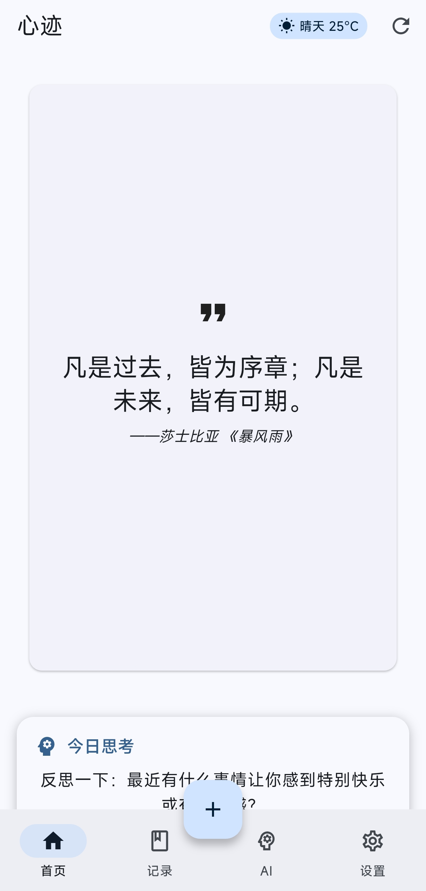
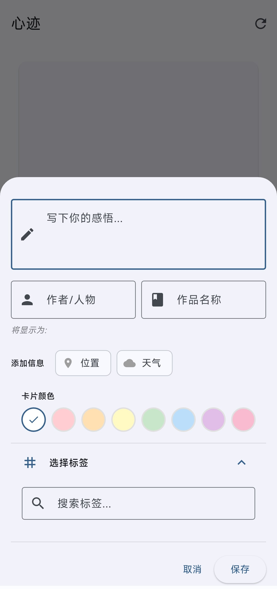
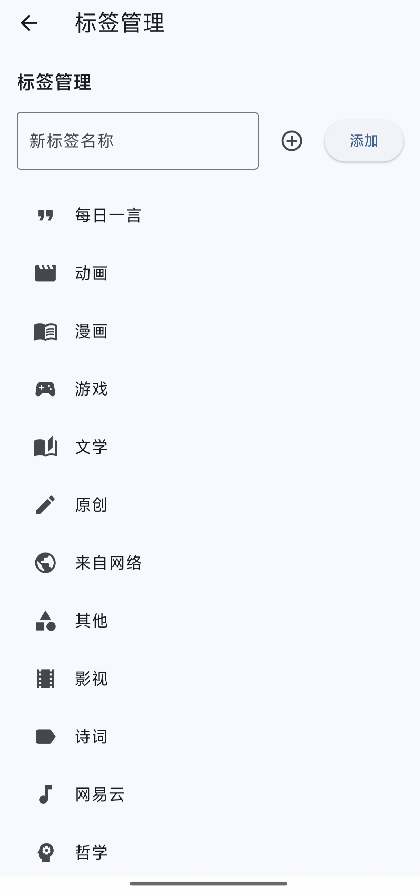
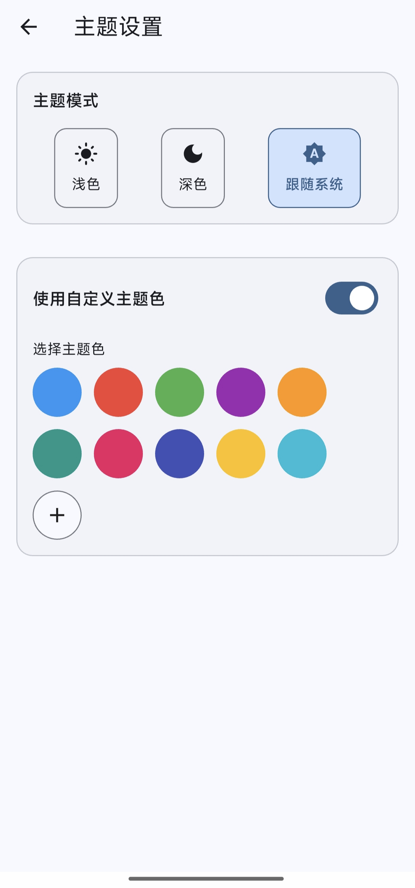
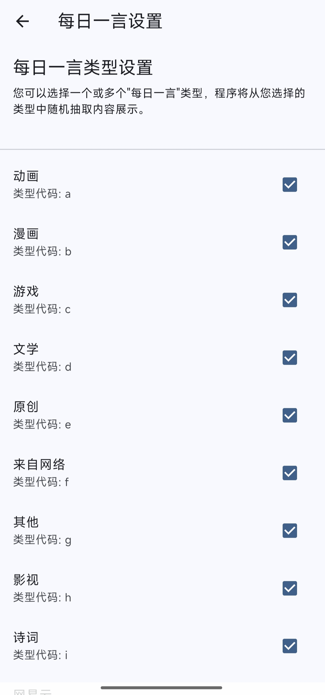
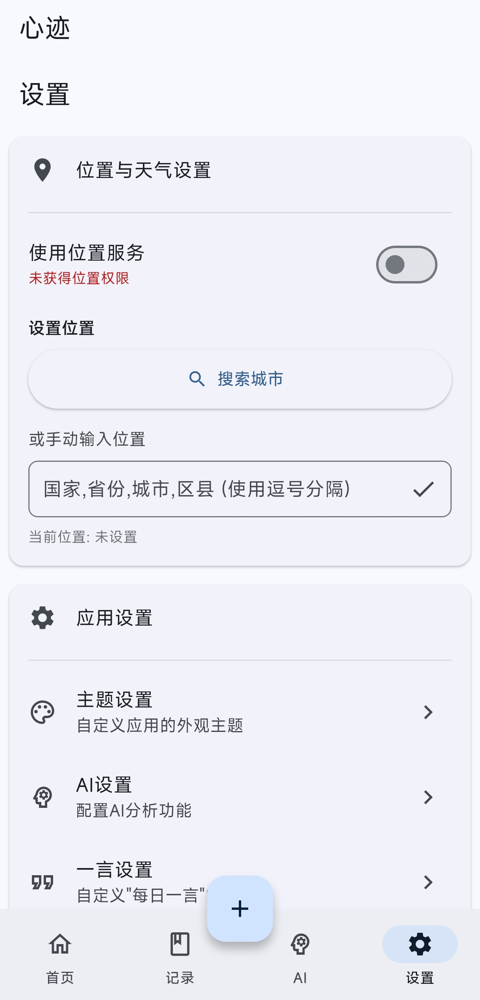

<div align="center">
  
  
  # 心迹 (ThoughtEcho)
  
  <p>
    <a href="https://github.com/Shangjin-Xiao/ThoughtEcho/blob/main/LICENSE">
      
    </a>
    <a href="https://github.com/Shangjin-Xiao/ThoughtEcho/releases/latest">
      
    </a>
    <!-- TODO: If CI is set up later, uncomment and potentially update the workflow filename -->
    <!--  -->
    <a href="https://github.com/Shangjin-Xiao/ThoughtEcho/stargazers">
      
    </a>
    <a href="https://github.com/Shangjin-Xiao/ThoughtEcho/network/members">
      
    </a>
  </p>

  <p>
    <b>📝 一款使用 Flutter 构建的本地优先笔记应用<br>
    捕捉思绪轨迹，释放 AI 洞察的力量 ✨</b>
  </p>
  
  <p>
    <a href="#-english-version"><b>English</b></a> • 
    <a href="#-中文版本"><b>中文</b></a>
  </p>
  
</div>

---

<div id="-中文版本">

## ✨ 当前功能

<div align="center">
  <table>
    <tr>
      <td align="center" width="33%"><b>✍️ 笔记管理</b><br>创建、编辑、查看和删除笔记</td>
      <td align="center" width="33%"><b>🏷️ 标签系统</b><br>便捷地分类与检索笔记</td>
      <td align="center" width="33%"><b>🎨 个性化主题</b><br>浅色/深色模式与自定义颜色</td>
    </tr>
    <tr>
      <td align="center"><b>💬 一言集成</b><br>展示精选句子，类型可筛选</td>
      <td align="center"><b>💾 数据备份与恢复</b><br>保护你的宝贵想法</td>
      <td align="center"><b>✨ AI 洞察</b><br>智能分析笔记内容 (开发中)</td>
    </tr>
  </table>
</div>

## 📸 应用截图

| 主页 | 添加/编辑笔记 | 标签管理 |
|:---:|:---:|:---:|
|  |  |  |
| **主题设置** | **一言类型选择** | **设置与备份** |
|  |  |  |


## 🛠️ 技术栈

<div align="center">
  <table>
    <tr>
      <td align="center"><b>框架</b></td>
      <td>Flutter (Dart)</td>
    </tr>
    <tr>
      <td align="center"><b>状态管理</b></td>
      <td>provider, get_it</td>
    </tr>
    <tr>
      <td align="center"><b>本地数据库</b></td>
      <td>sqflite</td>
    </tr>
    <tr>
      <td align="center"><b>核心依赖</b></td>
      <td>file_picker, path_provider, permission_handler, flutter_colorpicker, share_plus, flutter_local_notifications</td>
    </tr>
  </table>
</div>

## 🚀 快速开始

1. **环境准备** 
   
   确保已安装 Flutter 3.x+ 环境。运行 `flutter doctor` 检查配置。

2. **获取代码**
   ```bash
   git clone https://github.com/Shangjin-Xiao/ThoughtEcho.git
   cd ThoughtEcho
   ```

3. **安装依赖**
   ```bash
   flutter pub get
   ```

4. **运行应用**
   ```bash
   flutter run
   ```

5. **AI 功能配置** (可选)
   
   在应用设置中配置 API Key 以启用 AI 功能。

## 🗺️ 发展路线图

<div align="center">
  <table>
    <tr>
      <th>已完成 ✅</th>
      <th>近期 (Q2 2024) 🚧</th>
      <th>中期 (Q3 2024) 📅</th>
      <th>长期规划 💡</th>
    </tr>
    <tr>
      <td>
        • 剪贴板智能检测与快速添加<br>
        • 用户引导流程和教程<br>
        • 全屏沉浸式编辑器<br>
        • Material 3 现代化界面<br>
        • 数据库性能优化<br>
        • 基础标签和分类系统
      </td>
      <td>
        • 每日一言推送通知<br>
        • 支持插入本地图片
      </td>
      <td>
        • 富文本编辑与预览<br>
        • AI分析功能增强<br>
        • 高级数据可视化
      </td>
      <td>
        • UI、功能高度自定义<br>
        • 离线AI分析能力<br>
        • 多设备实时同步<br>
        • 地图选点添加位置<br>
        • 桌面端独立应用
      </td>
    </tr>
  </table>
</div>

## 🤝 如何贡献

1. **提交问题或建议**：通过 [GitHub Issues](https://github.com/Shangjin-Xiao/ThoughtEcho/issues) 反馈

2. **贡献代码**：
   - Fork 仓库并创建功能分支 `feature/YourFeature`
   - 提交更改 `git commit -m 'feat: Add feature'`
   - 创建 Pull Request 到主仓库

## 📄 许可证

本项目基于 [MIT 许可证](LICENSE) 发布。
</div>

---

<details id="-english-version">
<summary><h2>🇬🇧 English Version</h2></summary>

## ✨ Current Features

<div align="center">
  <table>
    <tr>
      <td align="center" width="33%"><b>✍️ Note Management</b><br>Create, edit, view, and delete notes</td>
      <td align="center" width="33%"><b>🏷️ Tag System</b><br>Organize and retrieve notes easily</td>
      <td align="center" width="33%"><b>🎨 Personalized Themes</b><br>Light/dark modes & custom colors</td>
    </tr>
    <tr>
      <td align="center"><b>💬 Hitokoto Integration</b><br>Display quotes with type filtering</td>
      <td align="center"><b>💾 Data Backup & Restore</b><br>Protect your valuable ideas</td>
      <td align="center"><b>✨ AI Insights</b><br>Smart note analysis (WIP)</td>
    </tr>
  </table>
</div>

## 📸 Application Screenshots

| Homepage | Add/Edit Note | Tag Management |
|:---:|:---:|:---:|
|  |  |  |
| **Theme Settings** | **Hitokoto Types** | **Settings & Backup** |
|  |  |  |


## 🛠️ Tech Stack

<div align="center">
  <table>
    <tr>
      <td align="center"><b>Framework</b></td>
      <td>Flutter (Dart)</td>
    </tr>
    <tr>
      <td align="center"><b>State Management</b></td>
      <td>provider, get_it</td>
    </tr>
    <tr>
      <td align="center"><b>Local Database</b></td>
      <td>sqflite</td>
    </tr>
    <tr>
      <td align="center"><b>Core Dependencies</b></td>
      <td>file_picker, path_provider, permission_handler, flutter_colorpicker, share_plus, flutter_local_notifications</td>
    </tr>
  </table>
</div>

## 🚀 Quick Start

1. **Prerequisites** 
   
   Ensure Flutter 3.x+ is installed. Run `flutter doctor` to check.

2. **Get the Code**
   ```bash
   git clone https://github.com/Shangjin-Xiao/ThoughtEcho.git
   cd ThoughtEcho
   ```

3. **Install Dependencies**
   ```bash
   flutter pub get
   ```

4. **Run the App**
   ```bash
   flutter run
   ```

5. **AI Feature Configuration** (Optional)
   
   Configure the API Key in app settings to enable AI features.

## 🗺️ Development Roadmap

<div align="center">
  <table>
    <tr>
      <th>Near Term (Q2 2024) 🚧</th>
      <th>Mid Term (Q3 2024) 📅</th>
      <th>Long Term 💡</th>
    </tr>
    <tr>
      <td>
        • New user onboarding flow<br>
        • Smart clipboard detection<br>
        • Daily Hitokoto notifications<br>
        • Database performance optimization<br>
        • Bug fixes & stability
      </td>
      <td>
        • Markdown editing & preview<br>
        • Image & file support<br>
        • AI feature enhancement<br>
        • Deep UI customization
      </td>
      <td>
        • Local AI analysis<br>
        • Code refactoring<br>
        • Cloud sync (to be evaluated)
      </td>
    </tr>
  </table>
</div>

## 🤝 How to Contribute

1. **Report Issues or Suggestions**: Via [GitHub Issues](https://github.com/Shangjin-Xiao/ThoughtEcho/issues)

2. **Contribute Code**:
   - Fork the repo and create feature branch `feature/YourFeature`
   - Commit changes `git commit -m 'feat: Add feature'`
   - Create Pull Request to main repository

## 📄 License

This project is licensed under the [MIT License](LICENSE).

</details>
