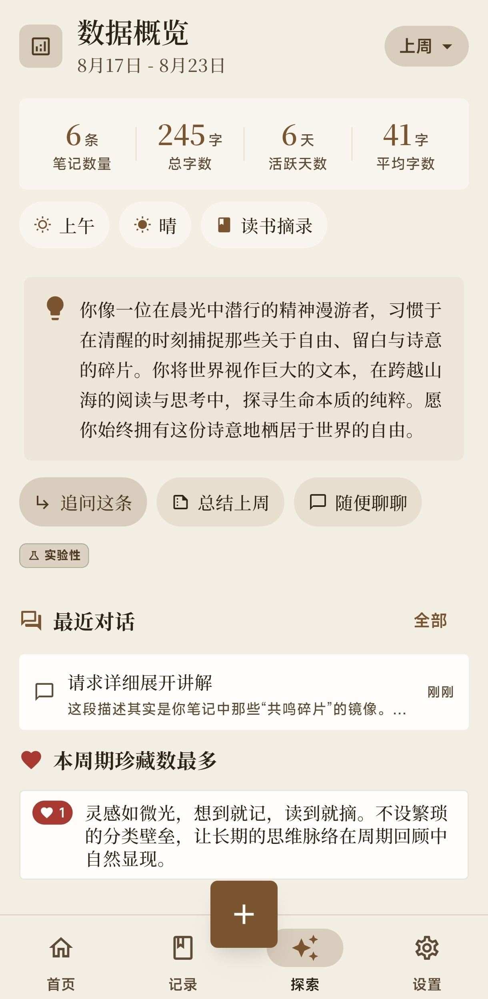
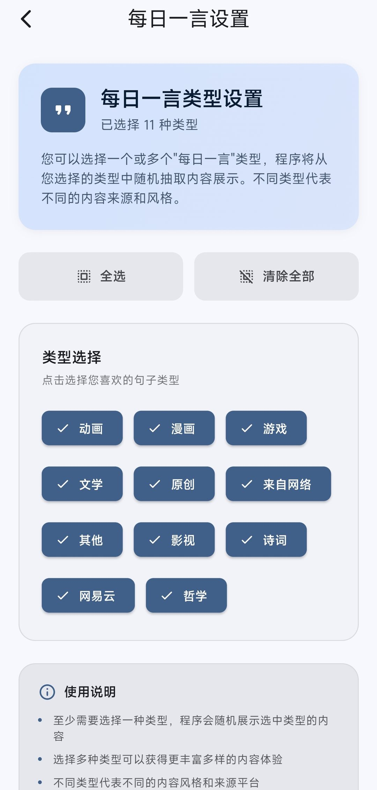
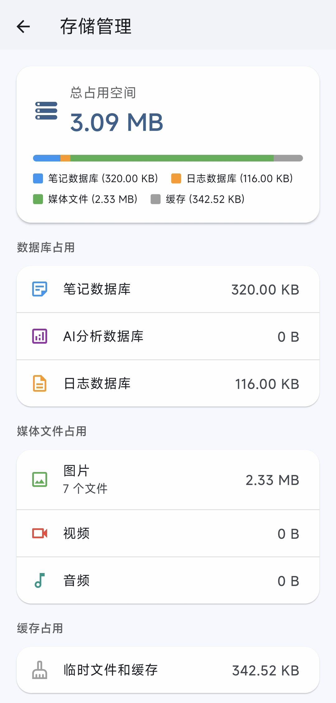

<div align="center">
  <a href="https://note.shangjinyun.cn/">
    
  </a>
  
  # ThoughtEcho (心迹)
  
  <p align="center">
    <b>📝 你的专属 AI 灵感摘录本 · 想到就记，读到就摘，剩下的交给 AI。</b><br>
    <b>Your Personal AI-Powered Inspiration Notebook — Jot it down, clip what you read, let AI sort out the rest.</b>
  </p>

  <p align="center">
    <a href="https://github.com/Shangjin-Xiao/ThoughtEcho/releases/latest">
      
    </a>
    <a href="https://github.com/Shangjin-Xiao/ThoughtEcho/releases">
      
    </a>
    <a href="https://www.microsoft.com/store/apps/9NC7GDG6KFMC">
      
    </a>
    <a href="https://flutter.dev/">
      
    </a>
    <a href="https://github.com/Shangjin-Xiao/ThoughtEcho">
      
    </a>
    <a href="https://github.com/Shangjin-Xiao/ThoughtEcho/stargazers">
      
    </a>
    <a href="https://github.com/Shangjin-Xiao/ThoughtEcho/blob/main/LICENSE">
      
    </a>
  </p>

  <p align="center">
    <a href="README.md"><b>English</b></a> • 
    <a href="README_CN.md"><b>简体中文</b></a> •
    <a href="https://note.shangjinyun.cn/"><b>Official Website</b></a> •
    <a href="docs/USER_MANUAL.md"><b>User Manual</b></a> •
    <a href="https://shangjin-xiao.github.io/ThoughtEcho/user-guide.html"><b>Web Guide</b></a>
  </p>

  <h3>📥 Download</h3>
  <p align="center">
    <a href="https://www.microsoft.com/store/apps/9NC7GDG6KFMC"></a>
  </p>

  <p><sub>Windows: Recommended from Microsoft Store (auto-update) · Android: Download APK from <a href="https://github.com/Shangjin-Xiao/ThoughtEcho/releases/latest">GitHub Releases</a></sub></p>
  <p><sub>🌍 <b>Localization:</b> Full support for <b>English</b>, <b>简体中文</b>, <b>日本語</b>, and <b>한국어</b> (German, Spanish, French in progress)</sub></p>
  
</div>

---

> **ThoughtEcho（心迹）** 是一款优雅、本地优先、AI 赋能的跨平台灵感笔记与知识摘录应用。  
> **ThoughtEcho** is an elegant, local-first, AI-powered cross-platform inspiration and quote notebook designed to capture fleeting thoughts, organize reading excerpts, and unlock deeper creative potential.

---

## 🌟 Why ThoughtEcho?

- 🔒 **Local-First & Privacy**: 100% data ownership stored locally with SQLite and MMKV. Sensitive notes can be hidden and protected by biometric authentication (Fingerprint / Face ID). No tracking, no forced cloud lock-in.
- 🧠 **Thoughter AI Agent & Long-Term Memory**: Multi-provider AI architecture (OpenAI, DeepSeek, Ollama, Gemini, Claude, OpenRouter, SiliconFlow, etc.). Features an autonomous Thoughter agent with cross-session long-term memory that understands your writing personality.
- ✍️ **Rich Multimedia & Context Capture**: Quill rich formatting with multimedia attachments (images, audio, video). Automatically captures geocoding location, weather, and time-of-day inspiration context.
- 📊 **Periodic Insights & Card Generation**: Automated weekly and monthly reflection insights, annual review reports, thinking pattern analysis, and one-click AI quote share card generation.
- 🔄 **Zero-Config Multi-Device Sync**: High-speed LocalSend LAN direct sync (mDNS discovery & encrypted transfer) plus flexible WebDAV cloud backup and restore.
- 🎨 **Artistic Themes & Typography**: Signature handcrafted "Paper & Ink" and "Plain" styles with specialized reading typography, plus dynamic Material 3 color palettes.

<br>

## ✨ Current Features

<div align="center">
  <table>
    <tr>
      <td align="center" width="33%"><b>✍️ Rich Text Notes</b><br>Quill rich formatting, multimedia attachments (images/audio/video), plain & rich dual storage</td>
      <td align="center" width="33%"><b>✨ Thoughter AI Agent</b><br>Agent tool calling, dedicated long-term memory database, interactive creative assistant</td>
      <td align="center" width="33%"><b>📊 Insights & Reports</b><br>AI periodic insights, annual review reports, creative rhythm & writing trend analysis</td>
    </tr>
    <tr>
      <td align="center"><b>🏷️ Tags & Search</b><br>Multi-tag filters, intelligent sorting, fast local SQLite full-text search</td>
      <td align="center"><b>🎯 AI Card Generation</b><br>Convert notes into beautiful, customizable shareable cards with artistic templates</td>
      <td align="center"><b>📦 Media & Backup Hub</b><br>Streaming chunked large-file processing, full ZIP import/export, incremental sync</td>
    </tr>
    <tr>
      <td align="center"><b>🌍 Context Sensing</b><br>Auto-captures location, weather, and time-of-day inspiration context</td>
      <td align="center"><b>🙈 Privacy Protection</b><br>Hidden tags + biometric (Fingerprint / Face ID / Windows Hello) unlock</td>
      <td align="center"><b>💾 Auto-Save Drafts</b><br>Real-time draft auto-saving with instant crash recovery; never lose a thought</td>
    </tr>
    <tr>
      <td align="center"><b>⚡ Quick Capture</b><br>Smart clipboard watcher, daily quotes (Hitokoto / ZenQuotes / etc.), AI writing prompts</td>
      <td align="center"><b>🎨 Handcrafted Themes</b><br>Paper & Ink, Plain, and Material 3 dynamic color tokens</td>
      <td align="center"><b>🔄 Multi-Device Sync</b><br>LocalSend LAN high-speed direct transfer + WebDAV cloud backup & restore</td>
    </tr>
  </table>
</div>

## 📸 Application Screenshots

### Core Features
| Homepage | Note List |
|:---:|:---:|
|  |  |

### Editing & AI Features
| Rich Text Editor | AI Q&A Chat | Filter & Sort |
|:---:|:---:|:---:|
|  |  |  |

### Insights & Reports
| Insights Analysis | Period Report | Device Sync |
|:---:|:---:|:---:|
|  |  |  |

### Settings & Management
| Theme Settings | Daily Quote Settings | Preferences |
|:---:|:---:|:---:|
|  |  |  |

### Storage & Backup
| Backup & Restore | Storage Management |
|:---:|:---:|
|  |  |

## 🛠️ Tech Stack

<div align="center">
  <table>
    <tr>
      <td align="center"><b>Framework</b></td>
      <td>Flutter (Dart) - Modern reactive cross-platform framework</td>
    </tr>
    <tr>
      <td align="center"><b>State Management</b></td>
      <td>Provider, GetIt - Reactive orchestration & dependency injection</td>
    </tr>
    <tr>
      <td align="center"><b>Local Database</b></td>
      <td>sqflite (Mobile) & sqflite_common_ffi (Desktop SQLite FFI)</td>
    </tr>
    <tr>
      <td align="center"><b>Rich Text Engine</b></td>
      <td>flutter_quill - Rich typography with images, audio, and video embeds</td>
    </tr>
    <tr>
      <td align="center"><b>AI Architecture</b></td>
      <td>OpenAI-compatible protocol architecture (Presets: Ollama, OpenAI, DeepSeek, Gemini, Claude, OpenRouter, SiliconFlow)</td>
    </tr>
    <tr>
      <td align="center"><b>Storage & Security</b></td>
      <td>MMKV (High-performance KV caching) + flutter_secure_storage (Encrypted API keys)</td>
    </tr>
    <tr>
      <td align="center"><b>Multi-Device Sync</b></td>
      <td>LocalSend (LAN mDNS discovery & encrypted TLS transfer) + WebDAV cloud sync</td>
    </tr>
    <tr>
      <td align="center"><b>Media Processing</b></td>
      <td>Streaming chunked processing for large files, smart caching, compression</td>
    </tr>
    <tr>
      <td align="center"><b>Supported Platforms</b></td>
      <td>Windows, Android, iOS (Web is not supported)</td>
    </tr>
  </table>
</div>

## 🚀 Quick Start

1. **Prerequisites**
   
   Ensure Flutter 3.24+ and Dart 3.5+ are installed. Run `flutter doctor` to verify your environment:
   ```bash
   flutter doctor
   ```

2. **Clone the Repository**
   ```bash
   git clone https://github.com/Shangjin-Xiao/ThoughtEcho.git
   cd ThoughtEcho
   ```

3. **Install Dependencies**
   ```bash
   flutter pub get
   ```

4. **Run the Application**
   ```bash
   flutter run
   ```

5. **Configure AI Services (Optional)**
   
   Navigate to **Settings → AI Settings**, choose an AI provider preset (e.g., DeepSeek, Ollama, OpenAI), paste your API Key, and start using AI Q&A, Thoughter agent, and periodic insights.

## 🗺️ Development Roadmap

<div align="center">
  <table>
    <tr>
      <th>Completed ✅</th>
      <th>Long Term 💡</th>
    </tr>
    <tr>
      <td>
        • Rich text editor with multimedia (images, audio, video)<br>
        • OpenAI-compatible multi-AI provider architecture<br>
        • Thoughter AI agent with dedicated long-term memory<br>
        • Paper & Ink / Plain / Material 3 signature theme tokens<br>
        • AI card generation with customizable share templates<br>
        • Large file streaming & full ZIP backup/restore<br>
        • LocalSend LAN direct transfer & WebDAV cloud sync<br>
        • Smart geocoding search & automatic weather logging<br>
        • Smart clipboard detection & quick capture on launch<br>
        • Periodic intelligent insights & annual reports<br>
        • Hidden notes with biometric (Fingerprint/Face ID) protection<br>
        • Real-time auto-saving drafts & crash recovery<br>
        • Multilingual support (Full EN/ZH/JA/KO; fallback to EN)<br>
        • Windows desktop application (MSIX installer)<br>
        • iOS platform support & CI build pipeline<br>
        • In-app Release Notes page with theme live preview
      </td>
      <td>
        <b>🔥 Smart Input Upgrades</b><br>
        • AI natural language semantic search<br>
        • Voice-to-text quick capture<br>
        • Camera OCR text recognition<br>
        • AI automatic author & source extraction<br><br>
        <b>🌍 User Experience & Knowledge</b><br>
        • Interactive notebook themes & custom paper textures<br>
        • Knowledge graph linking & topic clustering<br>
        • Map location picker & memory footprints<br><br>
        <b>✨ On-Device AI Exploration</b><br>
        • On-device lightweight offline LLM inference<br>
        • Local offline OCR & offline speech-to-text<br>
        • More third-party note import/export formats
      </td>
    </tr>
  </table>
</div>

> 📝 For in-depth technical documentation, see [Project Overview](docs/project-overview.md) and [User Manual](docs/USER_MANUAL.md).

## 🤝 How to Contribute

We welcome contributions of all kinds! Here's how you can get involved:

1. **Report Issues or Suggestions**: Open an issue on [GitHub Issues](https://github.com/Shangjin-Xiao/ThoughtEcho/issues)
2. **Help with Localization 🌍**:
   - Help complete and refine translation strings (German, Spanish, French, etc.)
   - Review and improve existing translations (English, Chinese, Japanese, Korean)
3. **Contribute Code**:
   - Fork the repository and create a feature branch `feature/YourFeature` or `fix/YourBugFix`
   - Ensure your code passes analysis and tests
   - Open a Pull Request with a clear description of the changes
4. **Spread the Word**: Star ⭐ the repository and share ThoughtEcho with others!

## 📄 License

This project is licensed under the [MIT License](LICENSE) - feel free to use, modify, and distribute.

## 🙏 Acknowledgments

Thanks to the following open-source projects and service providers:
- [Flutter](https://flutter.dev/) - Cross-platform UI framework
- [LocalSend](https://github.com/localsend/localsend) - Local network sync protocol
- [Sentry](https://sentry.io/) - Application crash & structured log monitoring
- [Hitokoto](https://hitokoto.cn/) - Chinese daily quote provider
- [ZenQuotes](https://zenquotes.io/) - English daily quote provider
- [API Ninjas Quotes API](https://api-ninjas.com/api/quotes) - Category-based quote provider
- [Meigen Oshieruyo](https://meigen.doodlenote.net/) - Japanese daily quote provider
- [Korean Advice](https://korean-advice-open-api.vercel.app/) - Korean daily quote provider
- [Open-Meteo](https://open-meteo.com/) - Weather data service
- [OpenStreetMap Nominatim](https://nominatim.openstreetmap.org/) - Geocoding service
