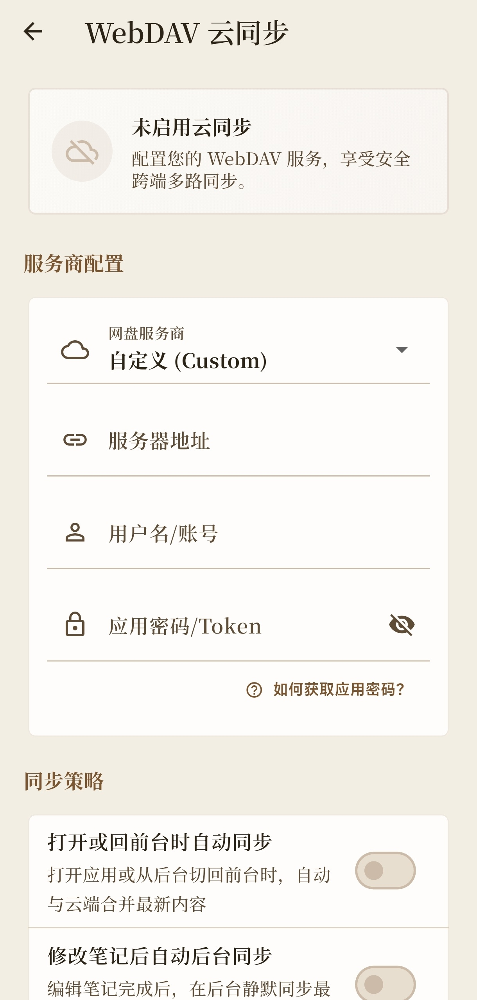

<div align="center">
  <a href="https://note.shangjinyun.cn/">
    
  </a>
  
  # 心迹 (ThoughtEcho)
  
  <p>
    <b>📝 你的专属灵感摘录本 / Your Personal AI-Powered Inspiration Notebook</b><br>
    <b>想到就记，读到就摘，剩下的交给 AI。</b>
  </p>

  <p>
    <a href="https://github.com/Shangjin-Xiao/ThoughtEcho/releases/latest">
      
    </a>
    <a href="https://github.com/Shangjin-Xiao/ThoughtEcho/releases">
      
    </a>
    <a href="https://www.microsoft.com/store/apps/9NC7GDG6KFMC">
      
    </a>
    <a href="https://github.com/Shangjin-Xiao/ThoughtEcho/stargazers">
      
    </a>
    <a href="https://github.com/Shangjin-Xiao/ThoughtEcho/blob/main/LICENSE">
      
    </a>
  </p>

  <p>
    <a href="README.md"><b>English</b></a> • 
    <a href="README_CN.md"><b>简体中文</b></a> •
    <a href="https://note.shangjinyun.cn/"><b>官方网站</b></a> •
    <a href="docs/USER_MANUAL.md"><b>用户手册</b></a> •
    <a href="https://shangjin-xiao.github.io/ThoughtEcho/user-guide.html"><b>网页指南</b></a>
  </p>

  <h3>📥 下载渠道 / Download</h3>
  <p>
    <a href="https://www.microsoft.com/store/apps/9NC7GDG6KFMC"></a>
    &nbsp;&nbsp;&nbsp;
    <a href="https://github.com/Shangjin-Xiao/ThoughtEcho/releases/latest"></a>
  </p>

  <p><sub>Windows 推荐从 Microsoft Store 安装（支持自动更新）· Android 请下载 64 位 APK</sub></p>
  <p><sub>🌍 语言支持：完整支持 <b>简体中文</b>、<b>English</b>、<b>日本語</b>、<b>한국어</b>（德语、西语、法语等正在完善中）</sub></p>
  
</div>

---

## 🌟 为什么选择 ThoughtEcho？

**心迹是你的专属灵感摘录本**。它能帮你：

- 📝 **随时随地捕获**：富文本、多媒体（图片/音频/视频），甚至一句话的灵感碎片
- ✨ **深度理解笔记**：通过 AI 问答、润色与摘要，让笔记产生更多价值
- 📊 **发现思维脉络**：智能提取周期洞察与年度报告，洞悉成长轨迹
- 🔄 **无缝多端同步**：局域网 LocalSend 高速直传与 WebDAV 云端同步
- 🔒 **保护个人隐私**：本地优先存储，敏感笔记支持隐藏标签与生物识别加密

<br>

## ✨ 当前功能

<div align="center">
  <table>
    <tr>
      <td align="center" width="33%"><b>✍️ 富文本笔记</b><br>Quill 富文本、多媒体附件与纯文本/富文本双重存储</td>
      <td align="center" width="33%"><b>✨ Thoughter（AI 灵感助手）</b><br>Agent 工具调用、跨会话长期记忆与笔记智能创作</td>
      <td align="center" width="33%"><b>📊 洞察与报告</b><br>AI 周期洞察、年度报告与写作趋势深度分析</td>
    </tr>
    <tr>
      <td align="center"><b>🏷️ 标签与搜索</b><br>多标签筛选、智能过滤与本地全文搜索</td>
      <td align="center"><b>🎯 AI卡片生成</b><br>将笔记转换为多种精美分享卡片</td>
      <td align="center"><b>📦 媒体与备份中心</b><br>大文件流式处理、ZIP 完整备份与增量同步</td>
    </tr>
    <tr>
      <td align="center"><b>🌍 情境记录</b><br>自动记录位置、天气与时间段等灵感上下文</td>
      <td align="center"><b>🙈 隐私保护</b><br>隐藏笔记标签 + 系统生物识别（指纹/面容）解锁</td>
      <td align="center"><b>💾 草稿自动保存</b><br>编辑实时自动暂存，异常退出内容不丢失</td>
    </tr>
    <tr>
      <td align="center"><b>⚡ 快速捕获</b><br>剪贴板自动检测、每日一言与灵感写作提示</td>
      <td align="center"><b>🎨 特色主题风格</b><br>纸与墨、素笺与 Material 3 动态取色</td>
      <td align="center"><b>🔄 多端数据同步</b><br>LocalSend 局域网高速直连 + WebDAV 云备份</td>
    </tr>
  </table>
</div>

## 📸 应用截图

### 核心功能
| 主页 | 笔记列表 |
|:---:|:---:|
|  |  |

### 编辑与 AI 功能
| 富文本编辑器 | AI 问答对话 | 筛选与排序 |
|:---:|:---:|:---:|
|  |  |  |

### 洞察与报告
| 洞察分析 | 周期报告 | 设备同步 |
|:---:|:---:|:---:|
|  |  |  |

### 设置与管理
| 主题风格设置 | 每日一言设置 | 偏好设置 |
|:---:|:---:|:---:|
|  |  |  |

### 存储与备份
| 备份与恢复 | 存储管理 | WebDAV 云同步 |
|:---:|:---:|:---:|
|  |  |  |

## 🛠️ 技术栈

<div align="center">
  <table>
    <tr>
      <td align="center"><b>应用框架</b></td>
      <td>Flutter (Dart) - 现代跨平台响应式 UI 框架</td>
    </tr>
    <tr>
      <td align="center"><b>状态管理</b></td>
      <td>Provider, GetIt - 依赖注入与响应式状态编排</td>
    </tr>
    <tr>
      <td align="center"><b>本地数据库</b></td>
      <td>sqflite (移动端), sqflite_common_ffi (桌面端 SQLite FFI)</td>
    </tr>
    <tr>
      <td align="center"><b>富文本引擎</b></td>
      <td>flutter_quill - 支持富文本排版、图片、音频与视频附件</td>
    </tr>
    <tr>
      <td align="center"><b>AI 服务集成</b></td>
      <td>OpenAI 兼容协议架构（内置 Ollama、OpenAI、DeepSeek、Gemini、OpenRouter 等模板）</td>
    </tr>
    <tr>
      <td align="center"><b>存储与安全</b></td>
      <td>MMKV (高性能键值缓存), flutter_secure_storage (密钥安全加密存储)</td>
    </tr>
    <tr>
      <td align="center"><b>多端同步</b></td>
      <td>LocalSend (局域网 mDNS 发现与加密传输) + WebDAV 云存储同步</td>
    </tr>
    <tr>
      <td align="center"><b>媒体处理</b></td>
      <td>大文件流式分片处理、内存智能优化、无损压缩</td>
    </tr>
    <tr>
      <td align="center"><b>支持平台</b></td>
      <td>Windows、Android、iOS（注：不支持 Web 平台）</td>
    </tr>
  </table>
</div>

## 🚀 快速开始

1. **环境准备** 
   
   确保已安装 Flutter 3.24+ / Dart 3.5+ 环境。运行以下命令检查配置：
   ```bash
   flutter doctor
   ```

2. **获取源码**
   ```bash
   git clone https://github.com/Shangjin-Xiao/ThoughtEcho.git
   cd ThoughtEcho
   ```

3. **安装依赖**
   ```bash
   flutter pub get
   ```

4. **运行应用**
   ```bash
   flutter run
   ```

5. **配置 AI 服务** (可选)
   
   在应用内进入「设置」→「AI 设置」，选择内置服务商模板（如 Ollama 云端、DeepSeek、OpenAI 等）填入 API Key 即可开启 AI 问答、Thoughter 智能体与洞察分析功能。

## 🗺️ 发展路线图

<div align="center">
  <table>
    <tr>
      <th>已完成 ✅</th>
      <th>长期规划 💡</th>
    </tr>
    <tr>
      <td>
        • 富文本编辑器与多媒体（图/音/视频）支持<br>
        • OpenAI 兼容多 AI 服务商集成架构<br>
        • Thoughter 智能体与独立长期记忆库<br>
        • 纸与墨 / 素笺 / Material 3 风格令牌体系<br>
        • AI 卡片生成与多种精美分享模板<br>
        • 大文件流式安全备份与 ZIP 全量导出<br>
        • LocalSend 局域网直传与 WebDAV 云同步<br>
        • 智能位置反查与天气自动记录<br>
        • 剪贴板智能识别与快捷摘录<br>
        • 周期性智能洞察报告与年度回顾<br>
        • 隐藏笔记与生物识别（指纹/面容）防护<br>
        • 编辑草稿实时自动保存与崩溃恢复<br>
        • 中英日韩多语言支持（英语默认回退）<br>
        • Windows 桌面端（MSIX 安装包）支持<br>
        • iOS 平台支持与持续集成流水线<br>
        • 更新说明页（Release Notes）内置预览
      </td>
      <td>
        <b>🔥 智能输入升级</b><br>
        • AI 自然语言智能检索<br>
        • 语音转文字随想速记<br>
        • 拍照 OCR 智能文字识别<br>
        • AI 自动提取摘录作者与出处<br><br>
        <b>🌍 用户体验与分析</b><br>
        • 更多个性化排版与仿真纸张质感<br>
        • 智能知识库关联与主题聚类<br>
        • 地图选点与足迹轨迹可视化<br><br>
        <b>✨ 端侧 AI 能力探索</b><br>
        • 端侧轻量模型离线推理<br>
        • 本地离线 OCR 识别与离线语音转写<br>
        • 更多第三方笔记导入/导出格式适配
      </td>
    </tr>
  </table>
</div>

> 📝 详细技术设计请参阅 [项目概览](docs/project-overview.md) 与 [用户手册](docs/USER_MANUAL.md)

## 🤝 如何贡献

我们非常欢迎社区参与 ThoughtEcho 的建设！你可以通过以下方式为项目做出贡献：

1. **提交问题或建议**：在 [GitHub Issues](https://github.com/Shangjin-Xiao/ThoughtEcho/issues) 反馈 Bug 或提出新功能提案。
2. **参与多语言翻译** 🌍：
   - 帮助完善德语、西班牙语、法语等已有语种的 ARB 词条
   - 协助校对和优化现有翻译（中/英/日/韩）
3. **提交代码改进**：
   - Fork 本仓库并新建分支 `feature/YourFeature` 或 `fix/YourBugFix`
   - 遵循项目的代码规范与测试要求
   - 提交 Pull Request 并详细说明改动内容
4. **分享与支持**：给项目点亮一个 ⭐ Star，向身边的朋友推荐 ThoughtEcho！

## 📄 开源许可证

本项目基于 [MIT 许可证](LICENSE) 发布。你可以自由使用、修改与分发。

## 🙏 鸣谢

感谢以下开源项目与服务提供商的支持：
- [Flutter](https://flutter.dev/) - 跨平台 UI 框架
- [LocalSend](https://github.com/localsend/localsend) - 局域网同步协议
- [Sentry](https://sentry.io/) - 崩溃收集与日志监控服务
- [一言（Hitokoto）](https://hitokoto.cn/) - 每日一言中文名言服务商
- [ZenQuotes](https://zenquotes.io/) - 每日一言英文名言服务商
- [API Ninjas Quotes API](https://api-ninjas.com/api/quotes) - 分类名言服务商
- [名言教えるよ](https://meigen.doodlenote.net/) - 每日一言日文名言服务商
- [Korean Advice](https://korean-advice-open-api.vercel.app/) - 每日一言韩文名言服务商
- [Open-Meteo](https://open-meteo.com/) - 天气数据服务
- [OpenStreetMap Nominatim](https://nominatim.openstreetmap.org/) - 地理编码与位置逆查询服务
