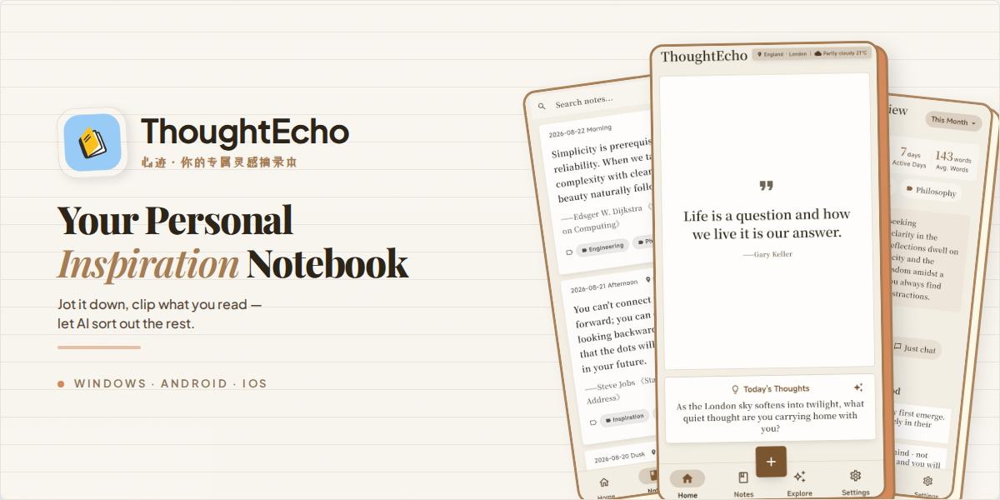
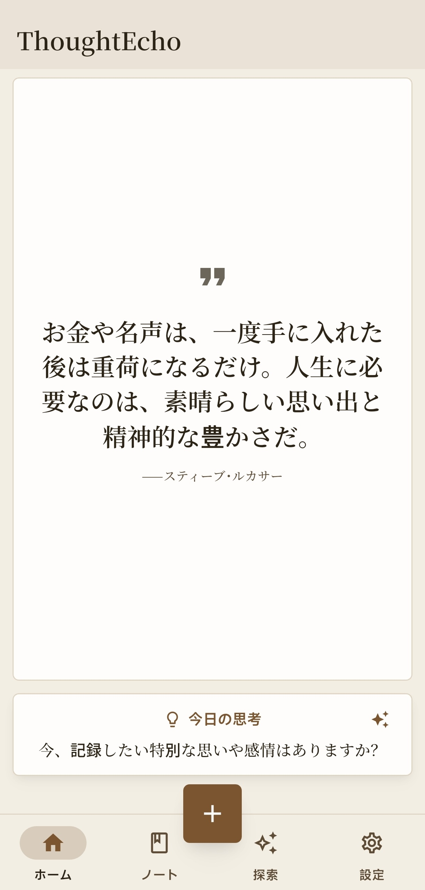

<div align="center">
  <a href="https://note.shangjinyun.cn/">
    
  </a>
  
  # ThoughtEcho (心迹)
  
  <p align="center">
    <b>📝 あなただけの AI インスピレーションノート · 思いついたらすぐ記録、読んだらすぐ抜粋、あとはAIにおまかせ。</b><br>
    <b>Your Personal AI-Powered Inspiration Notebook — Jot it down, clip what you read, let AI sort out the rest.</b>
  </p>

  <p align="center">
    <a href="https://github.com/Shangjin-Xiao/ThoughtEcho/releases/latest">
      
    </a>
    <a href="https://github.com/Shangjin-Xiao/ThoughtEcho/releases">
      
    </a>
    <a href="https://www.microsoft.com/store/apps/9NC7GDG6KFMC">
      
    </a>
    <a href="https://flutter.dev/">
      
    </a>
    <a href="https://github.com/Shangjin-Xiao/ThoughtEcho">
      
    </a>
    <a href="https://github.com/Shangjin-Xiao/ThoughtEcho/stargazers">
      
    </a>
    <a href="https://github.com/Shangjin-Xiao/ThoughtEcho/blob/main/LICENSE">
      
    </a>
  </p>

  <p align="center">
    <a href="README.md"><b>English</b></a> • 
    <a href="README_CN.md"><b>简体中文</b></a> •
    <a href="README_JA.md"><b>日本語</b></a> •
    <a href="README_KO.md"><b>한국어</b></a> •
    <a href="https://note.shangjinyun.cn/"><b>公式サイト</b></a> •
    <a href="docs/USER_MANUAL.md"><b>ユーザーマニュアル</b></a> •
    <a href="https://shangjin-xiao.github.io/ThoughtEcho/user-guide.html"><b>Webガイド</b></a>
  </p>

  <h3>📥 ダウンロード</h3>
  <p align="center">
    <a href="https://www.microsoft.com/store/apps/9NC7GDG6KFMC"></a>
    &nbsp;&nbsp;&nbsp;
    <a href="https://github.com/Shangjin-Xiao/ThoughtEcho/releases/latest"></a>
  </p>

  <p><sub>Windows: Microsoft Store 推奨（自動更新対応） · Android: <a href="https://github.com/Shangjin-Xiao/ThoughtEcho/releases/latest">GitHub Releases</a> から APK をダウンロード</sub></p>
  <p><sub>🌍 <b>多言語対応:</b> <b>日本語</b>、<b>English</b>、<b>简体中文</b>、<b>한국어</b> を完全サポート（ドイツ語、スペイン語、フランス語等は順次対応中）</sub></p>
  
</div>

---

> **ThoughtEcho（心迹）** は、エレガントでローカルファースト、AI駆動のクロスプラットフォームなインスピレーションノート＆引用抜粋アプリです。  
> **ThoughtEcho** is an elegant, local-first, AI-powered cross-platform inspiration and quote notebook designed to capture fleeting thoughts, organize reading excerpts, and unlock deeper creative potential.

---

## 🌟 なぜ ThoughtEcho なのか？

- 🔒 **ローカルファースト＆プライバシー保護**: SQLite と MMKV により、すべてのデータは端末ローカルに100%保持されます。機密ノートは非公開タグと生体認証（指紋 / Face ID / Windows Hello）で安全に保護。追跡や不要なクラウドの強制はありません。
- 💡 **Thoughter AI エージェント＆長期記憶**: OpenAI互換のマルチプロバイダーAIアーキテクチャ（OpenAI、DeepSeek、Ollama、Gemini、Claude、OpenRouter、SiliconFlowなど）。セッションを越えてあなたの好みを理解する自律型 Thoughter エージェントと専用の長期記憶データベースを搭載。
- ✍️ **リッチメディア＆コンテキスト記録**: Quill によるリッチテキスト装飾とマルチメディア添付（画像・音声・動画）。位置情報、天気、時間帯などのインスピレーション・コンテキストを自動記録。
- 📊 **定期インサイト＆シェアカード生成**: AIによる週次・月次の振り返りインサイト、年間レビューレポート、思考リズムの分析、ワンタップでの名言シェアカード生成。
- 🔄 **設定不要のマルチデバイス同期**: LocalSend LAN直接高速同期（mDNS検出と暗号化TLS転送）および柔軟な WebDAV クラウドバックアップ＆復元。
- 🎨 **こだわりのテーマとタイポグラフィ**: 読書に最適な手触りのある「紙と墨」「素箋」スタイル、および Material 3 ダイナミックカラーパレット。

<br>

## ✨ 主な機能

<div align="center">
  <table>
    <tr>
      <td align="center" width="33%"><b>✍️ リッチテキストノート</b><br>Quill リッチテキスト装飾、マルチメディア添付（画像/音声/動画）、プレーン＆リッチの二重保存</td>
      <td align="center" width="33%"><b>✨ Thoughter AI エージェント</b><br>エージェントツール呼び出し、専用の長期記憶データベース、対話型クリエイティブアシスタント</td>
      <td align="center" width="33%"><b>📊 インサイトとレポート</b><br>AI 定期インサイト、年間レビューレポート、創作リズムと執筆傾向の分析</td>
    </tr>
    <tr>
      <td align="center"><b>🏷️ タグと検索</b><br>複数タグフィルター、スマート絞り込み、高速なローカル SQLite 全文検索</td>
      <td align="center" width="33%"><b>🎯 AI カード生成</b><br>ノートを美しいデザインの共有カードにワンタップで変換</td>
      <td align="center"><b>📦 メディア＆バックアップ</b><br>大容量ファイルのストリーミングチャンク処理、ZIP 完全バックアップ/復元、増分同期</td>
    </tr>
    <tr>
      <td align="center"><b>🌍 コンテキスト記録</b><br>位置情報、天気、時間帯などのインスピレーション環境を自動記録</td>
      <td align="center"><b>🙈 プライバシー保護</b><br>非公開タグ + 生体認証（指紋 / Face ID / Windows Hello）ロック解除</td>
      <td align="center"><b>💾 下書き自動保存</b><br>リアルタイム自動保存と即時クラッシュ復元で大切なアイデアを保護</td>
    </tr>
    <tr>
      <td align="center"><b>⚡ クイックキャプチャ</b><br>スマートクリップボード監視、今日の一言（Hitokoto / ZenQuotes / 名言等）、AI 執筆プロンプト</td>
      <td align="center"><b>🎨 手触りのあるテーマ</b><br>「紙と墨」「素箋」および Material 3 ダイナミックカラートークン</td>
      <td align="center"><b>🔄 マルチデバイス同期</b><br>LocalSend LAN 高速直接転送 + WebDAV クラウドバックアップ＆復元</td>
    </tr>
  </table>
</div>

## 📸 アプリケーション スクリーンショット

### ホーム画面
<div align="center">
  
</div>

## 🛠️ 技術スタック

<div align="center">
  <table>
    <tr>
      <td align="center"><b>フレームワーク</b></td>
      <td>Flutter (Dart) - モダンでリアクティブなマルチプラットフォーム UI フレームワーク</td>
    </tr>
    <tr>
      <td align="center"><b>状態管理</b></td>
      <td>Provider, GetIt - リアクティブな状態オーケストレーションと依存性注入</td>
    </tr>
    <tr>
      <td align="center"><b>ローカルデータベース</b></td>
      <td>sqflite (モバイル) & sqflite_common_ffi (デスクトップ SQLite FFI)</td>
    </tr>
    <tr>
      <td align="center"><b>リッチテキストエンジン</b></td>
      <td>flutter_quill - 画像、音声、動画の埋め込みに対応したリッチタイポグラフィ</td>
    </tr>
    <tr>
      <td align="center"><b>AI アーキテクチャ</b></td>
      <td>OpenAI 互換プロトコル（プリセット：Ollama、OpenAI、DeepSeek、Gemini、Claude、OpenRouter、SiliconFlow）</td>
    </tr>
    <tr>
      <td align="center"><b>ストレージ＆セキュリティ</b></td>
      <td>MMKV (高性能キーバリューストレージ) + flutter_secure_storage (暗号化 API キー保存)</td>
    </tr>
    <tr>
      <td align="center"><b>マルチデバイス同期</b></td>
      <td>LocalSend (LAN mDNS 検出 & 暗号化 TLS 転送) + WebDAV クラウド同期</td>
    </tr>
    <tr>
      <td align="center"><b>メディア処理</b></td>
      <td>大容量ファイルのストリーミングチャンク処理、スマートキャッシュ、最適化</td>
    </tr>
    <tr>
      <td align="center"><b>対応プラットフォーム</b></td>
      <td>Windows、Android、iOS（※ Web プラットフォームは非対応）</td>
    </tr>
  </table>
</div>

## 🚀 クイックスタート

1. **前提条件**
   
   Flutter 3.29+ および Dart 3.5+ がインストールされていることを確認してください。`flutter doctor` を実行して環境を確認します：
   ```bash
   flutter doctor
   ```

2. **リポジトリのクローン**
   ```bash
   git clone https://github.com/Shangjin-Xiao/ThoughtEcho.git
   cd ThoughtEcho
   ```

3. **依存関係のインストール**
   ```bash
   flutter pub get
   ```

4. **アプリケーションの実行**
   ```bash
   flutter run
   ```

5. **AI サービスの設定（任意）**
   
   **設定 → AI設定** に移動し、お好みの AI プロバイダー（例：DeepSeek、Ollama、OpenAI 等）を選択して API キーを入力すると、AI Q&A や Thoughter エージェント、定期インサイトが利用可能になります。

## 🗺️ 開発ロードマップ

<div align="center">
  <table>
    <tr>
      <th>完了済み ✅</th>
      <th>長期計画 💡</th>
    </tr>
    <tr>
      <td>
        • マルチメディア対応リッチテキストエディタ（画像・音声・動画）<br>
        • OpenAI 互換のマルチ AI プロバイダーアーキテクチャ<br>
        • 専用の長期記憶を備えた Thoughter AI エージェント<br>
        • 「紙と墨」「素箋」「Material 3」の独自テーマスタイル<br>
        • カスタマイズ可能な共有テンプレート付き AI カード生成<br>
        • 大容量ファイルストリーミング＆完全 ZIP バックアップ/復元<br>
        • LocalSend LAN 直接転送＆WebDAV クラウド同期<br>
        • スマートジオコーディング検索＆天気情報の自動記録<br>
        • スマートクリップボード検知＆起動時クイックキャプチャ<br>
        • 定期的なスマートインサイト＆年間レポート<br>
        • 生体認証（指紋/Face ID）による非公開ノート保護<br>
        • リアルタイム下書き自動保存＆クラッシュ復元<br>
        • 多言語対応（日本語/英語/中国語/韓国語を完全サポート）<br>
        • Windows デスクトップアプリ（MSIX インストーラー）<br>
        • iOS プラットフォーム対応＆CI ビルドパイプライン<br>
        • テーマライブプレビュー付きアプリ内リリースノート
      </td>
      <td>
        <b>🔥 スマート入力の拡張</b><br>
        • AI 自然言語セマンティック検索<br>
        • 音声からテキストへのクイックキャプチャ<br>
        • カメラ OCR テキスト認識<br>
        • AI による著者・引用元の自動抽出<br><br>
        <b>🌍 ユーザー体験と知識の整理</b><br>
        • インタラクティブなノートテーマ＆カスタム紙質テクスチャ<br>
        • ナレッジグラフのリンク＆トピッククラスタリング<br>
        • 地図上の場所選択＆思い出フットプリント<br><br>
        <b>✨ オンデバイス AI の探求</b><br>
        • オンデバイス軽量オフライン LLM 推論<br>
        • ローカルオフライン OCR＆オフライン音声認識<br>
        • 他社製ノート形式のインポート/エクスポート対応拡充
      </td>
    </tr>
  </table>
</div>

> 📝 より詳細な技術ドキュメントについては、[プロジェクト概要](docs/project-overview.md) および [ユーザーマニュアル](docs/USER_MANUAL.md) をご覧ください。

## 🤝 コントリビューション

ThoughtEcho へのあらゆる貢献を歓迎します！

1. **問題の報告や機能リクエスト**: [GitHub Issues](https://github.com/Shangjin-Xiao/ThoughtEcho/issues) に Issue を作成してください。
2. **多言語化への協力 🌍**:
   - 未翻訳言語（ドイツ語、スペイン語、フランス語など）の翻訳補完
   - 既存の翻訳（日本語、英語、中国語、韓国語）のブラッシュアップ
3. **コードでの貢献**:
   - リポジトリをフォークし、ブランチ `feature/YourFeature` または `fix/YourBugFix` を作成
   - 解析（flutter analyze）とテストを通過することを確認
   - 変更内容を明確に記述して Pull Request を作成
4. **プロジェクトの応援**: ThoughtEcho リポジトリに Star ⭐ を付けて周りに広めてください！

## 📄 ライセンス

本プロジェクトは [MIT License](LICENSE) の下で公開されています。自由にご利用・改変・再配布いただけます。

## 🙏 謝辞

以下のオープンソースプロジェクトおよびサービス提供者に感謝申し上げます：
- [Flutter](https://flutter.dev/) - クロスプラットフォーム UI フレームワーク
- [LocalSend](https://github.com/localsend/localsend) - ローカルネットワーク同期プロトコル
- [Sentry](https://sentry.io/) - アプリケーションクラッシュ＆構造化ログ監視
- [Hitokoto](https://hitokoto.cn/) - 中国語今日の一言プロバイダー
- [ZenQuotes](https://zenquotes.io/) - 英語今日の一言プロバイダー
- [API Ninjas Quotes API](https://api-ninjas.com/api/quotes) - カテゴリ別名言プロバイダー
- [Meigen Oshieruyo](https://meigen.doodlenote.net/) - 日本語名言プロバイダー
- [Korean Advice](https://korean-advice-open-api.vercel.app/) - 韓国語名言プロバイダー
- [Open-Meteo](https://open-meteo.com/) - 気象データサービス
- [OpenStreetMap Nominatim](https://nominatim.openstreetmap.org/) - ジオコーディングサービス
