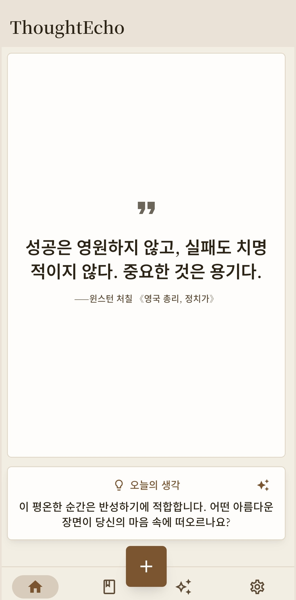

<div align="center">
  <a href="https://note.shangjinyun.cn/">
    
  </a>
  
  # ThoughtEcho (心迹)
  
  <p align="center">
    <b>📝 나만의 AI 영감 스크랩북 · 떠오르면 바로 적고, 읽으면 바로 발췌하고, 나머지는 AI에게 맡기세요.</b><br>
    <b>Your Personal AI-Powered Inspiration Notebook — Jot it down, clip what you read, let AI sort out the rest.</b>
  </p>

  <p align="center">
    <a href="https://github.com/Shangjin-Xiao/ThoughtEcho/releases/latest">
      
    </a>
    <a href="https://github.com/Shangjin-Xiao/ThoughtEcho/releases">
      
    </a>
    <a href="https://www.microsoft.com/store/apps/9NC7GDG6KFMC">
      
    </a>
    <a href="https://flutter.dev/">
      
    </a>
    <a href="https://github.com/Shangjin-Xiao/ThoughtEcho">
      
    </a>
    <a href="https://github.com/Shangjin-Xiao/ThoughtEcho/stargazers">
      
    </a>
    <a href="https://github.com/Shangjin-Xiao/ThoughtEcho/blob/main/LICENSE">
      
    </a>
  </p>

  <p align="center">
    <a href="README.md"><b>English</b></a> • 
    <a href="README_CN.md"><b>简体中文</b></a> •
    <a href="README_JA.md"><b>日本語</b></a> •
    <a href="README_KO.md"><b>한국어</b></a> •
    <a href="https://note.shangjinyun.cn/"><b>공식 웹사이트</b></a> •
    <a href="docs/USER_MANUAL.md"><b>사용자 매뉴얼</b></a> •
    <a href="https://shangjin-xiao.github.io/ThoughtEcho/user-guide.html"><b>웹 가이드</b></a>
  </p>

  <h3>📥 다운로드</h3>
  <p align="center">
    <a href="https://www.microsoft.com/store/apps/9NC7GDG6KFMC"></a>
    &nbsp;&nbsp;&nbsp;
    <a href="https://github.com/Shangjin-Xiao/ThoughtEcho/releases/latest"></a>
  </p>

  <p><sub>Windows: Microsoft Store 권장 (자동 업데이트 지원) · Android: <a href="https://github.com/Shangjin-Xiao/ThoughtEcho/releases/latest">GitHub Releases</a>에서 APK 다운로드</sub></p>
  <p><sub>🌍 <b>다국어 지원:</b> <b>한국어</b>, <b>English</b>, <b>简体中文</b>, <b>日本語</b> 완벽 지원 (독일어, 스페인어, 프랑스어 등 순차 지원 예정)</sub></p>
  
</div>

---

> **ThoughtEcho(心迹)** 는 우아하고 로컬 우선이며 AI가 결합된 크로스 플랫폼 영감 노트 및 발췌 앱입니다.  
> **ThoughtEcho** is an elegant, local-first, AI-powered cross-platform inspiration and quote notebook designed to capture fleeting thoughts, organize reading excerpts, and unlock deeper creative potential.

---

## 🌟 왜 ThoughtEcho인가요?

- 🔒 **로컬 우선 및 프라이버시 보호**: SQLite와 MMKV를 통해 모든 데이터는 100% 사용자 기기 로컬에 저장됩니다. 민감한 노트는 숨김 태그와 생체 인증(지문 / Face ID / Windows Hello)으로 안전하게 보호됩니다. 불필요한 추적이나 강제 클라우드 종속이 없습니다.
- 💡 **Thoughter AI 에이전트 & 장기 기억**: OpenAI 호환 멀티 AI 아키텍처(OpenAI, DeepSeek, Ollama, Gemini, Claude, OpenRouter, SiliconFlow 등 지원). 세션을 넘나들며 사용자의 글쓰기 성향을 이해하는 자율형 Thoughter 에이전트와 독립 장기 기억 데이터베이스를 탑재했습니다.
- ✍️ **풍부한 멀티미디어 & 맥락 기록**: Quill 기반의 풍부한 서식과 멀티미디어 첨부(이미지, 오디오, 비디오). 위치, 날씨, 시간대 등 영감이 떠오른 순간의 맥락을 자동으로 기록합니다.
- 📊 **주기별 인사이트 & 카드 생성**: AI가 생성하는 주간/월간 회고 인사이트, 연간 결산 보고서, 사고 패턴 분석, 원클릭 명언 공유 카드 생성.
- 🔄 **무설정 멀티 기기 동기화**: LocalSend LAN 직접 고속 전송(mDNS 자동 감지 및 암호화 TLS 전송) 및 유연한 WebDAV 클라우드 백업/복원.
- 🎨 **감성적인 테마와 타이포그래피**: 독서에 편안함을 주는 수공예 느낌의 「종이와 먹」, 「단아한 서간」 스타일 및 Material 3 동적 색상 팔레트.

<br>

## ✨ 주요 기능

<div align="center">
  <table>
    <tr>
      <td align="center" width="33%"><b>✍️ 리치 텍스트 노트</b><br>Quill 풍부한 서식 편집, 멀티미디어 첨부(이미지/오디오/비디오), 일반 텍스트 및 서식 텍스트 이중 저장</td>
      <td align="center" width="33%"><b>✨ Thoughter AI 에이전트</b><br>에이전트 도구 호출, 독립 장기 기억 데이터베이스, 대화형 창작 어시스턴트</td>
      <td align="center" width="33%"><b>📊 인사이트 및 보고서</b><br>AI 정기 인사이트, 연간 결산 보고서, 창작 리듬 및 작성 트렌드 심층 분석</td>
    </tr>
    <tr>
      <td align="center"><b>🏷️ 태그 및 검색</b><br>다중 태그 필터링, 지능형 정렬, 빠른 로컬 SQLite 전문 검색</td>
      <td align="center" width="33%"><b>🎯 AI 카드 생성</b><br>노트를 아름다운 디자인의 맞춤형 공유 카드로 변환</td>
      <td align="center"><b>📦 미디어 및 백업 허브</b><br>대용량 파일 스트리밍 청크 처리, ZIP 전체 백업 및 복원, 증분 동기화</td>
    </tr>
    <tr>
      <td align="center"><b>🌍 맥락 기록</b><br>위치, 날씨, 시간대 등 영감이 머물던 환경 정보 자동 기록</td>
      <td align="center"><b>🙈 프라이버시 보호</b><br>숨김 태그 + 생체 인증(지문 / Face ID / Windows Hello) 잠금 해제</td>
      <td align="center"><b>💾 임시 저장 자동화</b><br>실시간 자동 임시 저장 및 충돌 발생 시 즉시 복구로 데이터 보호</td>
    </tr>
    <tr>
      <td align="center"><b>⚡ 빠른 캡처</b><br>스마트 클립보드 감지, 오늘의 한마디(Hitokoto / ZenQuotes / 명언 등), AI 글쓰기 프롬프트</td>
      <td align="center"><b>🎨 감성 테마 스타일</b><br>「종이와 먹」, 「단아한 서간」 및 Material 3 동적 색상 토큰</td>
      <td align="center"><b>🔄 멀티 기기 동기화</b><br>LocalSend LAN 고속 직접 전송 + WebDAV 클라우드 백업 및 복원</td>
    </tr>
  </table>
</div>

## 📸 애플리케이션 스크린샷

### 홈 화면
<div align="center">
  
</div>

## 🛠️ 기술 스택

<div align="center">
  <table>
    <tr>
      <td align="center"><b>프레임워크</b></td>
      <td>Flutter (Dart) - 현대적이고 반응성이 뛰어난 크로스 플랫폼 UI 프레임워크</td>
    </tr>
    <tr>
      <td align="center"><b>상태 관리</b></td>
      <td>Provider, GetIt - 반응형 상태 오케스트레이션 및 의존성 주입</td>
    </tr>
    <tr>
      <td align="center"><b>로컬 데이터베이스</b></td>
      <td>sqflite (모바일) & sqflite_common_ffi (데스크톱 SQLite FFI)</td>
    </tr>
    <tr>
      <td align="center"><b>리치 텍스트 엔진</b></td>
      <td>flutter_quill - 이미지, 오디오, 비디오 임베딩을 지원하는 풍부한 타이포그래피</td>
    </tr>
    <tr>
      <td align="center"><b>AI 아키텍처</b></td>
      <td>OpenAI 호환 프로토콜 아키텍처 (프리셋: Ollama, OpenAI, DeepSeek, Gemini, Claude, OpenRouter, SiliconFlow)</td>
    </tr>
    <tr>
      <td align="center"><b>스토리지 및 보안</b></td>
      <td>MMKV (고성능 키-값 캐싱) + flutter_secure_storage (암호화된 API 키 저장)</td>
    </tr>
    <tr>
      <td align="center"><b>멀티 기기 동기화</b></td>
      <td>LocalSend (LAN mDNS 감지 & TLS 암호화 전송) + WebDAV 클라우드 동기화</td>
    </tr>
    <tr>
      <td align="center"><b>미디어 처리</b></td>
      <td>대용량 파일 스트리밍 청크 처리, 스마트 캐싱, 무손실 압축 최적화</td>
    </tr>
    <tr>
      <td align="center"><b>지원 플랫폼</b></td>
      <td>Windows, Android, iOS (※ Web 플랫폼은 지원하지 않습니다)</td>
    </tr>
  </table>
</div>

## 🚀 빠른 시작

1. **사전 준비**
   
   Flutter 3.29+ 및 Dart 3.5+ 가 설치되어 있는지 확인하세요. `flutter doctor` 명령어로 환경을 확인합니다:
   ```bash
   flutter doctor
   ```

2. **저장소 복제**
   ```bash
   git clone https://github.com/Shangjin-Xiao/ThoughtEcho.git
   cd ThoughtEcho
   ```

3. **종속성 설치**
   ```bash
   flutter pub get
   ```

4. **애플리케이션 실행**
   ```bash
   flutter run
   ```

5. **AI 서비스 설정 (선택 사항)**
   
   **설정 → AI 설정**으로 이동하여 원하는 AI 제공업체(예: DeepSeek, Ollama, OpenAI 등)를 선택하고 API 키를 입력하면 AI 질의응답, Thoughter 에이전트, 정기 인사이트 기능을 바로 사용할 수 있습니다.

## 🗺️ 개발 로드맵

<div align="center">
  <table>
    <tr>
      <th>완료됨 ✅</th>
      <th>장기 계획 💡</th>
    </tr>
    <tr>
      <td>
        • 멀티미디어 지원 서식 에디터 (이미지, 오디오, 비디오)<br>
        • OpenAI 호환 멀티 AI 제공업체 아키텍처<br>
        • 독립 장기 기억을 갖춘 Thoughter AI 에이전트<br>
        • 「종이와 먹」, 「단아한 서간」, 「Material 3」 맞춤 테마 스타일<br>
        • 커스텀 공유 템플릿을 갖춘 AI 카드 생성<br>
        • 대용량 파일 스트리밍 & ZIP 전체 백업 및 복원<br>
        • LocalSend LAN 직접 전송 & WebDAV 클라우드 동기화<br>
        • 스마트 지오코딩 검색 & 날씨 정보 자동 기록<br>
        • 스마트 클립보드 감지 & 앱 실행 시 빠른 캡처<br>
        • 정기 스마트 인사이트 & 연간 결산 보고서<br>
        • 생체 인증(지문/Face ID) 기반 숨김 노트 보호<br>
        • 실시간 임시 저장 자동화 & 충돌 복구<br>
        • 다국어 지원 (한국어/영어/중국어/일본어 완벽 지원)<br>
        • Windows 데스크톱 애플리케이션 (MSIX 설치 프로그램)<br>
        • iOS 플랫폼 지원 & CI 빌드 파이프라인<br>
        • 테마 실시간 미리보기를 제공하는 인앱 릴리스 노트
      </td>
      <td>
        <b>🔥 스마트 입력 기능 확장</b><br>
        • AI 자연어 시맨틱 검색<br>
        • 음성-텍스트 변환 빠른 캡처<br>
        • 카메라 OCR 텍스트 인식<br>
        • AI 기반 저자 및 출처 자동 추출<br><br>
        <b>🌍 사용자 경험 및 지식 관리</b><br>
        • 인터랙티브 노트 테마 & 맞춤 종이 질감<br>
        • 지식 그래프 연결 & 주제 클러스터링<br>
        • 지도 기반 위치 선택 & 기억 발자취<br><br>
        <b>✨ 온디바이스 AI 탐색</b><br>
        • 온디바이스 경량 오프라인 LLM 추론<br>
        • 로컬 오프라인 OCR & 오프라인 음성 인식<br>
        • 타사 노트 포맷 가져오기/내보내기 지원 확대
      </td>
    </tr>
  </table>
</div>

> 📝 상세 기술 문서는 [프로젝트 개요](docs/project-overview.md) 및 [사용자 매뉴얼](docs/USER_MANUAL.md)을 참조하세요.

## 🤝 기여 안내

ThoughtEcho 프로젝트에 대한 모든 형태의 기여를 환영합니다!

1. **이슈 및 기능 제안**: [GitHub Issues](https://github.com/Shangjin-Xiao/ThoughtEcho/issues)에서 이슈를 등록해 주세요.
2. **다국어 번역 지원 🌍**:
   - 미번역 언어(독일어, 스페인어, 프랑스어 등) 번역 보완
   - 기존 번역(한국어, 영어, 중국어, 일본어) 품질 개선
3. **코드 기여**:
   - 저장소를 Fork하고 브랜치 `feature/YourFeature` 또는 `fix/YourBugFix` 생성
   - 코드 분석(flutter analyze) 및 테스트 통과 확인
   - 변경 사항을 명확히 설명하는 Pull Request 생성
4. **프로젝트 응원**: ThoughtEcho 저장소에 Star ⭐를 누르고 널리 공유해 주세요!

## 📄 라이선스

본 프로젝트는 [MIT License](LICENSE)에 따라 라이선스가 부여됩니다. 자유롭게 사용, 수정 및 배포할 수 있습니다.

## 🙏 감사의 글

다음 오픈소스 프로젝트 및 서비스 제공자에게 감사드립니다:
- [Flutter](https://flutter.dev/) - 크로스 플랫폼 UI 프레임워크
- [LocalSend](https://github.com/localsend/localsend) - 로컬 네트워크 동기화 프로토콜
- [Sentry](https://sentry.io/) - 애플리케이션 충돌 및 구조화 로그 모니터링
- [Hitokoto](https://hitokoto.cn/) - 중국어 명언 서비스
- [ZenQuotes](https://zenquotes.io/) - 영어 명언 서비스
- [API Ninjas Quotes API](https://api-ninjas.com/api/quotes) - 카테고리별 명언 서비스
- [Meigen Oshieruyo](https://meigen.doodlenote.net/) - 일본어 명언 서비스
- [Korean Advice](https://korean-advice-open-api.vercel.app/) - 한국어 명언 서비스
- [Open-Meteo](https://open-meteo.com/) - 기상 데이터 서비스
- [OpenStreetMap Nominatim](https://nominatim.openstreetmap.org/) - 지오코딩 서비스
