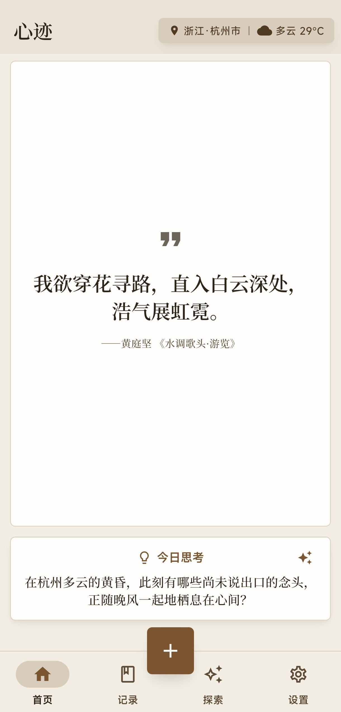
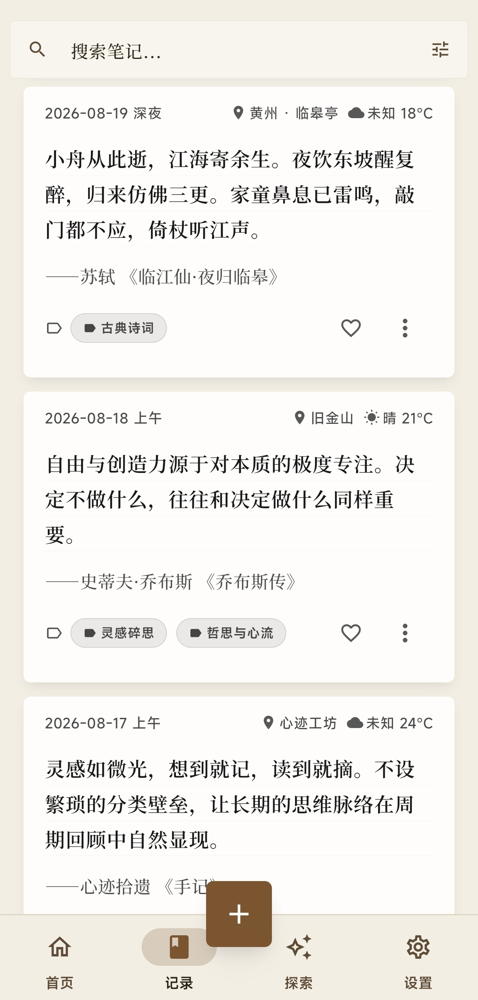
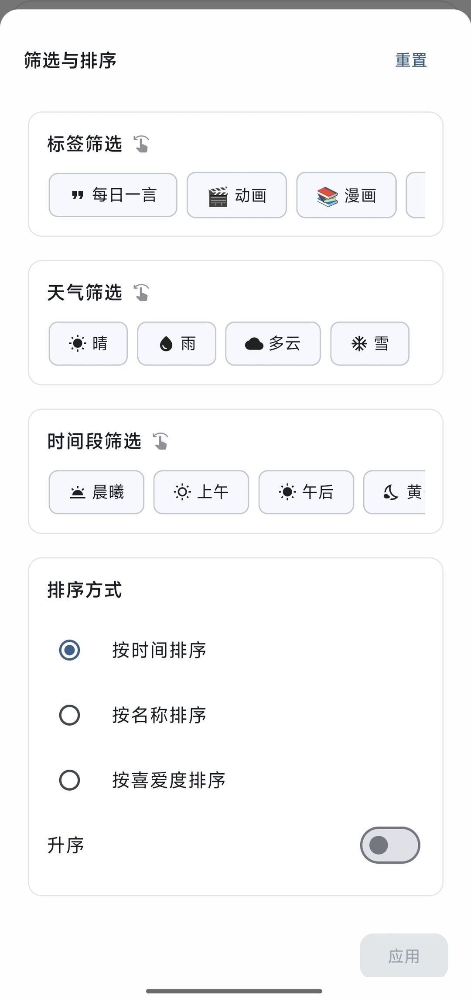
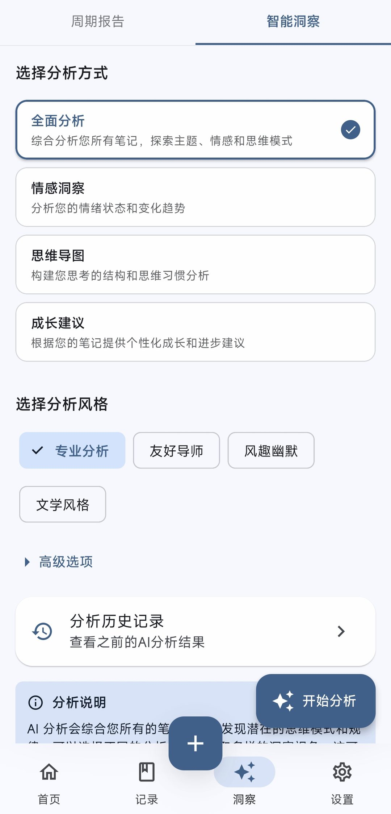
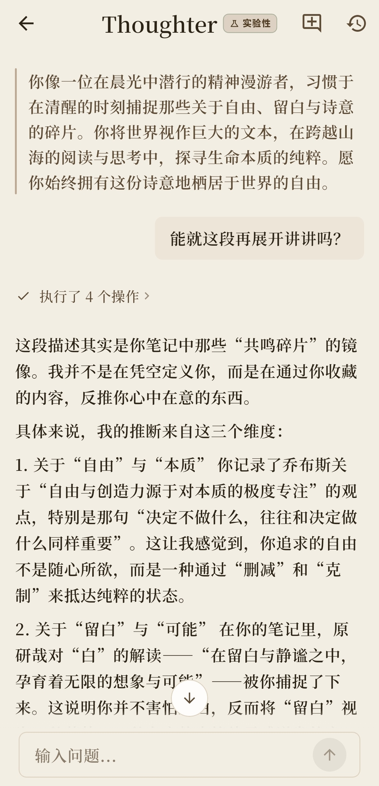
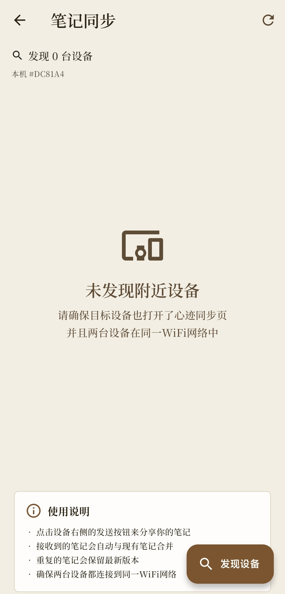
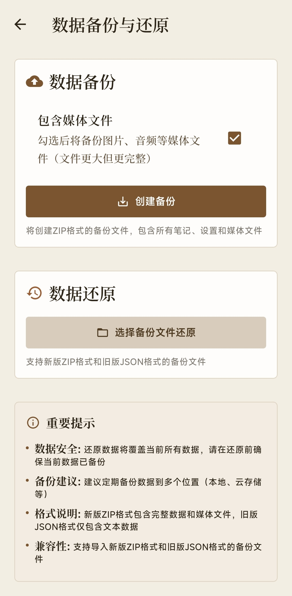
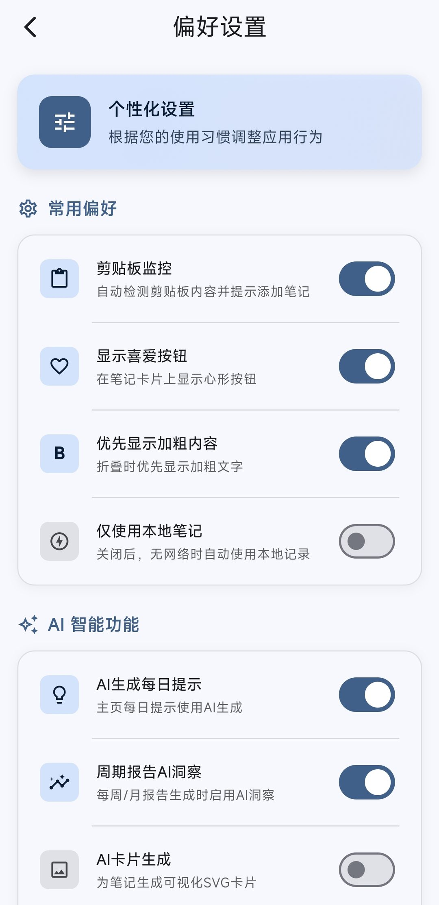
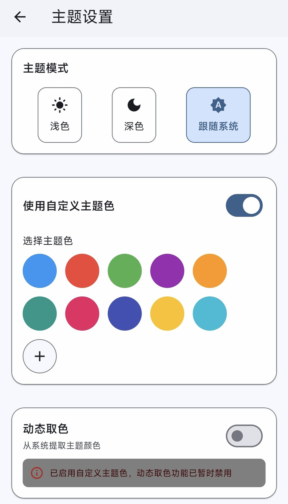

# 用户手册 / User Manual

[中文版](#-中文版本) | [English Version](#-english-version) | [网页版 / Web Version](https://shangjin-xiao.github.io/ThoughtEcho/user-guide.html)

---

# 心迹 (ThoughtEcho) 用户手册

欢迎使用心迹，您的专属 AI 灵感笔记本。本手册将帮助您快速了解应用的全部功能。

## 目录

1. [快速入门](#1-快速入门)
2. [AI 服务配置](#2-ai-服务配置)
3. [富文本编辑器](#3-富文本编辑器)
4. [笔记管理](#4-笔记管理)
5. [AI 功能](#5-ai-功能)
6. [设备同步](#6-设备同步)
7. [备份与恢复](#7-备份与恢复)
8. [设置详解](#8-设置详解)
9. [常见问题](#9-常见问题)

---

## 1. 快速入门

### 首次启动

- 应用会显示引导页面，介绍核心功能
- 可选择语言偏好与每日一言服务商
- 如有旧版数据，支持自动迁移

### 主页界面

- **底部导航**：首页、笔记列表、洞察、设置
- **每日灵感**：显示一言和 AI 生成的写作提示
- **快速捕获按钮（+）**：
  - 短按：快速添加笔记
  - 长按：语音输入
- **剪贴板检测**：切回应用时自动检测剪贴板内容并提示保存

---

## 2. AI 服务配置

> ⚠️ **重要**：AI 功能需要先配置一个 AI 服务才能使用

**访问路径**：设置 → AI 设置

### 推荐：Ollama 云端（新手首选）

Ollama 云端注册即用，免费额度充足，**不需要绑定支付方式**，是第一次配置 AI 的
最省事选择。

1. 打开 [ollama.com](https://ollama.com) 注册账号
2. 进入 [API Keys 页面](https://ollama.com/settings/keys) 创建一个密钥并复制
3. 回到心迹：「设置」→「AI 设置」→ 点「一键添加」（首次配置时会直接显示在页面上）
4. 把密钥粘进 API Key 输入框
5. 点「测试连接」，成功后点「保存」

接口地址是 `https://ollama.com/v1`，模型默认填 `gemma4:31b-cloud`，也可以换成
`gpt-oss:120b-cloud`、`gpt-oss:20b-cloud`、`minimax-m3:cloud` 等云端模型。

### 支持的服务商

心迹的 AI 接入统一走 **OpenAI 兼容接口**，内置了以下服务商模板：

| 服务商 | 说明 |
| --- | --- |
| Ollama 云端 | 免费额度充足，推荐新手 |
| OpenAI | 官方接口，需要海外支付方式 |
| OpenRouter | 一个 Key 调用 Claude、Gemini 等上百个模型 |
| DeepSeek | 国内直连，价格低，中文表现好 |
| 硅基流动 | 国内聚合平台，部分小模型免费 |
| 智谱 GLM | 国内直连，glm-4-flash 免费 |
| 月之暗面 Kimi | 国内直连，长上下文表现好 |
| 阿里云百炼 | 通义千问系列的 OpenAI 兼容接口 |
| 火山方舟 | 豆包系列，模型名填推理接入点 ID |
| Google Gemini | Gemini 官方的 OpenAI 兼容接口，有免费额度 |
| Ollama（本地） | 连接本机 Ollama，不联网、不需要密钥 |
| LM Studio | 连接本机 LM Studio，不联网、不需要密钥 |
| 自定义 | 任何 OpenAI 兼容接口，地址和模型手填 |

> 💡 **想用 Claude？** 选 OpenRouter，模型填 `anthropic/claude-sonnet-4.5`。
> Anthropic 官方的 `/v1/messages` 协议与 OpenAI 格式不兼容，心迹暂未支持直连。

### 配置步骤

1. 打开「设置」→「AI 设置」
2. 点「添加 AI 服务」
3. 在「选择服务商」里挑一个模板，接口地址和模型会自动填好
4. 填入 API Key（模板下方有「获取 API Key」直达链接）
5. 需要的话改一下模型名，常用模型可以直接点选
6. 点「测试连接」验证——**不需要先保存也能测**
7. 点「保存」

保存后这条配置会出现在「我的 AI 服务」列表里并自动设为当前使用。点击列表中的
其他配置即可切换，点右侧「⋮」可以编辑、测试、重命名或删除。

> 💡 **接口地址怎么填**：填服务商文档给的 base URL（例如 `https://ollama.com/v1`）
> 就行，心迹会自动补成 `/chat/completions`；填完整地址也可以。

### 本地 AI 配置（Ollama）

本地 AI 在你自己的电脑上运行，免费且不需要联网。

1. **安装 Ollama**：访问 [ollama.com](https://ollama.com) 下载安装，并 `ollama pull` 一个模型
2. **在心迹中配置**：选「Ollama」模板 → 填入你下载的模型名 → 测试连接并保存

### 本地 AI 配置（LM Studio）

1. **安装 LM Studio**：访问 [lmstudio.ai](https://lmstudio.ai) 下载，下载模型后启动本地服务器
2. **在心迹中配置**：选「LM Studio」模板 → 填入已加载的模型名 → 测试连接并保存

> ⚠️ 手机连本机的 Ollama / LM Studio 时，`localhost` 要改成电脑的局域网 IP，
> 并确保推理服务允许局域网访问。

### API Key 安全说明

> 🔐 **你的密钥是安全的**：
>
> - API Key 加密保存在本机安全存储中，不写进普通配置文件
> - 密钥不会被包含在备份文件里
> - 删除一条配置时，对应的密钥会一起删除

### 多服务商支持

心迹支持同时保存多个 AI 服务配置：

- 随时在列表里一键切换当前使用的服务
- 当前服务不可用时会自动尝试其他已配置的服务

---

## 3. 富文本编辑器

### 工具栏功能

编辑器提供丰富的文字排版工具：

- **撤销/重做** - 撤销或恢复操作
- **文字样式** - 加粗、斜体、下划线、删除线
- **标题** - 支持多级标题
- **字体控制** - 调整字号和字体
- **文字颜色** - 设置文字颜色和背景高亮
- **文本对齐** - 左对齐、居中、右对齐、两端对齐
- **列表** - 有序列表、无序列表、缩进控制
- **引用和代码** - 添加引用块或代码格式
- **链接** - 插入或编辑链接
- **媒体** - 插入图片、视频、音频。**特别说明**：心迹支持直接插入、查看和播放采用 Google Motion Photo 格式的**实况照片 (Live Photos)**（由 [FrameEcho (帧迹)](https://github.com/Shangjin-Xiao/FrameEcho) 技术支持呈现）。
- **清除格式** - 移除所有格式
- **搜索** - 在文档中搜索内容

### Thoughter 辅助功能（✨ 按钮，实验性 / Beta）

> ⚠️ **实验性功能说明**：Thoughter 属于实验性 AI Agent 助手。AI 回答可能包含错误或不准确内容，请客观核查；AI 不会直接改写您的笔记，所有的创建与修改建议均必须由您点击保存/应用后才会生效。

点击编辑器顶部的 ✨ 按钮，可使用以下 AI 功能：

| 功能                   | 说明                       |
| ---------------------- | -------------------------- |
| **自动查找作者和出处** | 自动识别笔记的作者和出处   |
| **润色文本**           | AI 帮您改进文字表达        |
| **续写**               | AI 根据上下文继续您的思路  |
| **深度分析**           | 生成笔记的总结和洞察       |
| **问笔记**             | 针对笔记内容与 AI 对话交流 |

Agent 会在工具调用后继续处理结果，并将完整回答保留为最终消息。新建或编辑建议会以卡片展示最终笔记，可生成普通文本或原生富文本；编辑建议可展开「查看修改记录」，确认后只修改匹配的段落并保留其他格式和媒体。普通笔记默认保持普通模式，转换为富文本时会明确提示。如果笔记在建议生成后又被修改，应用会拒绝覆盖并要求重新生成建议。

### 附加信息编辑面板

点击编辑器顶部的 ✏️ 按钮或「编辑附加信息」，可编辑笔记的附加信息：

#### 来源信息

- **作者**：填写笔记的作者姓名
- **出处**：填写来源作品、书籍或网站
- 可以点击 AI 按钮自动识别作者和出处

#### 颜色标记

- 提供 21 种预设颜色供选择
- 也可以使用颜色选择器自定义颜色
- 点击「移除」可清除颜色标记

#### 标签选择

- 可以为笔记添加多个标签
- 支持搜索查找标签
- 标签区域可以展开或折叠
- 顶部会显示已选择的标签数量

#### 位置和天气

- **位置开关**：开启后会自动获取您当前的位置
- **天气开关**：开启后会自动获取当前天气信息
- 在编辑模式下可以手动修改位置
- 如果是记录过去的事情，可以手动选择当时的天气

### 快速捕获与系统级摘录 (Android)

心迹提供了多种快速记录灵感的方式：

- **剪贴板检测**：开启后，当您复制了文本回到心迹，会提示您快速保存为笔记。
- **系统级文本摘录 (Android 专属)**：
  - 在任何其他应用（如浏览器、阅读器等）中选中文本。
  - 在弹出的系统菜单中选择「分享」或「在心迹中摘录」。
  - 心迹将自动新建笔记并填入您选中的文本。
  - **更智能的是**：心迹会尝试自动预填充该内容的**来源应用**信息以及相关的**标签**，让您的知识管理更加无缝。

### 自动保存与默认模板

- **草稿自动保存**：每 2 秒自动保存草稿到本地存储。
- **草稿恢复**：重新打开编辑器时可恢复上次草稿。
- **笔记默认模板**：您可以在设置中开启此功能，每次新建笔记时将自动带入预设的文本格式（如每日回顾的固定结构）。
- **手动保存**：点击顶部工具栏的 💾 按钮。
- **保存进度**：显示实时保存状态和进度条。

---

## 4. 笔记管理

### 排序选项（3 种）

| 排序方式       | 说明                            |
| -------------- | ------------------------------- |
| **时间排序**   | 按创建/修改时间排序（默认降序） |
| **名称排序**   | 按笔记标题字母顺序排序          |
| **喜爱度排序** | 按收藏次数排序                  |

每种排序均支持升序/降序切换。

### 回收站

- 支持软删除笔记，可在回收站中恢复或永久删除。
- 支持配置 7天/30天/90天 的保留期，到期自动清理。

### 筛选选项（3 类）

#### 标签筛选

- 按自定义分类标签筛选
- 支持隐藏标签（需生物识别验证）
- 横向滚动的标签选择器
- 支持 emoji 和 Material 图标

#### 天气筛选

- 按天气类型筛选：晴天、阴天、雨天、雪天、雾天等
- 选择某一天气类别会包含该类别下所有天气
- 图标化显示

#### 时间段筛选

- 早晨、下午、傍晚、夜间
- 可多选
- 用于按创作时段查找笔记

所有筛选条件可组合使用，支持重置。

### 笔记操作

#### 主要操作

| 操作         | 方式               | 说明                       |
| ------------ | ------------------ | -------------------------- |
| **编辑**     | 菜单 → 编辑        | 打开富文本编辑器           |
| **问 AI**    | 菜单 → 问 AI       | 与 AI 对话讨论笔记         |
| **生成卡片** | 菜单 → 生成卡片    | AI 生成精美分享卡片        |
| **导出 PDF** | 菜单 / 批量选择 → 导出 PDF | 生成标准 A4 尺寸富文本 PDF，支持打印预览 |
| **删除**     | 菜单 → 删除 / 左滑 | 删除笔记                   |
| **收藏**     | 点击 ❤️            | 增加喜爱度（最高显示 99+） |

### AI 卡片生成（20 种模板）

点击「生成卡片」后，AI 会根据笔记内容生成 SVG 格式的精美卡片。

**卡片风格**：

- **Knowledge** - 极光渐变、玻璃拟态、高对比度
- **SOTA Modern** - 网格渐变、浮动卡片、动态阴影
- **Mindful** - 有机形状、大地色系、纸张纹理
- **Neon Cyber** - 深色网格、霓虹线条、等宽字体
- **Quote** - 居中文字、蓝色网格背景
- **Philosophical** - 极简主义与象征元素
- **Minimalist** - 简约排版
- **Nature** - 自然元素、自然色彩
- **Retro** - 复古设计美学
- **Ink** - 传统水墨风格
- **Cyberpunk** - 高科技美学
- **Geometric** - 几何图案设计
- **Academic** - 学术研究风格
- **Emotional** - 柔和渐变、温暖圆角
- **Dev** - 代码/技术笔记风格
- **Classic Serif** - 传统衬线字体
- **Modern Pop** - 现代流行色彩
- **Soft Gradient** - 柔和渐变
- **Polaroid** - 拍立得风格
- **Magazine** - 杂志排版风格

**卡片附加信息**：自动包含作者、日期、位置、天气、温度、时段等信息。

---

## 5. AI 功能

### Thoughter AI 对话助手

> ⚠️ **实验性功能**：Thoughter 目前为实验性 AI Agent 助手，AI 回答可能包含错误，请自行核查；Thoughter 不会直接改写您的笔记，所有创建和修改建议须由您点击「保存」/「应用」后才会生效。

Thoughter 是心迹内置的 AI 对话助手，支持自然语言对话、笔记联动分析与 Agent 工作流，帮助您整理思路、挖掘洞察并快速创作。

**访问路径**：

- **探索 Tab**（底部导航第三项）→ 直接进入 Thoughter Agent 对话
- **笔记菜单** → 「问 AI」→ 进入与该笔记绑定的对话
- **编辑器 ✨ 按钮** → 「问笔记」→ 在编辑器内启动针对当前笔记的对话

**三种对话模式**：

| 模式 | 说明 |
| ---- | ---- |
| **Agent 模式** | 默认模式。Thoughter 可主动调用工具搜索、分析笔记并提出创建/编辑建议，适合开放性探索与创作任务 |
| **问笔记** | 绑定到特定笔记，Thoughter 基于该笔记内容回答问题，不会随意扩展 |
| **自由对话** | 纯对话模式，不绑定笔记内容 |

**Agent 工具能力**：

在 Agent 模式下，Thoughter 可以调用以下工具，工具调用过程会实时展示在对话界面：

| 工具 | 说明 |
| ---- | ---- |
| **搜索笔记** | 按关键词、标签、日期、天气、时段等条件检索您的笔记 |
| **获取笔记详情** | 读取特定笔记的完整内容及元数据 |
| **获取标签列表** | 查询您已有的全部标签 |
| **获取位置和天气** | 获取当前位置与天气信息 |
| **联网搜索** | 通过搜索引擎检索实时信息（只读） |
| **抓取网页** | 读取指定网址的页面内容（只读） |
| **提议新建笔记** | 生成新笔记草稿，由您确认后保存 |
| **提议编辑笔记** | 对已有笔记提出局部或全文修改建议，由您确认后应用 |

**笔记提案卡片**：

当 Thoughter 提议创建或编辑笔记时，会以卡片形式展示最终内容，支持普通文本和原生富文本两种格式。编辑建议卡片可展开「查看修改记录」，确认后只修改匹配段落并保留其余格式与媒体。若笔记在建议生成后被修改，Thoughter 会拒绝覆盖并要求重新生成。

**跨会话长期记忆与个性化**：

- **长期记忆**：Thoughter 支持跨会话记住您的写作偏好、表达习惯与个人背景，并在对话中自动保持一致。
- **隐私与物理隔离**：长期记忆存储于本地独立数据库，绝不上传云端，不进入多端同步与数据备份，保障您的绝对隐私。
- **用户称呼**：支持在 Thoughter 中设置自定义昵称，让 AI 按照您喜欢的方式称呼您。
- **记忆管理**：可在「设置」→「AI 设置」中随时查看当前已记录的画像条目或一键清空记忆。

**思考过程与快捷操作**：

- **深度思考展示**：搭配支持推理思考的模型时，点击 💡 灯泡图标可展开查看 AI 的完整思考链路与耗时。
- **快捷操作栏**：每条 AI 回复下方均配备快捷操作栏，支持一键复制内容、重试生成或直接采纳提案。

**历史对话**：

- 点击右上角「历史」图标可查看并恢复历史对话记录。
- 点击右上角「新建对话」图标可开启全新会话。

---

### 每日灵感

AI 会根据时间、天气、位置等情况，为您生成个性化的写作提示。

**特点**：

- 早晨/白天的提示更偏向行动（目标、勇气、选择、专注）
- 傍晚/夜间的提示更偏向反思（情感、意义、宽恕、感恩）
- 支持中英文等多种语言
- 没有网络时也可以使用本地生成功能

### 周期性报告

**访问路径**：洞察 → 周期报告

**报告类型**：

- **周报**：过去 7 天的笔记统计
- **月报**：过去 30 天的笔记统计
- **年报**：全年笔记统计

**报告内容**：

- 笔记总数、总字数、活跃天数统计
- 最常见的创作时段（早晨/下午/傍晚/夜间）
- 天气模式分析
- 常用标签统计
- AI 生成的诗意洞察
- 精选笔记卡片展示

### AI 洞察分析

**访问路径**：洞察 → AI 洞察

#### 分析类型（4 种）

| 类型         | 说明                                                              |
| ------------ | ----------------------------------------------------------------- |
| **综合分析** | 整合主题、情感、价值观、行为模式，全方位概览                      |
| **情感分析** | 识别表层和深层情感、触发因素、未满足需求，提供情绪调节策略        |
| **思维导图** | 提取 5-9 个核心思想节点，绘制 8-15 个连接关系（因果、对比、递归） |
| **成长分析** | 识别驱动力/价值观、形成中的能力/习惯，制定 30 天行动计划          |

#### 分析风格（4 种）

| 风格     | 说明                 |
| -------- | -------------------- |
| **专业** | 清晰、客观的专业分析 |
| **友好** | 温暖、鼓励的建议     |
| **幽默** | 轻松有趣的表达方式   |
| **文学** | 富有诗意的语言风格   |

分析结果以清晰的结构呈现，包含洞察、证据、建议和反思问题。

### 问笔记聊天

**功能说明**：针对特定笔记内容与 AI 进行对话。

**特点**：

- AI 能够理解笔记内容并回答相关问题
- 只回答与笔记相关的内容，不会随意扩展
- 如果笔记中没有相关信息，AI 会直接告诉您
- 您可以边看边读 AI 生成的回答。

---

## 6. 设备同步

### WebDAV 云端同步 (Beta)

心迹支持使用 WebDAV 协议进行安全可靠的云端同步：
- **配置路径**：设置 → WebDAV 同步
- **安全与流量控制**：支持强制 HTTPS 加密传输，并可限制移动网络下同步以节省流量。
- **冲突隔离**：在多端云同步时，如果发生笔记内容冲突将被妥善隔离，避免您的数据遭到意外覆盖。

### 局域网直接同步

心迹也支持在同一 WiFi 网络下的设备间直接同步，无需云服务器。

- 笔记数据会完整发送并按最后修改时间智能合并。
- 图片、音频和视频会先与接收端清单比较，只传输缺失或大小发生变化的文件，以减少重复打包和传输。
- 媒体增量同步不会删除接收端已有文件；与旧版本设备同步时会自动回退到完整媒体传输。

### 同步流程

1. **寻找设备**：应用会自动在同一 WiFi 网络中寻找您的其他心迹设备
2. **选择设备**：从列表中选择要同步的目标设备
3. **传输数据**：发送或接收笔记数据
4. **自动合并**：智能合并两台设备的笔记

### 合并规则

当两台设备有相同笔记时，应用会：

- 应用会保留您最后一次修改的内容
- 如果修改时间相同但内容不同，会记录为冲突供您处理

同步完成后会显示：

- 新增了多少条笔记
- 更新了多少条笔记
- 跳过了多少条笔记（因为本地版本更新）
- 是否有冲突需要处理

### 支持平台

| 平台    | 支持情况    | 说明 |
| ------- | ----------- | ---- |
| Android | ✅ 完整支持 | 原生应用支持（支持 APK 安装） |
| Windows | ✅ 完整支持 | 原生应用支持（支持微软商店安装） |
| iOS     | ✅ 完整支持 | 原生应用支持 |

> 💡 **跨平台互通**：在局域网同步中，心迹基于标准协议运作，同 WiFi 下可与运行了 LocalSend 客户端的其他设备（包含 macOS、Linux）直接发现并互相传输笔记。

---

## 7. 备份与恢复

### 备份格式

心迹的备份文件为 ZIP 格式，包含：

- 所有笔记数据
- 图片、视频、音频等媒体文件

旧版本的 JSON 格式备份也可以导入，应用会自动识别和转换。

### 恢复模式

导入备份时可以选择三种模式：

| 模式     | 说明                                 | 适用场景                 |
| -------- | ------------------------------------ | ------------------------ |
| **覆盖** | 清空当前所有数据，完全替换为备份内容 | 换新设备，想完整恢复数据 |
| **合并** | 智能合并备份和当前数据               | 从其他设备同步数据       |
| **追加** | 直接添加备份中的笔记                 | 导入补充数据             |

### 备份操作步骤

**访问路径**：设置 → 备份与恢复

#### 创建备份

1. 点击「创建备份」按钮
2. 选择保存位置
3. 等待备份完成（会显示进度条）
4. 备份文件会保存为 `.zip` 格式

#### 恢复备份

1. 点击「恢复备份」按钮
2. 选择备份文件（支持 `.zip` 或旧版 `.json` 格式）
3. 选择恢复模式（覆盖、合并或追加）
4. 等待恢复完成

---

## 8. 设置详解

### 位置与天气

- **位置服务开关**：控制是否允许应用获取您的位置
- **位置状态**：
  - ✅ 位置功能已开启
  - ⚠️ 已允许权限但功能未启用
  - ❌ 未允许位置权限
- **城市搜索**：支持搜索历史记录与语言感知在线搜索（基于 Open-Meteo），方便精准选定城市并获取匹配天气
- **当前地址**：显示您设置的位置或「未设置」

### 语言设置

应用支持多种语言，包括中文、英文、日文、韩文、西班牙文、法文、德文等。也可以选择跟随系统语言。

### 主题设置

#### 主题风格（3 种）

心迹提供了三种独特的设计风格：

| 风格 | 说明 | 特点 |
| --- | --- | --- |
| 🎨 **Material** | 标准 Material 3 风格（默认） | 支持 Material You 动态壁纸取色或自定义主题色 |
| 📜 **纸与墨** | 温暖典雅的手工质感 | 暖白纸张色调、衬线字体、对齐的横线纹理与微阴影 |
| 📄 **素笺** | 冷峻极简的现代纸感 | 冷灰纸面、深青色墨、硬朗无横线极简边框 |

#### 墨色定制（Theme Accent）

在选择「纸与墨」或「素笺」手工风格时，您可以进一步挑选搭配的墨色（如生褐、青瓷、黛蓝等），实现换墨不换纸的个性化排版。在「更新说明」页面中还提供了行内实时预览切换器。

#### 主题模式

- 🌞 **浅色模式**：手动浅色主题
- 🌙 **深色模式**：手动深色主题
- 🔄 **跟随系统**：自动跟随系统设置

#### 颜色自定义（Material 风格下）

- **动态颜色**：从您的手机壁纸提取颜色作为主题色（Android 12+ 支持）
- **自定义主题色**：
  - 10 种预设颜色可选
  - 也可以使用颜色选择器自由选择任意颜色

### 偏好设置

| 设置              | 类型 | 说明                          |
| ----------------- | ---- | ----------------------------- |
| 剪贴板监控        | 开关 | 自动捕获剪贴板文本            |
| 显示收藏按钮      | 开关 | 在 UI 中显示收藏功能          |
| 显示精确时间      | 开关 | 显示精确时间戳 vs 相对时间    |
| 显示笔记编辑时间  | 开关 | 在笔记中显示最后编辑时间      |
| 优先显示加粗内容  | 开关 | 折叠视图中优先显示加粗文本    |
| 仅使用本地笔记    | 开关 | 限制为本地笔记 vs 云同步      |
| 自动附加位置      | 开关 | 自动为笔记添加位置            |
| 自动附加天气      | 开关 | 自动为笔记添加天气信息        |
| 每日提示生成 (AI) | 开关 | 启用 AI 每日提示              |
| 周期报告 AI 洞察  | 开关 | 启用周期报告的 AI 分析        |
| AI 卡片生成       | 开关 | 启用 AI 卡片生成功能          |
| 生物识别认证      | 开关 | 需要指纹/面部解锁查看隐藏笔记 |

### 一言设置

**可选一言服务商**：

| 服务商           | 说明                         |
| ---------------- | ---------------------------- |
| Hitokoto         | 支持一言类型筛选             |
| ZenQuotes        | 英文随机名言                 |
| API Ninjas       | 支持分类筛选，可配置服务密钥 |
| Meigen Oshieruyo | 日文名言                     |
| Korean Advice    | 韩文建议语录                 |

**服务商与筛选关系**：

- 仅 Hitokoto 显示「一言类型」选择
- 仅 API Ninjas 显示「分类」选择
- 其他服务商不显示分类筛选选项

**Hitokoto 可用类型**：

| 代码 | 类型   |
| ---- | ------ |
| a    | 动画   |
| b    | 漫画   |
| c    | 游戏   |
| d    | 文学   |
| e    | 原创   |
| f    | 网络   |
| g    | 其他   |
| h    | 影视   |
| i    | 诗词   |
| j    | 网易云 |
| k    | 哲学   |

**功能**：

- 服务商切换后自动保存
- Hitokoto 支持多选类型筛选、全选/清除
- 确保至少选择一种类型
- API Ninjas 支持分类搜索、多选和清空
- 未支持分类的服务商会显示「该服务商不支持分类筛选」

### 智能推送设置 (Beta)

#### 推送模式

| 模式           | 说明                           |
| -------------- | ------------------------------ |
| **智能**       | 根据时间/位置/天气自动选择内容 |
| **自定义**     | 用户手动选择推送类型和筛选器   |
| **仅每日一言** | 只推送一言                     |
| **仅过去笔记** | 随机历史笔记                   |
| **两者**       | 随机混合一言和历史笔记         |

#### 推送频率

- 每天
- 工作日（周一至周五）
- 周末（周六和周日）
- 自定义

#### 推送时间配置

- 每天多个时间段
- 时/分选择器
- 可选标签（如「早间灵感」）
- 每个时间段可启用/禁用

#### 过去笔记类型

- **去年今日**：去年同一日期
- **上月今日**：上月同一日期
- **上周今日**：上周同一日期
- **随机回忆**：完全随机的旧笔记
- **相同位置**：来自当前位置的历史笔记
- **相同天气**：匹配当前天气的历史笔记

#### 高级选项

- 标签筛选
- 天气类型筛选
- 最近推送历史（最多 30 条，防止重复）

### 分类与标签管理

**访问路径**：设置 → 分类管理 / 标签管理

- 创建新分类（最多 50 字符）
- 图标选择（emoji 或 Material 图标）
- 现有分类列表显示
- 分类 CRUD 操作（创建、读取、更新、删除）

### 关于与反馈

在设置页面的“反馈与建议”中，您可以：

- **反馈建议**：支持直接在应用内发送反馈，也可跳转到 GitHub 社区进行讨论。
- **联系开发者**：通过电子邮件直接联系开发者。
- **上报日志帮助改进**：开启后，遇到 Bug 或崩溃时将自动向开发团队提交错误日志。为了保护您的隐私，**该功能默认关闭**，且上传的信息仅包含崩溃堆栈及设备型号等排查所需的上下文信息，不包含任何您的日记内容。此设置在重启应用后生效。

---

## 9. 常见问题

### AI 相关

**Q: AI 功能无法使用？**  
A:

1. 检查 AI 设置中的 API Key 是否正确
2. 使用「测试连接」验证
3. 确保网络连接正常
4. 检查 API Key 余额是否充足

**Q: 本地 AI (Ollama/LMStudio) 无法连接？**  
A:

1. 确保本地 AI 服务已启动
2. 检查连接地址是否正确
3. 确保防火墙允许连接
4. 检查模型是否已下载并加载

**Q: AI 响应很慢？**  
A:

1. 本地 AI 取决于您的电脑性能，可尝试使用更小的模型
2. 云服务可能因网络问题较慢
3. 您可以尝试在设置中降低回复长度

**Q: 同步失败？**  
A:

1. 确保两台设备在同一网络
2. 关闭防火墙或网络代理后重试
3. 检查设备是否出现在列表中
4. 尝试手动输入对方设备的地址

**Q: 设备发现不到？**  
A:

1. 检查 WiFi 是否连接到同一网络
2. 部分路由器设置可能会影响设备发现
3. 苹果设备（iOS）请确保已允许访问本地网络权限

### 隐私安全

**Q: 如何保护隐私笔记？**  
A:

1. 使用隐藏标签标记敏感笔记
2. 在偏好设置中开启生物识别保护
3. 查看隐藏笔记需要指纹/面部验证

**Q: 数据存储在哪里？**  
A:

1. 所有数据本地存储，不会自动上传云端
2. AI 功能会将笔记内容发送到 AI 服务商处理
3. 您的 API Key 安全地保存在设备上，不会导出

### 其他

**Q: 如何完全删除应用数据？**  
A:

1. 在设置中使用「清除所有数据」
2. 或卸载应用后重新安装

**Q: 支持哪些设备？**  
A: 原生应用支持 Android、iOS 与 Windows（同局域网内可与运行了 LocalSend 的设备跨平台互传）。

---

# ThoughtEcho User Manual

Welcome to ThoughtEcho, your personal AI-powered inspiration notebook. This manual will help you understand all features of the app.

## Table of Contents

1. [Getting Started](#1-getting-started)
2. [AI Service Configuration](#2-ai-service-configuration)
3. [Rich Text Editor](#3-rich-text-editor)
4. [Note Management](#4-note-management)
5. [AI Features](#5-ai-features)
6. [Device Sync](#6-device-sync)
7. [Backup & Restore](#7-backup--restore)
8. [Settings Guide](#8-settings-guide)
9. [FAQ](#9-faq)

---

## 1. Getting Started

### First Launch

- App displays onboarding pages introducing core features
- Choose language preference and daily quote provider
- Supports automatic migration from older versions

### Home Interface

- **Bottom Navigation**: Home, Notes, Insights, Settings
- **Daily Inspiration**: Shows Hitokoto quote and AI writing prompts
- **Quick Capture Button (+)**:
  - Short press: Quick add note
  - Long press: Voice input
- **Clipboard Detection**: Auto-detects clipboard content when returning to app

---

## 2. AI Service Configuration

> ⚠️ **Important**: AI features need a configured AI service first

**Access Path**: Settings → AI Settings

### Recommended: Ollama Cloud (best first choice)

Ollama Cloud works right after sign-up, has a generous free tier and **requires no
payment method**. It is the easiest way to get AI running.

1. Sign up at [ollama.com](https://ollama.com)
2. Create and copy a key on the [API Keys page](https://ollama.com/settings/keys)
3. In ThoughtEcho: Settings → AI Settings → tap "Add it" (shown right on the page
   before anything is configured)
4. Paste the key into the API Key field
5. Tap "Test connection", then "Save"

The endpoint is `https://ollama.com/v1` and the model defaults to `gemma4:31b-cloud`.
Other cloud models include `gpt-oss:120b-cloud`, `gpt-oss:20b-cloud` and `minimax-m3:cloud`.

### Supported Providers

All AI access goes through the **OpenAI-compatible protocol**. These provider
templates are built in:

| Provider | Notes |
| --- | --- |
| Ollama Cloud | Generous free tier, recommended |
| OpenAI | Official API, needs an international payment method |
| OpenRouter | One key for hundreds of models, incl. Claude and Gemini |
| DeepSeek | Low cost, strong Chinese performance |
| SiliconFlow | Aggregator; some small models are free |
| Zhipu GLM | glm-4-flash is free |
| Moonshot Kimi | Strong long-context performance |
| Alibaba Bailian | OpenAI-compatible endpoint for the Qwen family |
| Volcengine Ark | Doubao models; use the endpoint ID as model name |
| Google Gemini | Gemini's OpenAI-compatible endpoint, has a free tier |
| Ollama (local) | Local Ollama, offline, no key needed |
| LM Studio | Local LM Studio, offline, no key needed |
| Custom | Any OpenAI-compatible endpoint, filled in by hand |

> 💡 **Want Claude?** Pick OpenRouter and use the model
> `anthropic/claude-sonnet-4.5`. Anthropic's official `/v1/messages` protocol is
> not OpenAI-compatible and is not supported directly yet.

### Configuration Steps

1. Open "Settings" → "AI Settings"
2. Tap "Add AI service"
3. Pick a template under "Choose a provider" — URL and model are filled in for you
4. Enter your API Key ("Get an API key" links straight to the provider's console)
5. Adjust the model if needed; common models can be tapped to fill in
6. Tap "Test connection" — **you do not have to save first**
7. Tap "Save"

The saved configuration appears in "My AI services" and becomes the active one.
Tap another entry to switch; the "⋮" menu offers edit, test, rename and delete.

> 💡 **What to put in the URL field**: the base URL from the provider's docs
> (e.g. `https://ollama.com/v1`) is enough — `/chat/completions` is appended
> automatically. Full endpoint URLs work too.

### Local AI Setup (Ollama)

Local AI runs on your own computer, free and offline.

1. **Install Ollama**: get it at [ollama.com](https://ollama.com) and `ollama pull` a model
2. **Configure**: pick the "Ollama" template → enter your model name → test and save

### Local AI Setup (LM Studio)

1. **Install LM Studio**: get it at [lmstudio.ai](https://lmstudio.ai), download a model, start the local server
2. **Configure**: pick the "LM Studio" template → enter the loaded model name → test and save

> ⚠️ To reach a desktop Ollama / LM Studio from your phone, replace `localhost`
> with the computer's LAN IP and allow LAN access in the inference server.

### API Key Security

> 🔐 **Your keys are safe**:
>
> - API Keys are stored encrypted in the device's secure storage, never in plain config files
> - Keys are not included in backup files
> - Deleting a configuration also deletes its key

### Multi-Provider Support

ThoughtEcho can keep several AI configurations at once:

- Switch the active service from the list at any time
- Other configured services are tried automatically if the active one fails

---

## 3. Rich Text Editor

### Toolbar Features

The editor provides rich text formatting tools:

- **Undo/Redo** - Undo or redo operations
- **Text Styling** - Bold, italic, underline, strikethrough
- **Headers** - Multiple heading levels
- **Font Controls** - Adjust font size and family
- **Text Colors** - Set text color and background highlight
- **Alignment** - Left, center, right, justify
- **Lists** - Ordered lists, unordered lists, indent control
- **Quotes and Code** - Add blockquote or code formatting
- **Links** - Insert or edit links
- **Media** - Insert images, videos, audio. **Note**: ThoughtEcho supports direct insertion, viewing, and playing of **Live Photos** (Google Motion Photo format), powered by [FrameEcho](https://github.com/Shangjin-Xiao/FrameEcho).
- **Clear Formatting** - Remove all formatting
- **Search** - Search within document

### Thoughter Features (✨ Button, Experimental / Beta)

> ⚠️ **Experimental Feature Notice**: Thoughter is an experimental AI Agent assistant. AI responses may contain errors or inaccuracies and should be verified critically. AI cannot directly edit your notes; all note creations and modification proposals will take effect only after you click Save/Apply.

Click the ✨ button at the top of the editor for:

| Feature                                  | Description                                 |
| ---------------------------------------- | ------------------------------------------- |
| **Automatically find author and origin** | Automatically identify author and source    |
| **Polish Text**                          | AI helps improve your writing               |
| **Continue Writing**                     | AI continues your thoughts based on context |
| **Deep Analysis**                        | Generate summary and insights               |
| **Ask Note**                             | Chat with AI about note content             |

The Agent continues processing after tool calls and preserves its full answer as the final message. Create and edit proposals show the final note in a card and can contain plain text or native rich text. Edit cards offer a “View change history” panel, then apply only the matched passages while preserving unrelated formatting and media. Plain notes stay plain by default, and any conversion to rich text is called out explicitly. If a note changes after a proposal is generated, the app refuses to overwrite it and asks for a fresh proposal.

### Extra Information Panel

Click ✏️ button or "Edit Extra Information" to edit note information:

#### Source Information

- **Author**: Enter the author's name
- **Source**: Enter the source work, book, or website
- Click AI button to auto-detect author and source

#### Color Tags

- 21 preset colors available
- Custom color picker for any color
- Click "Remove" to clear color tag

#### Tag Selection

- Add multiple tags to notes
- Search to find tags
- Tag section can be expanded or collapsed
- Shows count of selected tags at top

#### Location & Weather

- **Location Toggle**: Auto-fetch your current location when enabled
- **Weather Toggle**: Auto-fetch current weather when enabled
- Can manually modify location in edit mode
- Manual weather selection for past events

### Quick Capture & System-wide Excerpt (Android)

ThoughtEcho provides several ways to capture inspiration quickly:

- **Clipboard Detection**: Auto-detects clipboard content and prompts to save as a note.
- **System-wide Text Extraction (Android Only)**:
  - Select text in any other app (e.g., browser, reader).
  - Select "Share" or "Excerpt to ThoughtEcho" from the system menu.
  - ThoughtEcho will create a new note with the selected text.
  - **Smart Feature**: It automatically pre-populates the **Source App**, **Author** (if detectable), and relevant **Tags** for a seamless experience.

### Auto-Save & Default Templates

- **Draft Auto-Save**: Automatically saves draft every 2 seconds.
- **Draft Recovery**: Restore last draft when reopening editor.
- **Default Note Templates**: Enable this in settings to automatically populate new notes with a pre-defined text structure (e.g., for daily reflections).
- **Manual Save**: Click 💾 button in toolbar.
- **Save Progress**: Displays real-time save status and progress bar.
- **Save Progress**: Shows real-time save status and progress

---

## 4. Note Management

### Sorting Options (3 Types)

| Sort Type    | Description                                             |
| ------------ | ------------------------------------------------------- |
| **Time**     | Sort by creation/modification date (default descending) |
| **Name**     | Sort alphabetically by title                            |
| **Favorite** | Sort by favorite count                                  |

Each supports ascending/descending toggle.

### Recycle Bin

- Supports soft deleting notes, which can be restored or permanently deleted from the Recycle Bin.
- Configurable retention periods (7/30/90 days) with automatic cleanup.

### Filter Options (3 Categories)

#### Tag Filtering

- Filter by custom category tags
- Hidden tags (requires biometric verification)
- Horizontal scrollable tag selector
- Emoji and Material icon support

#### Weather Filtering

- Filter by weather type: Sunny, Cloudy, Rainy, Snowy, Foggy, etc.
- Selecting a category includes all weather in that category
- Icon-based display

#### Time Period Filtering

- Morning, Afternoon, Evening, Night
- Multiple selections allowed
- Find notes by creation time period

All filters can be combined and reset.

### Note Operations

#### Main Operations

| Action            | Method                     | Description                               |
| ----------------- | -------------------------- | ----------------------------------------- |
| **Edit**          | Menu → Edit                | Open rich text editor                     |
| **Ask AI**        | Menu → Ask AI              | Chat with AI about note                   |
| **Generate Card** | Menu → Generate Card       | AI creates beautiful share card           |
| **Export PDF**    | Menu / Batch Selection → Export PDF | Export standard A4 rich-text PDF with native print preview |
| **Delete**        | Menu → Delete / Swipe left | Delete note                               |
| **Favorite**      | Tap ❤️                     | Increase favorite count (max display 99+) |

### AI Card Generation (20 Templates)

Clicking "Generate Card" creates SVG format cards based on note content.

**Card Styles**:

- **Knowledge** - Aurora gradients, glassmorphism, high contrast
- **SOTA Modern** - Mesh gradients, floating card, dynamic shadows
- **Mindful** - Organic shapes, earth tones, paper texture
- **Neon Cyber** - Dark grid, neon lines, monospace font
- **Quote** - Centered text, blue grid background
- **Philosophical** - Minimalist with symbolic elements
- **Minimalist** - Simple typography focus
- **Nature** - Organic elements, natural colors
- **Retro** - Vintage design aesthetic
- **Ink** - Traditional brush/ink style
- **Cyberpunk** - High-tech aesthetic
- **Geometric** - Math/pattern-based design
- **Academic** - Research/study focused layout
- **Emotional** - Soft gradients, warmth, rounded shapes
- **Dev** - Code/technical note focus
- **Classic Serif** - Traditional typography
- **Modern Pop** - Contemporary vibrant colors
- **Soft Gradient** - Pastel, smooth transitions
- **Polaroid** - Instant photo aesthetic
- **Magazine** - Publication-style layout

**Card extra information**: Automatically includes author, date, location, weather, temperature, time period.

---

## 5. AI Features

### Thoughter AI Assistant

> ⚠️ **Experimental Feature**: Thoughter is currently an experimental AI Agent assistant. AI responses may contain errors and should be verified. Thoughter cannot directly modify your notes — all create and edit proposals take effect only after you click Save/Apply.

Thoughter is ThoughtEcho's built-in AI conversation assistant. It supports natural language dialogue, note-linked analysis, and Agent workflows to help you organize ideas, uncover insights, and create content quickly.

**Access Paths**:

- **Explore Tab** (third item in bottom navigation) → Open Thoughter Agent conversation directly
- **Note menu** → "Ask AI" → Open a conversation linked to that note
- **Editor ✨ button** → "Ask Note" → Start a note-linked conversation from within the editor

**Three Conversation Modes**:

| Mode | Description |
| ---- | ----------- |
| **Agent Mode** | Default mode. Thoughter proactively uses tools to search, analyze notes, and propose create/edit actions. Ideal for open-ended exploration and creative tasks. |
| **Ask Note** | Bound to a specific note. Thoughter answers questions based solely on that note's content. |
| **Free Chat** | Pure conversation mode, not bound to any note content. |

**Agent Tool Capabilities**:

In Agent mode, Thoughter can invoke the following tools. Tool calls are shown in real time in the conversation:

| Tool | Description |
| ---- | ----------- |
| **Explore Notes** | Search notes by keyword, tag, date, weather, time period, and more |
| **Get Note Detail** | Read the full content and metadata of a specific note |
| **Get Tags** | Retrieve your complete tag list |
| **Get Location & Weather** | Fetch current location and weather information |
| **Web Search** | Search for real-time information via a search engine (read-only) |
| **Web Fetch** | Read the content of a specific URL (read-only) |
| **Propose New Note** | Generate a new note draft for you to review and save |
| **Propose Note Edit** | Suggest partial or full edits to an existing note for you to review and apply |

**Note Proposal Cards**:

When Thoughter proposes creating or editing a note, it displays the result as a card in plain text or native rich text format. Edit cards include a "View Change History" panel. Once confirmed, only matched passages are updated, leaving other formatting and media intact. If a note is modified after a proposal is generated, Thoughter will refuse to overwrite it and ask for a fresh proposal.

**Cross-Session Long-Term Memory & Personalization**:

- **Long-Term Memory**: Thoughter remembers your writing style, preferences, and personal background across sessions, keeping its tone and assistance consistent over time.
- **Privacy & Physical Isolation**: Long-term memory is stored locally in a separate database, never uploaded to any cloud server, and excluded from multi-device sync and data backups for complete privacy.
- **Custom Nickname**: Set your preferred name or nickname in Thoughter settings for a more natural conversation experience.
- **Memory Management**: View currently stored profile facts or clear memory with one tap under "Settings" → "AI Settings".

**Deep Thinking & Action Bar**:

- **Reasoning Process Display**: When using models with reasoning capabilities, tap the 💡 lightbulb icon to expand and inspect the AI's complete thinking process and execution time.
- **Quick Action Bar**: Each AI response includes a streamlined action bar to copy text, retry generation, or directly apply proposed changes with a single tap.

**Conversation History**:

- Tap the "History" icon in the top-right corner to view and restore previous conversations.
- Tap the "New Chat" icon to start a fresh session.

---

### Daily Inspiration

AI generates personalized writing prompts based on time, weather, and location.

**Features**:

- Morning/daytime prompts focus on action (goals, courage, choices, focus)
- Evening/night prompts focus on reflection (emotions, meaning, forgiveness, gratitude)
- Supports multiple languages including Chinese and English
- Works offline with local generation

### Periodic Reports

**Access Path**: Insights → Periodic Reports

**Report Types**:

- **Weekly**: Past 7 days statistics
- **Monthly**: Past 30 days statistics
- **Yearly**: Full year statistics

**Report Content**:

- Total notes, word count, active days statistics
- Most common creation time period (morning/afternoon/evening/night)
- Weather pattern analysis
- Frequently used tags
- AI-generated poetic insights
- Featured note cards display

### AI Insight Analysis

**Access Path**: Insights → AI Insights

#### Analysis Types (4 Types)

| Type              | Description                                                                             |
| ----------------- | --------------------------------------------------------------------------------------- |
| **Comprehensive** | Integrates themes, emotions, values, behavior patterns for full overview                |
| **Emotional**     | Identifies surface/deep emotions, triggers, unmet needs, provides regulation strategies |
| **Mindmap**       | Extracts 5-9 core thought nodes, maps 8-15 connections (causal, contrasting, recursive) |
| **Growth**        | Identifies drivers/values, forming abilities/habits, creates 30-day action plan         |

#### Analysis Styles (4 Styles)

| Style            | Description                            |
| ---------------- | -------------------------------------- |
| **Professional** | Clear, objective professional analysis |
| **Friendly**     | Warm, encouraging advice               |
| **Humorous**     | Light-hearted, witty observations      |
| **Literary**     | Poetic, aesthetic language             |

Analysis results are presented in a clear structure with insights, evidence, suggestions, and reflection questions.

### Note Q&A Chat

Chat with AI about specific note content.

**Features**:

- AI understands note content and answers related questions
- Only answers questions related to the note
- Tells you directly if information isn't in the note
- You can see the results as they appear.

---

## 6. Device Sync

### WebDAV Cloud Sync (Beta)

ThoughtEcho supports secure cloud synchronization via the WebDAV protocol:
- **Path**: Settings → WebDAV Sync
- **Security & Data Control**: Enforces HTTPS encryption and allows restricting sync over cellular networks.
- **Conflict Isolation**: Notes modified simultaneously on different devices are isolated safely to prevent data loss.

### Local Network Sync

ThoughtEcho also supports direct sync between devices on the same WiFi network, no cloud server required.

- Note data is sent in full and intelligently merged by last modification time.
- Images, audio, and video are compared with the receiver's inventory, so only missing or size-changed files are transferred.
- Incremental media sync does not delete files already on the receiver. Sync with older app versions automatically falls back to a full media transfer.

### Sync Process

1. **Looking for Devices**: The app will look for your other devices automatically
2. **Select Device**: Choose target device from list
3. **Transfer Data**: Send or receive note data
4. **Auto-Merge**: Intelligently merge notes from both devices

### Merge Rules

When both devices have the same note:

- The app keeps your most recent changes.
- If modified at the same time but different content, log as conflict for your review

After sync completes, shows:

- How many notes were added
- How many notes were updated
- How many notes were skipped (because local version was newer)
- Whether there are conflicts to resolve

### Supported Platforms

| Platform | Support         | Notes |
| -------- | --------------- | ----- |
| Android  | ✅ Full Support | Native app support (APK package available) |
| Windows  | ✅ Full Support | Native app support (Microsoft Store available) |
| iOS      | ✅ Full Support | Native app support |

> 💡 **Cross-Platform Interoperability**: For local network sync, ThoughtEcho uses a standard protocol that can discover and transfer notes with other devices on the same WiFi running LocalSend clients (including macOS and Linux).

---

## 7. Backup & Restore

### Backup Formats

ThoughtEcho backup files are in ZIP format, containing:

- All note data
- Media files (images, videos, audio)

Legacy JSON format backups can also be imported, the app will automatically recognize and convert them.

### Restore Modes

When importing a backup, you can choose from three modes:

| Mode          | Description                                    | Use Case                                       |
| ------------- | ---------------------------------------------- | ---------------------------------------------- |
| **Overwrite** | Clear all current data and replace with backup | Switching to new device, want complete restore |
| **Merge**     | Intelligently merge backup with current data   | Syncing data from another device               |
| **Append**    | Directly add notes from backup                 | Importing supplemental data                    |

### Backup Operation Steps

**Access Path**: Settings → Backup & Restore

#### Create Backup

1. Click "Create Backup" button
2. Select save location
3. Wait for completion (progress bar shown)
4. Backup file saved as `.zip` format

#### Restore Backup

1. Click "Restore Backup" button
2. Select backup file (supports `.zip` or legacy `.json` format)
3. Choose restore mode (Overwrite, Merge, or Append)
4. Wait for completion

---

## 8. Settings Guide

### Location & Weather

- **Location Service Toggle**: Control whether app can access your location
- **Location Status**:
  - ✅ Location feature enabled
  - ⚠️ Permission granted but feature not enabled
  - ❌ Location permission not granted
- **City Search**: Supports recent search history and language-aware online search (powered by Open-Meteo) for quick city selection and weather fetching
- **Current Address**: Shows your set location or "Not Set"

### Language Settings

The app supports multiple languages including Chinese, English, Japanese, Korean, Spanish, French, German, etc. You can also choose to follow system language.

### Theme Settings

#### Theme Styles (3 Types)

ThoughtEcho offers three distinctive design aesthetics:

| Style | Description | Highlights |
| --- | --- | --- |
| 🎨 **Material** | Standard Material 3 style (Default) | Supports Material You dynamic wallpaper color or custom seed color |
| 📜 **Paper & Ink** | Warm, handcrafted tactile feel | Warm paper tones, serif typography, aligned ruling lines & subtle shadows |
| 📄 **Plain** | Minimalist cool paper aesthetic | Cool paper surface, deep teal ink, clean border styling without ruling lines |

#### Custom Ink Accents (Theme Accent)

When using "Paper & Ink" or "Plain" handcrafted styles, you can customize your accent ink color (such as Raw Umber, Celadon, Indigo, etc.) to change the ink without altering the paper identity. The "Release Notes" page also offers an inline live preview switcher.

#### Theme Modes

- 🌞 **Light Mode**: Manual light theme
- 🌙 **Dark Mode**: Manual dark theme
- 🔄 **Follow System**: Auto-sync with system setting

#### Color Customization (Material Style)

- **Dynamic Color**: Extract colors from your phone wallpaper as theme color (Android 12+ support)
- **Custom Theme Color**:
  - 10 preset colors available
  - Use color picker to freely choose any color

### Preferences

| Setting                      | Type   | Description                                      |
| ---------------------------- | ------ | ------------------------------------------------ |
| Clipboard Monitoring         | Toggle | Auto-capture clipboard text                      |
| Show Favorite Button         | Toggle | Display favorites in UI                          |
| Show Exact Time              | Toggle | Precise timestamps vs relative time              |
| Show Note Edit Time          | Toggle | Display the last edited time in notes            |
| Prioritize Bold Content      | Toggle | Show bold text first in collapsed view           |
| Use Local Notes Only         | Toggle | Restrict to local quotes vs cloud sync           |
| Auto-Attach Location         | Toggle | Automatically add location to notes              |
| Auto-Attach Weather          | Toggle | Automatically add weather info to notes          |
| Daily Prompt Generation (AI) | Toggle | Enable AI daily prompts                          |
| Periodic Report AI Insights  | Toggle | Enable AI analysis for periodic reports          |
| AI Card Generation           | Toggle | Enable AI card generation feature                |
| Biometric Authentication     | Toggle | Require fingerprint/face unlock for hidden notes |

### Hitokoto Settings

**Available Daily Quote Providers**:

| Provider         | Description                                       |
| ---------------- | ------------------------------------------------- |
| Hitokoto         | Supports quote type filtering                     |
| ZenQuotes        | English random quotes                             |
| API Ninjas       | Supports category filtering and service key setup |
| Meigen Oshieruyo | Japanese quotes                                   |
| Korean Advice    | Korean advice quotes                              |

**Provider and Filter Behavior**:

- Only Hitokoto shows quote type selection
- Only API Ninjas shows category selection
- Other providers hide category filtering options

**Available Hitokoto Types**:

| Code | Type       |
| ---- | ---------- |
| a    | Anime      |
| b    | Comics     |
| c    | Games      |
| d    | Literature |
| e    | Original   |
| f    | Network    |
| g    | Other      |
| h    | Film & TV  |
| i    | Poetry     |
| j    | NetEase    |
| k    | Philosophy |

**Features**:

- Provider selection is saved immediately
- Hitokoto supports multi-select type filtering with Select All / Clear All
- Ensures at least one type remains selected
- API Ninjas supports category search, multi-select, and clear all
- Unsupported providers show a "category filtering not supported" hint

### Smart Push Settings (Beta)

#### Push Modes

| Mode                 | Description                                        |
| -------------------- | -------------------------------------------------- |
| **Smart**            | Auto-select content based on time/location/weather |
| **Custom**           | User manually selects push types and filters       |
| **Daily Quote Only** | Just Hitokoto pushes                               |
| **Past Notes Only**  | Random historical notes                            |
| **Both**             | Random mix of daily quotes and past notes          |

#### Push Frequency

- Daily
- Weekdays (Mon-Fri)
- Weekends (Sat-Sun)
- Custom

#### Push Time Configuration

- Multiple time slots per day
- Hour/minute selectors
- Optional labels (e.g., "Morning Inspiration")
- Enable/disable per slot

#### Past Note Types

- **Year Ago Today**: Same date from previous year
- **Month Ago Today**: Same date from previous month
- **Week Ago Today**: Same date last week
- **Random Memory**: Completely random old note
- **Same Location**: Historical notes from current location
- **Same Weather**: Historical notes matching current weather

#### Advanced Options

- Tag filtering
- Weather type filtering
- Recent push history (max 30 notes, prevents duplicates)

### Category & Tag Management

**Access Path**: Settings → Category Management / Tag Management

- Create new categories (max 50 characters)
- Icon selection (emoji or Material icons)
- List display of existing categories
- Category CRUD operations (Create, Read, Update, Delete)

### About & Feedback

In the "Feedback & Suggestions" section within Settings, you can:

- **Feedback**: Supports sending feedback directly in-app, or navigating to GitHub for community discussions.
- **Contact Developer**: Reach out to the developer directly via email.
- **Upload logs to help improve**: When enabled, crash/bug diagnostics are sent to help troubleshoot. This feature is **disabled by default** for privacy, excludes note/journal content, and takes effect after app restart.

---

## 9. FAQ

### AI Related

**Q: AI features not working?**  
A:

1. Check AI settings for correct API Key
2. Use "Test Connection" to verify
3. Ensure network connection is stable
4. Check if API Key has sufficient balance

**Q: Can't connect to local AI (Ollama/LMStudio)?**  
A:

1. Ensure local AI service is running
2. Check if the connection address is correct
3. Ensure firewall allows the connection
4. Check if model is downloaded and loaded

**Q: AI responses are slow?**  
A:

1. Local AI depends on your computer's performance, try using a smaller model
2. Cloud services may be slow due to network issues
3. You can try reducing the response length in settings

### Sync Related

**Q: Sync failing?**  
A:

1. Ensure both devices are on the same network
2. Try disabling firewall or VPN
3. Check if the device appears in the list
4. Try manually entering the other device's address

**Q: Device not discovered?**  
A:

1. Check if WiFi is connected to the same network
2. Some router settings might interfere with discovery
3. For iPhone/iPad (iOS): ensure local network permission is granted

### Privacy & Security

**Q: How to protect private notes?**  
A:

1. Use hidden tags to mark sensitive notes
2. Enable biometric protection in preferences
3. Viewing hidden notes requires fingerprint/face verification

**Q: Where is data stored?**  
A:

1. All data stored locally, not auto-uploaded to cloud
2. AI features send note content to AI provider for processing
3. Your API Keys are saved safely on your device, not exported

### Other

**Q: How to completely delete app data?**  
A:

1. Use "Clear All Data" in settings
2. Or uninstall and reinstall the app

**Q: What devices are supported?**  
A: Native apps are supported on Android, iOS, and Windows (cross-platform transfer with devices running LocalSend is also supported on the same local network).

