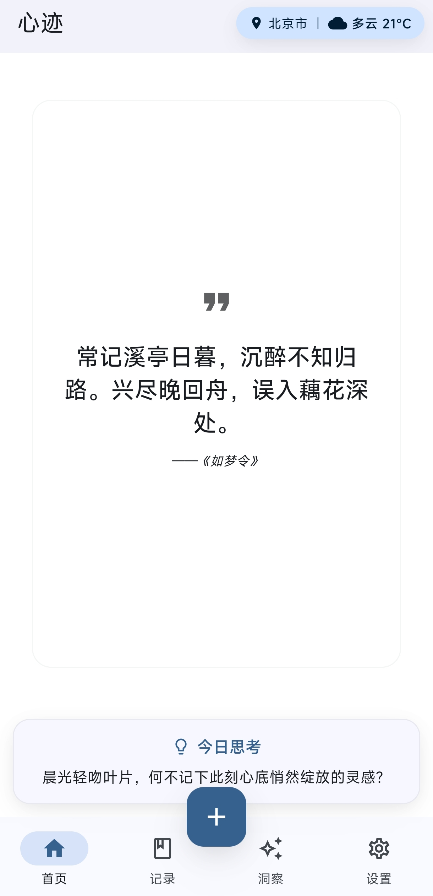
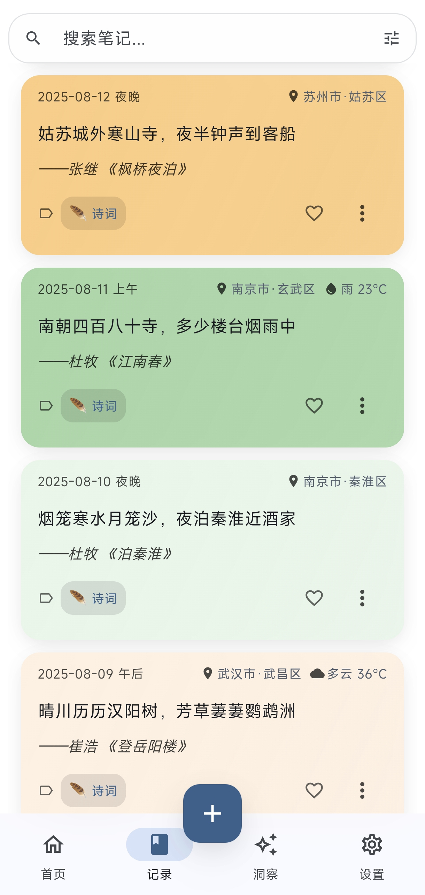
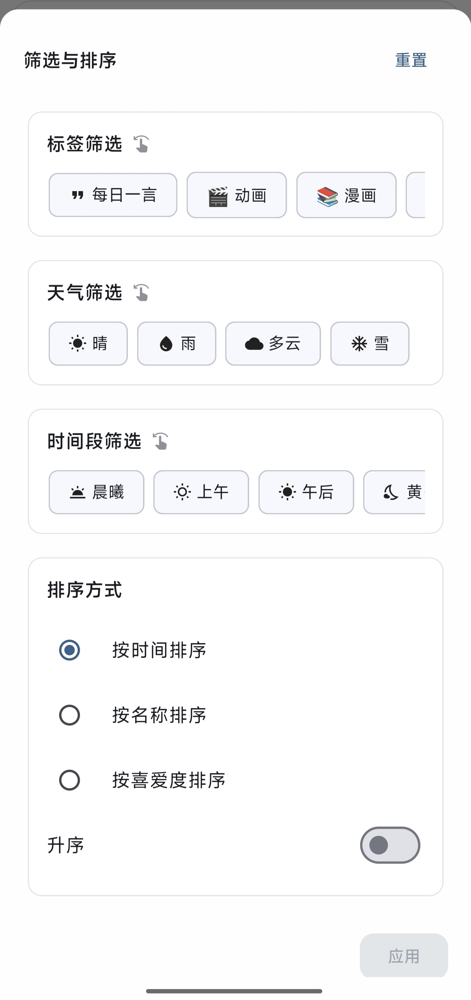
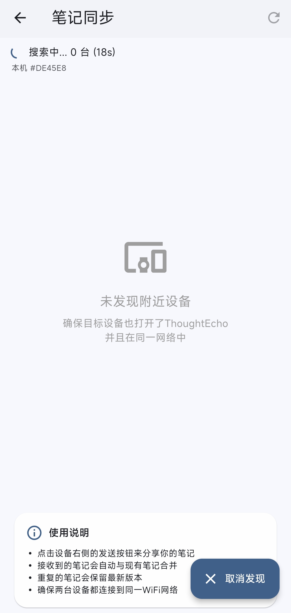
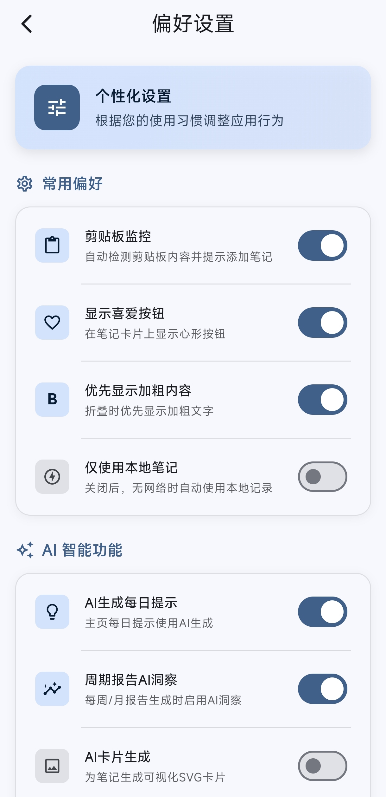
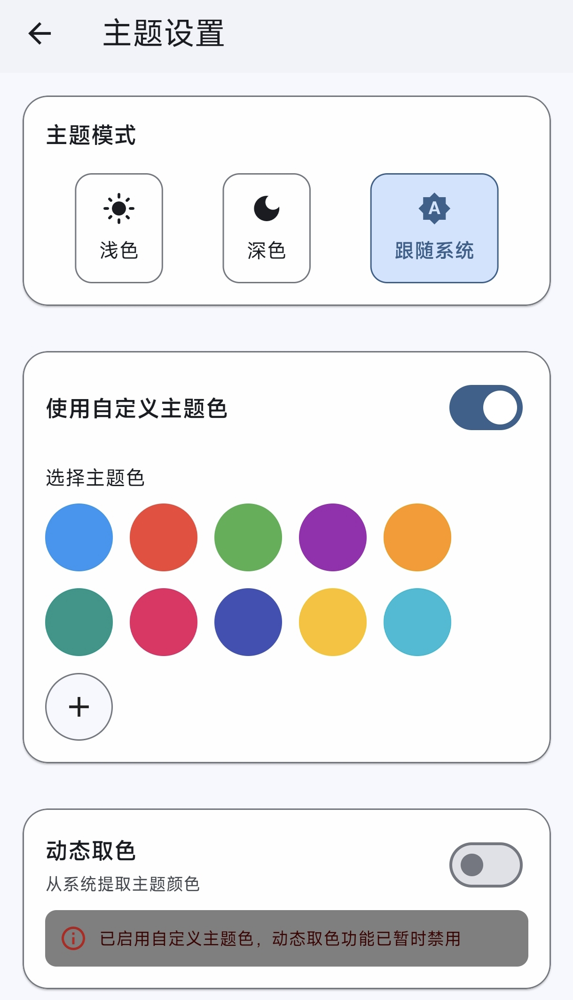

# 用户手册 / User Manual

[中文版](#-中文版本) | [English Version](#-english-version) | [网页版 / Web Version](https://shangjin-xiao.github.io/ThoughtEcho/user-guide.html)

---

<div id="-中文版本">

# 心迹 (ThoughtEcho) 用户手册

欢迎使用心迹，您的专属 AI 灵感笔记本。本手册将帮助您快速了解应用的全部功能。

## 目录

1. [快速入门](#1-快速入门)
2. [AI 服务配置](#2-ai-服务配置)
3. [富文本编辑器](#3-富文本编辑器)
4. [笔记管理](#4-笔记管理)
5. [AI 功能](#5-ai-功能)
6. [设备同步](#6-设备同步)
7. [备份与恢复](#7-备份与恢复)
8. [设置详解](#8-设置详解)
9. [开发者模式](#9-开发者模式)
10. [常见问题](#10-常见问题)

---

## 1. 快速入门

### 首次启动
- 应用会显示引导页面，介绍核心功能
- 可选择语言偏好和一言类型
- 如有旧版数据，支持自动迁移

### 主页界面
- **底部导航**：首页、笔记列表、洞察、设置
- **每日灵感**：显示一言和 AI 生成的写作提示
- **快速捕获按钮（+）**：
  - 短按：快速添加笔记
  - 长按：语音输入
- **剪贴板检测**：切回应用时自动检测剪贴板内容并提示保存



---

## 2. AI 服务配置

> ⚠️ **重要**：AI 功能需要配置 API Key 才能使用

**访问路径**：设置 → AI 助手设置

### 支持的服务商

| 服务商 | API 地址 | 默认模型 | 说明 |
|--------|----------|----------|------|
| **OpenAI** | `https://api.openai.com/v1/chat/completions` | gpt-4o | 官方 OpenAI 服务 |
| **OpenRouter** | `https://openrouter.ai/api/v1/chat/completions` | openai/gpt-4o | 多模型聚合平台 |
| **SiliconFlow** | `https://api.siliconflow.cn/v1/chat/completions` | (用户自选) | 国内 AI 服务 |
| **DeepSeek** | `https://api.deepseek.com/v1/chat/completions` | deepseek-chat | 国产大模型 |
| **Anthropic Claude** | `https://api.anthropic.com/v1/messages` | claude-3.7-sonnet-latest | Claude 系列模型 |
| **Ollama (本地)** | `http://localhost:11434/v1/chat/completions` | (用户自选) | 本地运行开源模型 |
| **LMStudio (本地)** | `http://localhost:1234/v1/chat/completions` | (用户自选) | 本地模型推理 |
| **自定义** | (用户配置) | (用户配置) | 兼容 OpenAI API 格式的任意服务 |

### 详细配置步骤

#### 云服务商配置（以 OpenAI 为例）
1. 打开「设置」→「AI 助手设置」
2. 点击「添加服务商」或选择预设服务商
3. 选择「OpenAI」预设
4. 在 API Key 输入框中填入您的密钥（以 `sk-` 开头）
5. 可选：修改模型名称（如 `gpt-4o`、`gpt-4-turbo`）
6. 可选：调整温度参数（0-2，越高越有创意）
7. 可选：调整最大 Token 数（默认 32000）
8. 点击「测试连接」验证配置
9. 保存设置

#### 本地 AI 配置（Ollama）

1. **安装 Ollama**
   - 访问 [ollama.ai](https://ollama.ai) 下载安装
   - 运行 `ollama pull llama3.1` 下载模型

2. **在心迹中配置**
   - 打开「AI 助手设置」
   - 选择「Ollama」预设
   - API 地址保持默认：`http://localhost:11434/v1/chat/completions`
   - 模型名称填写您下载的模型（如 `llama3.1`）
   - API Key 可留空
   - 测试连接并保存

#### 本地 AI 配置（LMStudio）

1. **安装 LMStudio**
   - 访问 [lmstudio.ai](https://lmstudio.ai) 下载安装
   - 下载您需要的模型
   - 启动本地服务器（左侧栏 Local Server）

2. **在心迹中配置**
   - 选择「LMStudio」预设
   - API 地址：`http://localhost:1234/v1/chat/completions`
   - 模型名称填写已加载的模型
   - API Key 可留空

### API Key 安全说明

> 🔐 **安全机制**：
> - API Key 使用 `flutter_secure_storage` 加密存储
> - 密钥不会以明文形式保存在配置文件中
> - 密钥不会包含在备份文件中
> - 支持 API Key 格式验证（OpenAI: `sk-*`，OpenRouter: `sk_*` 或 `or_*`）

### 多服务商支持

心迹支持同时配置多个 AI 服务商，具有自动故障转移功能：
- 当主服务商不可用时，自动切换到备用服务商
- 失败的服务商会有 5 分钟冷却期
- 可设置服务商优先级

---

## 3. 富文本编辑器


### 工具栏功能（11 组）

#### 历史操作
- **撤销**：撤销上一步操作
- **重做**：重做已撤销的操作

#### 文字样式
- **加粗**：`Ctrl/Cmd + B`
- **斜体**：`Ctrl/Cmd + I`
- **下划线**：`Ctrl/Cmd + U`
- **删除线**：添加删除线效果

#### 标题
- **标题样式**：支持 H1-H6 多级标题

#### 字体控制
- **字号选择**：调整文字大小
- **字体选择**：更换字体

#### 文字颜色
- **文字颜色**：设置文字前景色
- **背景高亮**：设置文字背景色

#### 文本对齐
- **左对齐/居中/右对齐/两端对齐**

#### 列表
- **有序列表**：数字编号列表
- **无序列表**：项目符号列表
- **增加缩进**
- **减少缩进**

#### 块元素
- **引用块**：添加引用样式
- **代码块**：添加代码格式

#### 链接
- **插入/编辑链接**

#### 媒体插入
- **插入图片**：支持从文件、相机、URL 导入
- **插入视频**：支持从文件、相机、URL 导入
- **插入音频**：支持从文件、录音、URL 导入

#### 工具
- **清除格式**：移除选中文字的所有格式
- **搜索**：在文档中搜索内容

### AI 辅助功能（✨ 按钮）

点击编辑器顶部的 ✨ 按钮，可使用以下 AI 功能：

| 功能 | 说明 |
|------|------|
| **智能分析来源** | 分析笔记内容，猜测作者、出处，并给出置信度和解释 |
| **润色文本** | AI 改进文字表达，流式显示润色结果，可一键应用 |
| **续写** | AI 根据上下文继续您的思路，流式生成内容 |
| **深度分析** | 对笔记进行综合分析，生成 Markdown 格式的洞察 |
| **问笔记** | 打开单独的对话页面，针对笔记内容提问交流 |

### 元数据编辑面板

点击编辑器顶部的 ✏️ 按钮或「编辑元数据」，可编辑：

#### 来源信息
- **作者**：笔记的作者
- **出处**：来源作品/书籍/网站
- 支持 AI 自动分析识别

#### 颜色标记
- 21 种预设颜色（浅色和深色系列）
- 支持自定义颜色选择器
- 可移除颜色标记

#### 标签选择
- 多选标签
- 可搜索的标签列表
- 可展开/折叠的标签区域
- 显示已选标签数量

#### 位置和天气
- **位置开关**：开启后自动获取当前位置
- **天气开关**：开启后自动获取当前天气
- 编辑模式下可修改位置
- 过去日期可手动选择天气
- 记录经纬度坐标

### 自动保存

- **草稿自动保存**：每 2 秒自动保存草稿到本地存储
- **草稿恢复**：重新打开编辑器时可恢复上次草稿
- **手动保存**：点击顶部工具栏的 💾 按钮
- **保存进度**：显示实时保存状态和进度条

---

## 4. 笔记管理



### 排序选项（3 种）

| 排序方式 | 说明 |
|----------|------|
| **时间排序** | 按创建/修改时间排序（默认降序） |
| **名称排序** | 按笔记标题字母顺序排序 |
| **喜爱度排序** | 按收藏次数排序 |

每种排序均支持升序/降序切换。

### 筛选选项（3 类）



#### 标签筛选
- 按自定义分类标签筛选
- 支持隐藏标签（需生物识别验证）
- 横向滚动的标签选择器
- 支持 emoji 和 Material 图标

#### 天气筛选
- 按天气类型筛选：晴天、阴天、雨天、雪天、雾天等
- 选择某一天气类别会包含该类别下所有天气
- 图标化显示

#### 时间段筛选
- 早晨、下午、傍晚、夜间
- 可多选
- 用于按创作时段查找笔记

所有筛选条件可组合使用，支持重置。

### 笔记操作

#### 主要操作
| 操作 | 方式 | 说明 |
|------|------|------|
| **编辑** | 菜单 → 编辑 | 打开富文本编辑器 |
| **问 AI** | 菜单 → 问 AI | 与 AI 对话讨论笔记 |
| **生成卡片** | 菜单 → 生成卡片 | AI 生成精美分享卡片 |
| **删除** | 菜单 → 删除 / 左滑 | 删除笔记 |
| **收藏** | 点击 ❤️ | 增加喜爱度（最高显示 99+） |

### AI 卡片生成（20 种模板）

点击「生成卡片」后，AI 会根据笔记内容生成 SVG 格式的精美卡片。

**卡片风格**：
- **Knowledge** - 极光渐变、玻璃拟态、高对比度
- **SOTA Modern** - 网格渐变、浮动卡片、动态阴影
- **Mindful** - 有机形状、大地色系、纸张纹理
- **Neon Cyber** - 深色网格、霓虹线条、等宽字体
- **Quote** - 居中文字、蓝色网格背景
- **Philosophical** - 极简主义与象征元素
- **Minimalist** - 简约排版
- **Nature** - 自然元素、自然色彩
- **Retro** - 复古设计美学
- **Ink** - 传统水墨风格
- **Cyberpunk** - 高科技美学
- **Geometric** - 几何图案设计
- **Academic** - 学术研究风格
- **Emotional** - 柔和渐变、温暖圆角
- **Dev** - 代码/技术笔记风格
- **Classic Serif** - 传统衬线字体
- **Modern Pop** - 现代流行色彩
- **Soft Gradient** - 柔和渐变
- **Polaroid** - 拍立得风格
- **Magazine** - 杂志排版风格

**卡片元数据**：自动包含作者、日期、位置、天气、温度、时段等信息。

---

## 5. AI 功能

### 每日灵感

**功能说明**：基于时间、天气、位置等上下文，AI 生成个性化的写作提示。

**生成逻辑**：
- **早晨/白天**：行动导向（目标、勇气、选择、专注）
- **傍晚/夜间**：反思导向（情感、意义、宽恕、感恩）
- **下午**：稳定与当下意识

**特点**：
- 流式生成，实时显示
- 支持多语言（中文 15-30 字，英文 8-18 词）
- 离线时使用本地确定性生成器作为后备
- 可结合历史笔记洞察进行个性化推荐

### 周期性报告

**访问路径**：洞察 → 周期报告

**报告类型**：
- **周报**：过去 7 天的笔记统计
- **月报**：过去 30 天的笔记统计
- **年报**：全年笔记统计

**报告内容**：
- 笔记总数、总字数、活跃天数
- 最常见的创作时段（早晨/下午/傍晚/夜间）
- 天气模式分析
- 高频标签统计
- AI 生成的诗意洞察（流式显示）
- 精选笔记卡片生成（6 张一组，自动翻页）

### AI 洞察分析


**访问路径**：洞察 → AI 洞察

#### 分析类型（4 种）

| 类型 | 说明 |
|------|------|
| **综合分析** | 整合主题、情感、价值观、行为模式，全方位概览 |
| **情感分析** | 识别表层和深层情感、触发因素、未满足需求，提供情绪调节策略 |
| **思维导图** | 提取 5-9 个核心思想节点，绘制 8-15 个连接关系（因果、对比、递归） |
| **成长分析** | 识别驱动力/价值观、形成中的能力/习惯，制定 30 天行动计划 |

#### 分析风格（4 种）

| 风格 | 说明 |
|------|------|
| **专业** | 清晰、客观、结构化语言，使用专业术语 |
| **友好** | 温暖、鼓励、导师式建议，支持性语调 |
| **幽默** | 机智、善用比喻、轻松观察 |
| **文学** | 诗意语言、文学引用、美学表达 |

**输出格式**：Markdown 结构，包含洞察、证据、可行建议、反思问题。

### 年度报告

**功能说明**：生成精美的 HTML 格式年度总结。

**报告内容**：
- 渐变色头部设计
- 年度统计卡片（笔记数、字数、活跃天数）
- AI 生成的年度洞察
- 数据回顾区域
- 鼓励性结语

**特点**：
- 响应式设计，适配移动端（最大宽度 414px）
- 现代 CSS 设计（flexbox、圆角、阴影、emoji 图标）
- 低温度参数（0.3）确保输出稳定

### 问笔记聊天


**功能说明**：针对特定笔记内容与 AI 进行对话。

**特点**：
- 上下文感知：AI 基于笔记内容回答
- 专业助手人设：只回答与笔记相关的问题
- 承认信息不足：不会编造内容
- 支持流式响应：实时显示回答

---

## 6. 设备同步



### LocalSend 协议

心迹使用 LocalSend 协议进行局域网 P2P 同步，无需云服务器。

**协议版本**：2.1（支持回退到 1.0）

**核心端点**：
- `/info` - 设备信息与能力发现
- `/register` - 设备注册握手
- `/prepare-upload` - 会话初始化
- `/upload` - 文件传输
- `/cancel` - 取消会话

**HTTP 服务端口**：53320

### 设备发现

#### UDP 组播发现（主要）
- **组播地址**：`224.0.0.170`
- **组播端口**：53317
- **发现超时**：30 秒
- **公告间隔**：5 秒
- **设备过期**：40 秒（未收到公告则移除）

#### mDNS/Bonjour（备用）
- **服务类型**：`_thoughtecho._tcp`
- 同时扫描：`_localsend._tcp`（兼容 LocalSend）
- 用于 UDP 组播失败时（特别是 iOS）

### 同步流程

1. **设备发现**：自动扫描局域网内的心迹设备
2. **连接建立**：选择目标设备并建立连接
3. **数据传输**：发送/接收笔记数据
4. **合并处理**：使用 LWW 策略合并数据

### 合并策略（Last-Write-Wins）

**决策逻辑**：
```
如果 远程时间戳 > 本地时间戳 → 使用远程数据
如果 本地时间戳 > 远程时间戳 → 使用本地数据
如果 时间戳相等：
  - 内容不同 → 保留本地，记录冲突
  - 内容相同 → 使用本地（幂等）
```

**合并报告统计**：
- 新增笔记数
- 更新笔记数
- 跳过笔记数（本地更新）
- 冲突笔记数
- 错误记录

### 支持平台

| 平台 | 支持情况 | 说明 |
|------|----------|------|
| **Android** | ✅ 完整支持 | UDP 组播、HTTP |
| **iOS** | ✅ 完整支持 | UDP 组播（需网络权限）、mDNS 备用 |
| **Windows** | ✅ 完整支持 | UDP 组播、HTTP |
| **macOS** | ✅ 完整支持 | UDP 组播、HTTP |
| **Linux** | ✅ 完整支持 | UDP 组播、HTTP |
| **Web** | ⚠️ 受限 | 无 UDP/本地网络访问 |

---

## 7. 备份与恢复


### 备份格式

#### ZIP 格式（推荐，版本 1.2.0）

```
backup_file.zip
├── backup_data.json  (结构化数据)
└── media/            (媒体文件)
    ├── images/
    ├── videos/
    └── audio/
```

**JSON 数据结构**：
```json
{
  "version": "1.2.0",
  "createdAt": "ISO8601 时间戳",
  "device_id": "设备指纹",
  "notes": {
    "categories": [...],
    "quotes": [...]
  },
  "settings": {...},
  "ai_analysis": [...]
}
```

#### 旧版 JSON 格式（兼容）

直接 JSON 备份，无 ZIP 压缩，导入时自动检测并转换。

### 备份特点

- **流式导出**：通过 IOSink 增量写入 JSON
- **分块读取**：防止内存溢出
- **批量处理**：每 50 条笔记分页
- **进度回调**：5% JSON、25% 媒体、35% 压缩
- **内存监控**：检测内存压力，必要时中止

### 恢复模式

| 模式 | 说明 | 适用场景 |
|------|------|----------|
| **覆盖** | 清除所有现有数据后导入 | 设备重置/完整恢复 |
| **合并** | 使用 LWW 策略合并数据 | 从其他设备同步 |
| **追加** | 简单追加数据（旧版行为） | 兼容性导入 |

### 备份操作

**访问路径**：设置 → 备份与恢复

1. **创建备份**
   - 点击「创建备份」
   - 选择保存位置
   - 等待备份完成（显示进度）
   - 备份文件保存为 `.zip` 格式

2. **恢复备份**
   - 点击「恢复备份」
   - 选择备份文件（`.zip` 或 `.json`）
   - 选择恢复模式（覆盖/合并）
   - 等待恢复完成

---

## 8. 设置详解



### 位置与天气

- **位置服务开关**：启用/禁用位置权限
- **位置状态显示**：
  - ✅ 位置已启用且服务运行中
  - ⚠️ 权限已授予但服务禁用
  - ❌ 未授予权限
- **城市搜索**：手动配置位置的交互式城市搜索
- **当前地址显示**：显示格式化位置或「未设置」

### 语言设置

| 代码 | 语言 | 显示名称 |
|------|------|----------|
| null | 跟随系统 | Follow System |
| zh | 中文 | 中文 |
| en | 英文 | English |
| ja | 日文 | 日本語 |
| ko | 韩文 | 한국어 |
| es | 西班牙文 | Español |
| fr | 法文 | Français |
| de | 德文 | Deutsch |

### 主题设置



#### 主题模式
- 🌞 **浅色模式**：手动浅色主题
- 🌙 **深色模式**：手动深色主题
- 🔄 **跟随系统**：自动跟随系统设置

#### 颜色自定义
- **动态颜色**：使用 Material You 自适应颜色，从设备壁纸提取
- **自定义主题色**：
  - 10 种预设颜色：蓝色、红色、绿色、紫色、橙色、青色、粉色、靛蓝、琥珀、青色
  - 自定义颜色选择器（色轮选择）
  - 完整色谱选择
  - 色调/变体选择

### 偏好设置

| 设置 | 类型 | 说明 |
|------|------|------|
| 剪贴板监控 | 开关 | 自动捕获剪贴板文本 |
| 显示收藏按钮 | 开关 | 在 UI 中显示收藏功能 |
| 显示精确时间 | 开关 | 显示精确时间戳 vs 相对时间 |
| 优先显示加粗内容 | 开关 | 折叠视图中优先显示加粗文本 |
| 仅使用本地笔记 | 开关 | 限制为本地笔记 vs 云同步 |
| 自动附加位置 | 开关 | 自动为笔记添加位置 |
| 自动附加天气 | 开关 | 自动为笔记添加天气信息 |
| 每日提示生成 (AI) | 开关 | 启用 AI 每日提示 |
| 周期报告 AI 洞察 | 开关 | 启用周期报告的 AI 分析 |
| AI 卡片生成 | 开关 | 启用 AI 卡片生成功能 |
| 生物识别认证 | 开关 | 需要指纹/面部解锁查看隐藏笔记 |

### 一言设置

**可用一言类型**：

| 代码 | 类型 |
|------|------|
| a | 动画 |
| b | 漫画 |
| c | 游戏 |
| d | 文学 |
| e | 原创 |
| f | 网络 |
| g | 哲学 |
| h | 笑话 |
| i | 谚语 |
| j | 创业 |
| k | 励志 |
| l | 名言 |

**功能**：
- 多选类型筛选
- 全选/清除按钮
- 确保至少选择一种类型
- 标题显示类型数量

### 智能推送设置

#### 推送模式

| 模式 | 说明 |
|------|------|
| **智能** | 根据时间/位置/天气自动选择内容 |
| **自定义** | 用户手动选择推送类型和筛选器 |
| **仅每日一言** | 只推送一言 |
| **仅过去笔记** | 随机历史笔记 |
| **两者** | 随机混合一言和历史笔记 |

#### 推送频率
- 每天
- 工作日（周一至周五）
- 周末（周六和周日）
- 自定义

#### 推送时间配置
- 每天多个时间段
- 时/分选择器
- 可选标签（如「早间灵感」）
- 每个时间段可启用/禁用

#### 过去笔记类型
- **去年今日**：去年同一日期
- **上月今日**：上月同一日期
- **上周今日**：上周同一日期
- **随机回忆**：完全随机的旧笔记
- **相同位置**：来自当前位置的历史笔记
- **相同天气**：匹配当前天气的历史笔记

#### 高级选项
- 标签筛选
- 天气类型筛选
- 最近推送历史（最多 30 条，防止重复）

### 分类与标签管理

**访问路径**：设置 → 分类管理 / 标签管理

- 创建新分类（最多 50 字符）
- 图标选择（emoji 或 Material 图标）
- 现有分类列表显示
- 分类 CRUD 操作（创建、读取、更新、删除）

---

## 9. 开发者模式

### 激活方法

1. 进入「设置」→「关于心迹」
2. 在 2 秒内**连续点击应用图标 3 次**
3. 看到「开发者模式已启用」提示
4. 再次三连击可关闭开发者模式

### 开发者功能

| 功能 | 可见性 | 位置 |
|------|--------|------|
| **本地 AI 功能** | 仅开发者 | 设置 → 偏好 → 本地 AI |
| **日志设置** | 仅开发者 | 设置 → 日志 |
| **调试信息对话框** | 仅 Debug 构建 | 设置 → 调试信息 |
| **新版标签 UI** | 仅开发者 | 分类 → 标签设置（预览） |

### 调试功能（仅 Debug 模式）

- **数据库状态检查**
  - 连接信息
  - 表结构
  - 记录数量
- **日志统计**
  - 各级别事件数量
  - 错误指标
- **详细信息对话框**

### 日志持久化

- 启用开发者模式时自动持久化日志
- 禁用开发者模式时暂停持久化
- 与统一日志服务集成

---

## 10. 常见问题

### AI 相关

**Q: AI 功能无法使用？**  
A: 
1. 检查 AI 设置中的 API Key 是否正确
2. 使用「测试连接」验证
3. 确保网络连接正常
4. 检查 API Key 余额是否充足

**Q: 本地 AI (Ollama/LMStudio) 无法连接？**  
A:
1. 确保本地 AI 服务已启动
2. 检查端口是否正确（Ollama: 11434, LMStudio: 1234）
3. 确保防火墙允许本地连接
4. 检查模型是否已下载并加载

**Q: AI 响应很慢？**  
A:
1. 本地 AI 受设备性能限制，可尝试更小的模型
2. 云服务可能因网络延迟较慢
3. 可在设置中降低 max_tokens 参数

### 同步相关

**Q: 同步失败？**  
A: 
1. 确保两台设备在同一局域网
2. 关闭防火墙/VPN 后重试
3. 检查设备是否正确显示在发现列表中
4. 尝试手动输入设备 IP 地址

**Q: 设备发现不到？**  
A:
1. 检查 Wi-Fi 是否连接到同一网络
2. 部分路由器可能阻止 UDP 组播，尝试 mDNS 发现
3. iOS 设备确保已授予本地网络权限

### 隐私安全

**Q: 如何保护隐私笔记？**  
A: 
1. 使用隐藏标签标记敏感笔记
2. 在偏好设置中开启生物识别保护
3. 查看隐藏笔记需要指纹/面部验证

**Q: 数据存储在哪里？**  
A:
1. 所有数据本地存储，不会自动上传云端
2. AI 功能会将笔记内容发送到 AI 服务商处理
3. API Key 加密存储，不会导出

### 其他

**Q: 如何完全删除应用数据？**  
A:
1. 在设置中使用「清除所有数据」
2. 或卸载应用后重新安装

**Q: 支持哪些设备？**  
A: Android、iOS、Windows、macOS、Linux、Web（部分功能受限）

</div>

---

<div id="-english-version">

# ThoughtEcho User Manual

Welcome to ThoughtEcho, your personal AI-powered inspiration notebook. This manual will help you understand all features of the app.

## Table of Contents

1. [Getting Started](#1-getting-started)
2. [AI Service Configuration](#2-ai-service-configuration)
3. [Rich Text Editor](#3-rich-text-editor)
4. [Note Management](#4-note-management)
5. [AI Features](#5-ai-features)
6. [Device Sync](#6-device-sync)
7. [Backup & Restore](#7-backup--restore)
8. [Settings Guide](#8-settings-guide)
9. [Developer Mode](#9-developer-mode)
10. [FAQ](#10-faq)

---

## 1. Getting Started

### First Launch
- App displays onboarding pages introducing core features
- Choose language preferences and Hitokoto types
- Supports automatic migration from older versions

### Home Interface
- **Bottom Navigation**: Home, Notes, Insights, Settings
- **Daily Inspiration**: Shows Hitokoto quote and AI writing prompts
- **Quick Capture Button (+)**:
  - Short press: Quick add note
  - Long press: Voice input
- **Clipboard Detection**: Auto-detects clipboard content when returning to app


---

## 2. AI Service Configuration

> ⚠️ **Important**: AI features require API Key configuration

**Access Path**: Settings → AI Assistant Settings

### Supported Providers

| Provider | API URL | Default Model | Notes |
|----------|---------|---------------|-------|
| **OpenAI** | `https://api.openai.com/v1/chat/completions` | gpt-3.5-turbo | Official OpenAI service |
| **OpenRouter** | `https://openrouter.ai/api/v1/chat/completions` | meta-llama/llama-3.1-8b-instruct:free | Multi-model aggregation |
| **SiliconFlow** | `https://api.siliconflow.cn/v1/chat/completions` | (custom) | Chinese AI service |
| **DeepSeek** | `https://api.deepseek.com/v1/chat/completions` | deepseek-chat | Chinese LLM |
| **Anthropic Claude** | `https://api.anthropic.com/v1/messages` | claude-3-haiku-20240307 | Claude models |
| **Ollama (Local)** | `http://localhost:11434/v1/chat/completions` | (custom) | Local open-source models |
| **LMStudio (Local)** | `http://localhost:1234/v1/chat/completions` | (custom) | Local model inference |
| **Custom** | (user configured) | (user configured) | Any OpenAI API compatible service |

### Configuration Steps

#### Cloud Provider Setup (OpenAI Example)
1. Open "Settings" → "AI Assistant Settings"
2. Click "Add Provider" or select a preset
3. Choose "OpenAI" preset
4. Enter your API Key (starts with `sk-`)
5. Optional: Modify model name (e.g., `gpt-4o`, `gpt-4-turbo`)
6. Optional: Adjust temperature (0-2, higher = more creative)
7. Optional: Adjust max tokens (default 32000)
8. Click "Test Connection" to verify
9. Save settings

#### Local AI Setup (Ollama)

1. **Install Ollama**
   - Visit [ollama.ai](https://ollama.ai) to download
   - Run `ollama pull llama3.1` to download a model

2. **Configure in ThoughtEcho**
   - Open "AI Assistant Settings"
   - Select "Ollama" preset
   - Keep default API URL: `http://localhost:11434/v1/chat/completions`
   - Enter model name (e.g., `llama3.1`)
   - API Key can be left empty
   - Test connection and save

#### Local AI Setup (LMStudio)

1. **Install LMStudio**
   - Visit [lmstudio.ai](https://lmstudio.ai) to download
   - Download your preferred model
   - Start local server (Local Server in sidebar)

2. **Configure in ThoughtEcho**
   - Select "LMStudio" preset
   - API URL: `http://localhost:1234/v1/chat/completions`
   - Enter loaded model name
   - API Key can be left empty

### API Key Security

> 🔐 **Security Features**:
> - API Keys encrypted using `flutter_secure_storage`
> - Keys never stored in plain text in config files
> - Keys not included in backup files
> - Supports format validation (OpenAI: `sk-*`, OpenRouter: `sk_*` or `or_*`)

### Multi-Provider Support

ThoughtEcho supports multiple AI providers with automatic failover:
- Automatically switches to backup provider when primary is unavailable
- Failed providers have 5-minute cooldown
- Provider priority can be configured

---

## 3. Rich Text Editor


### Toolbar Features (11 Groups)

#### History
- **Undo**: Undo last action
- **Redo**: Redo undone action

#### Text Styling
- **Bold**: `Ctrl/Cmd + B`
- **Italic**: `Ctrl/Cmd + I`
- **Underline**: `Ctrl/Cmd + U`
- **Strikethrough**: Add strikethrough effect

#### Headers
- **Header Style**: Support for H1-H6 headings

#### Font Controls
- **Font Size**: Adjust text size
- **Font Family**: Change font

#### Text Colors
- **Text Color**: Set foreground color
- **Background Highlight**: Set background color

#### Alignment
- **Left/Center/Right/Justify**

#### Lists
- **Ordered List**: Numbered list
- **Unordered List**: Bullet list
- **Increase Indent**
- **Decrease Indent**

#### Block Elements
- **Blockquote**: Add quote styling
- **Code Block**: Add code formatting

#### Links
- **Insert/Edit Link**

#### Media Insertion
- **Insert Image**: From file, camera, or URL
- **Insert Video**: From file, camera, or URL
- **Insert Audio**: From file, recording, or URL

#### Tools
- **Clear Formatting**: Remove all formatting from selection
- **Search**: Search within document

### AI Assistant Features (✨ Button)

Click the ✨ button at the top of the editor for:

| Feature | Description |
|---------|-------------|
| **Smart Analyze Source** | Analyzes note content, guesses author/source with confidence and explanation |
| **Polish Text** | AI improves writing, streams results, one-click apply |
| **Continue Writing** | AI continues your thoughts based on context |
| **Deep Analysis** | Comprehensive analysis with Markdown insights |
| **Ask Note** | Opens separate chat page for Q&A about note content |

### Metadata Editing Panel

Click ✏️ button or "Edit Metadata" to access:

#### Source Information
- **Author**: Note author
- **Source**: Origin work/book/website
- Supports AI auto-detection

#### Color Tags
- 21 preset colors (light and dark variants)
- Custom color picker
- Color removal option

#### Tag Selection
- Multi-select tags
- Searchable tag list
- Expandable/collapsible tag section
- Selected tag count display

#### Location & Weather
- **Location Toggle**: Auto-fetch current location when enabled
- **Weather Toggle**: Auto-fetch current weather when enabled
- Edit mode allows location modification
- Manual weather selection for past dates
- Coordinates tracking (latitude/longitude)

### Auto-Save

- **Draft Auto-Save**: Saves draft every 2 seconds
- **Draft Recovery**: Restore last draft when reopening editor
- **Manual Save**: Click 💾 button in toolbar
- **Save Progress**: Real-time status and progress bar

---

## 4. Note Management


### Sorting Options (3 Types)

| Sort Type | Description |
|-----------|-------------|
| **Time** | Sort by creation/modification date (default descending) |
| **Name** | Sort alphabetically by title |
| **Favorite** | Sort by favorite count |

Each supports ascending/descending toggle.

### Filter Options (3 Categories)


#### Tag Filtering
- Filter by custom category tags
- Hidden tags (requires biometric verification)
- Horizontal scrollable tag selector
- Emoji and Material icon support

#### Weather Filtering
- Filter by weather type: Sunny, Cloudy, Rainy, Snowy, Foggy, etc.
- Selecting a category includes all weather in that category
- Icon-based display

#### Time Period Filtering
- Morning, Afternoon, Evening, Night
- Multiple selections allowed
- Find notes by creation time period

All filters can be combined and reset.

### Note Operations

#### Main Operations
| Action | Method | Description |
|--------|--------|-------------|
| **Edit** | Menu → Edit | Open rich text editor |
| **Ask AI** | Menu → Ask AI | Chat with AI about note |
| **Generate Card** | Menu → Generate Card | AI creates beautiful share card |
| **Delete** | Menu → Delete / Swipe left | Delete note |
| **Favorite** | Tap ❤️ | Increase favorite count (max display 99+) |

### AI Card Generation (20 Templates)

Clicking "Generate Card" creates SVG format cards based on note content.

**Card Styles**:
- **Knowledge** - Aurora gradients, glassmorphism, high contrast
- **SOTA Modern** - Mesh gradients, floating card, dynamic shadows
- **Mindful** - Organic shapes, earth tones, paper texture
- **Neon Cyber** - Dark grid, neon lines, monospace font
- **Quote** - Centered text, blue grid background
- **Philosophical** - Minimalist with symbolic elements
- **Minimalist** - Simple typography focus
- **Nature** - Organic elements, natural colors
- **Retro** - Vintage design aesthetic
- **Ink** - Traditional brush/ink style
- **Cyberpunk** - High-tech aesthetic
- **Geometric** - Math/pattern-based design
- **Academic** - Research/study focused layout
- **Emotional** - Soft gradients, warmth, rounded shapes
- **Dev** - Code/technical note focus
- **Classic Serif** - Traditional typography
- **Modern Pop** - Contemporary vibrant colors
- **Soft Gradient** - Pastel, smooth transitions
- **Polaroid** - Instant photo aesthetic
- **Magazine** - Publication-style layout

**Card Metadata**: Automatically includes author, date, location, weather, temperature, time period.

---

## 5. AI Features

### Daily Inspiration

**Description**: AI generates personalized writing prompts based on time, weather, location context.

**Generation Logic**:
- **Morning/Daytime**: Action-oriented (goals, courage, choices, focus)
- **Evening/Night**: Reflection-oriented (emotions, meaning, forgiveness, gratitude)
- **Afternoon**: Stability and present-moment awareness

**Features**:
- Streaming generation, real-time display
- Multi-language support (Chinese 15-30 chars, English 8-18 words)
- Offline fallback using local deterministic generator
- Can integrate historical note insights for personalization

### Periodic Reports

**Access Path**: Insights → Periodic Reports

**Report Types**:
- **Weekly**: Past 7 days statistics
- **Monthly**: Past 30 days statistics
- **Yearly**: Full year statistics

**Report Content**:
- Total notes, word count, active days
- Most common creation time period
- Weather pattern analysis
- Top tag statistics
- AI-generated poetic insights (streaming)
- Featured note cards (6 per batch, auto-pagination)

### AI Insight Analysis


**Access Path**: Insights → AI Insights

#### Analysis Types (4 Types)

| Type | Description |
|------|-------------|
| **Comprehensive** | Integrates themes, emotions, values, behavior patterns for full overview |
| **Emotional** | Identifies surface/deep emotions, triggers, unmet needs, provides regulation strategies |
| **Mindmap** | Extracts 5-9 core thought nodes, maps 8-15 connections (causal, contrasting, recursive) |
| **Growth** | Identifies drivers/values, forming abilities/habits, creates 30-day action plan |

#### Analysis Styles (4 Styles)

| Style | Description |
|-------|-------------|
| **Professional** | Clear, objective, structured language with expert terminology |
| **Friendly** | Warm, encouraging, mentor-like advice with supportive tone |
| **Humorous** | Witty, uses analogies, light-hearted observations |
| **Literary** | Poetic language, literary references, aesthetic expression |

**Output Format**: Markdown structured with insights, evidence, actionable advice, reflection questions.

### Annual Report

**Description**: Generates beautiful HTML format annual summary.

**Report Content**:
- Gradient header design
- Annual statistics cards (notes, words, active days)
- AI-generated annual insights
- Data recap section
- Encouraging closing message

**Features**:
- Responsive design, mobile-friendly (max-width 414px)
- Modern CSS design (flexbox, rounded corners, shadows, emoji icons)
- Low temperature (0.3) ensures stable output

### Note Q&A Chat


**Description**: Chat with AI about specific note content.

**Features**:
- Context-aware: AI answers based on note content
- Professional assistant persona: Only answers note-related questions
- Acknowledges insufficient information: Won't fabricate content
- Streaming response support: Real-time answer display

---

## 6. Device Sync


### LocalSend Protocol

ThoughtEcho uses LocalSend protocol for LAN P2P sync, no cloud server required.

**Protocol Version**: 2.1 (with fallback to 1.0)

**Core Endpoints**:
- `/info` - Device info and capability discovery
- `/register` - Device registration handshake
- `/prepare-upload` - Session initialization
- `/upload` - File transfer
- `/cancel` - Cancel session

**HTTP Server Port**: 53320

### Device Discovery

#### UDP Multicast (Primary)
- **Multicast Address**: `224.0.0.170`
- **Multicast Port**: 53317
- **Discovery Timeout**: 30 seconds
- **Announcement Interval**: 5 seconds
- **Device Expiry**: 40 seconds (removed if no announcement)

#### mDNS/Bonjour (Fallback)
- **Service Type**: `_thoughtecho._tcp`
- Also scans: `_localsend._tcp` (LocalSend compatible)
- Used when UDP multicast fails (especially iOS)

### Sync Process

1. **Device Discovery**: Auto-scan for ThoughtEcho devices on LAN
2. **Connection Establishment**: Select target device and connect
3. **Data Transfer**: Send/receive note data
4. **Merge Processing**: Use LWW strategy to merge data

### Merge Strategy (Last-Write-Wins)

**Decision Logic**:
```
If remote timestamp > local timestamp → Use remote data
If local timestamp > remote timestamp → Use local data
If timestamps equal:
  - Content differs → Keep local, log conflict
  - Content same → Use local (idempotent)
```

**Merge Report Statistics**:
- Inserted notes count
- Updated notes count
- Skipped notes count (local was newer)
- Conflict notes count
- Error records

### Supported Platforms

| Platform | Support | Notes |
|----------|---------|-------|
| **Android** | ✅ Full | UDP multicast, HTTP |
| **iOS** | ✅ Full | UDP multicast (requires network permission), mDNS fallback |
| **Windows** | ✅ Full | UDP multicast, HTTP |
| **macOS** | ✅ Full | UDP multicast, HTTP |
| **Linux** | ✅ Full | UDP multicast, HTTP |
| **Web** | ⚠️ Limited | No UDP/local network access |

---

## 7. Backup & Restore


### Backup Formats

#### ZIP Format (Recommended, Version 1.2.0)

```
backup_file.zip
├── backup_data.json  (structured data)
└── media/            (media files)
    ├── images/
    ├── videos/
    └── audio/
```

**JSON Data Structure**:
```json
{
  "version": "1.2.0",
  "createdAt": "ISO8601 timestamp",
  "device_id": "device fingerprint",
  "notes": {
    "categories": [...],
    "quotes": [...]
  },
  "settings": {...},
  "ai_analysis": [...]
}
```

#### Legacy JSON Format (Compatible)

Direct JSON backup without ZIP compression, auto-detected and converted on import.

### Backup Features

- **Streaming Export**: Incremental JSON writing via IOSink
- **Chunked Reading**: Prevents memory overflow
- **Batch Processing**: 50 notes per page
- **Progress Callbacks**: 5% JSON, 25% media, 35% compression
- **Memory Monitoring**: Detects pressure, aborts if necessary

### Restore Modes

| Mode | Description | Use Case |
|------|-------------|----------|
| **Overwrite** | Clears all existing data before import | Device reset/full restore |
| **Merge** | Uses LWW strategy to merge data | Sync from other device |
| **Append** | Simple data append (legacy behavior) | Compatibility import |

### Backup Operations

**Access Path**: Settings → Backup & Restore

1. **Create Backup**
   - Click "Create Backup"
   - Select save location
   - Wait for completion (shows progress)
   - Backup saved as `.zip` file

2. **Restore Backup**
   - Click "Restore Backup"
   - Select backup file (`.zip` or `.json`)
   - Choose restore mode (Overwrite/Merge)
   - Wait for completion

---

## 8. Settings Guide


### Location & Weather

- **Location Service Toggle**: Enable/disable location permission
- **Location Status Display**:
  - ✅ Location enabled and service running
  - ⚠️ Permission granted but service disabled
  - ❌ No permission granted
- **City Search**: Interactive city search for manual location configuration
- **Current Address Display**: Shows formatted location or "Not Set"

### Language Settings

| Code | Language | Display Name |
|------|----------|--------------|
| null | System Default | Follow System |
| zh | Chinese | 中文 |
| en | English | English |
| ja | Japanese | 日本語 |
| ko | Korean | 한국어 |
| es | Spanish | Español |
| fr | French | Français |
| de | German | Deutsch |

### Theme Settings


#### Theme Modes
- 🌞 **Light Mode**: Manual light theme
- 🌙 **Dark Mode**: Manual dark theme
- 🔄 **Follow System**: Auto-sync with system setting

#### Color Customization
- **Dynamic Color**: Uses Material You adaptive colors from device wallpaper
- **Custom Theme Color**:
  - 10 preset colors: Blue, Red, Green, Purple, Orange, Teal, Pink, Indigo, Amber, Cyan
  - Custom color picker (wheel selection)
  - Full color spectrum selection
  - Shade/variation selection

### Preferences

| Setting | Type | Description |
|---------|------|-------------|
| Clipboard Monitoring | Toggle | Auto-capture clipboard text |
| Show Favorite Button | Toggle | Display favorites in UI |
| Show Exact Time | Toggle | Precise timestamps vs relative time |
| Prioritize Bold Content | Toggle | Show bold text first in collapsed view |
| Use Local Notes Only | Toggle | Restrict to local quotes vs cloud sync |
| Auto-Attach Location | Toggle | Automatically add location to notes |
| Auto-Attach Weather | Toggle | Automatically add weather info to notes |
| Daily Prompt Generation (AI) | Toggle | Enable AI daily prompts |
| Periodic Report AI Insights | Toggle | Enable AI analysis for periodic reports |
| AI Card Generation | Toggle | Enable AI card generation feature |
| Biometric Authentication | Toggle | Require fingerprint/face unlock for hidden notes |

### Hitokoto Settings

**Available Hitokoto Types**:

| Code | Type |
|------|------|
| a | Anime |
| b | Comics |
| c | Games |
| d | Literature |
| e | Original |
| f | Network |
| g | Philosophy |
| h | Jokes |
| i | Proverbs |
| j | Startup |
| k | Encouragement |
| l | Famous Quotes |

**Features**:
- Multi-select type filtering
- Select All / Clear All buttons
- Ensures at least one type selected
- Header shows type count

### Smart Push Settings

#### Push Modes

| Mode | Description |
|------|-------------|
| **Smart** | Auto-select content based on time/location/weather |
| **Custom** | User manually selects push types and filters |
| **Daily Quote Only** | Just Hitokoto pushes |
| **Past Notes Only** | Random historical notes |
| **Both** | Random mix of daily quotes and past notes |

#### Push Frequency
- Daily
- Weekdays (Mon-Fri)
- Weekends (Sat-Sun)
- Custom

#### Push Time Configuration
- Multiple time slots per day
- Hour/minute selectors
- Optional labels (e.g., "Morning Inspiration")
- Enable/disable per slot

#### Past Note Types
- **Year Ago Today**: Same date from previous year
- **Month Ago Today**: Same date from previous month
- **Week Ago Today**: Same date last week
- **Random Memory**: Completely random old note
- **Same Location**: Historical notes from current location
- **Same Weather**: Historical notes matching current weather

#### Advanced Options
- Tag filtering
- Weather type filtering
- Recent push history (max 30 notes, prevents duplicates)

### Category & Tag Management

**Access Path**: Settings → Category Management / Tag Management

- Create new categories (max 50 characters)
- Icon selection (emoji or Material icons)
- List display of existing categories
- Category CRUD operations (Create, Read, Update, Delete)

---

## 9. Developer Mode

### Activation Method

1. Go to "Settings" → "About ThoughtEcho"
2. **Triple-tap the app icon within 2 seconds**
3. See "Developer mode enabled" message
4. Triple-tap again to disable

### Developer Features

| Feature | Visibility | Location |
|---------|------------|----------|
| **Local AI Features** | Dev Only | Settings → Preferences → Local AI |
| **Logs Settings** | Dev Only | Settings → Logs |
| **Debug Info Dialog** | Debug Build Only | Settings → Debug Info |
| **New Tag UI** | Dev Only | Category → Tag Settings (Preview) |

### Debug Features (Debug Mode Only)

- **Database Status Check**
  - Connection info
  - Table schemas
  - Record counts
- **Log Statistics**
  - Event counts by level
  - Error metrics
- **Detailed Info Dialog**

### Log Persistence

- Logs automatically persist when dev mode enabled
- Logs pause persistence when dev mode disabled
- Integrated with unified log service

---

## 10. FAQ

### AI Related

**Q: AI features not working?**  
A: 
1. Check AI settings for correct API Key
2. Use "Test Connection" to verify
3. Ensure network connection is stable
4. Check if API Key has sufficient balance

**Q: Can't connect to local AI (Ollama/LMStudio)?**  
A:
1. Ensure local AI service is running
2. Check port is correct (Ollama: 11434, LMStudio: 1234)
3. Ensure firewall allows local connections
4. Check if model is downloaded and loaded

**Q: AI responses are slow?**  
A:
1. Local AI is limited by device performance, try smaller models
2. Cloud services may be slow due to network latency
3. Try reducing max_tokens parameter in settings

### Sync Related

**Q: Sync failing?**  
A: 
1. Ensure both devices are on same LAN
2. Try disabling firewall/VPN
3. Check if device appears in discovery list
4. Try manually entering device IP address

**Q: Device not discovered?**  
A:
1. Check if Wi-Fi is connected to same network
2. Some routers may block UDP multicast, try mDNS discovery
3. iOS devices: ensure local network permission is granted

### Privacy & Security

**Q: How to protect private notes?**  
A: 
1. Use hidden tags to mark sensitive notes
2. Enable biometric protection in preferences
3. Viewing hidden notes requires fingerprint/face verification

**Q: Where is data stored?**  
A:
1. All data stored locally, not auto-uploaded to cloud
2. AI features send note content to AI provider for processing
3. API Keys are encrypted, not exported

### Other

**Q: How to completely delete app data?**  
A:
1. Use "Clear All Data" in settings
2. Or uninstall and reinstall the app

**Q: What devices are supported?**  
A: Android, iOS, Windows, macOS, Linux, Web (limited features)

</div>
