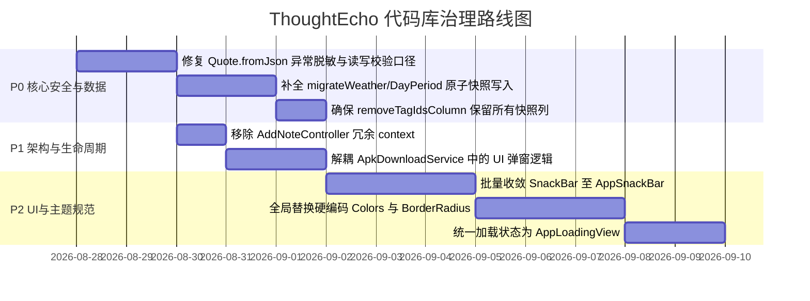

# ThoughtEcho 全代码库深度审计与问题分析报告 (2026-08-28)

> ⚠️ **核验批注（2026-08-28 发版前）**：本报告的代码快照早于当日提交 `b0b32ca`(#538)，其中 **2.2 已被该提交修复**、**2.4 严重度显著高估**。逐条核验结论与处置排期见
> [`codebase-roadmap-and-issues-2026-08-28.md` §6.0.1](codebase-roadmap-and-issues-2026-08-28.md#601-对-codebase-comprehensive-audit-2026-08-28md-的交叉核验)。
> 引用本报告任一条目前，请先与 HEAD 比对。

## 1. 总体评估概览 (Executive Summary)

**ThoughtEcho（心迹）** 作为一个基于 Flutter 3.x 开发的跨平台笔记与情绪追踪应用，在整体架构设计上具备了非常优秀的工程水准：
- **模块化拆分良好**：`DatabaseService` 按职责拆分为 12 个 Mixin、`HomePage` 拆分为多部件编排、`Thoughter` 长期记忆采用物理隔离独立的 `agent_memory.db`；
- **主题风格系统健壮**：已实现基于 `ThemeExtension` 的令牌化驱动（Material、纸墨、素笺），避免了硬编码风格分支；
- **AI 链路设计严谨**：测试连接已与主聊天链路统一，网络超时已下沉至 Client 内部，API 密钥完全基于 `SecureStorageService` 存储。

然而，在对整个代码库进行全面细致的静态检查与源码审查后，仍然发现了若干处涉及**数据安全性、隐私脱敏、迁移完整性、架构职责划分以及 UI 规范遵循**方面的历史遗留问题和潜在隐患。以下为详细的问题分类与整改建议。

---

## 2. P0: 核心安全、隐私与数据完整性 (Security & Data Integrity)

### 2.1 `Quote.fromJson` 异常信息直接泄露用户笔记明文 ✅ 已修复（2026-08-28）
- **定位**：[`lib/models/quote_model.dart:L312`](../lib/models/quote_model.dart#L312)
- **现象**：
  ```dart
  } catch (e) {
    throw FormatException('解析Quote JSON失败: $e, JSON: $json');
  }
  ```
- **问题分析**：
  当 JSON 反序列化解析失败抛出 `FormatException` 时，错误信息中完整拼入了 `$json`。`$json` 包含笔记的完整 `content` 与 `delta_content`（用户正文和富文本数据）。如果上层调用者（或捕获该异常的代码）直接将 `e.toString()` 打印或上报到本地数据库日志/Sentry，会将用户的笔记隐私正文写入日志文件中。
- **整改建议**：
  在 `Quote.fromJson` 的异常抛出中移除 `$json` 明文拼接，仅保留错误字段名或异常类型（例如 `throw FormatException('解析Quote JSON失败: $e, rowId: ${json['id']}')`）。

---

### 2.2 数据库迁移原值覆盖缺乏快照留底 (天气与时间段迁移) ⚠️ 已过时：`b0b32ca`(#538) 已按本条建议修复
- **定位**：[`lib/services/database/schema_repair_adapter.dart:L375-L380`](../lib/services/database/schema_repair_adapter.dart#L375-L380)、[`lib/services/database/schema_repair_adapter.dart:L446-L453`](../lib/services/database/schema_repair_adapter.dart#L446-L453)
- **现象**：
  在 `migrateDayPeriodToKey` 和 `migrateWeatherToKey` 中：
  ```dart
  batch.update(
    'quotes',
    {'day_period': entry.value},
    where: 'day_period = ?',
    whereArgs: [entry.key],
  );
  ```
- **问题分析**：
  与标准的 `repairOutOfDomainSentiment` 不同（后者在单条 SQL 中显式执行 `SET sentiment_backup = sentiment, sentiment = ?`），`migrateWeatherToKey` 和 `migrateDayPeriodToKey` 仅在建列时通过 `_ensureBackupColumn` 复制了一次整列。由于 `_checkAndMigrateWeatherData` / `_checkAndMigrateDayPeriodData` 在每次应用启动时都会检测，如果后续用户通过 WebDAV 同步或导入操作带入旧版格式数据，再次触发迁移时因 `weather_backup` 列已存在，`_ensureBackupColumn` 会直接跳过，导致后续这批数据的原值直接被覆盖且无任何留底。
- **整改建议**：
  将 UPDATE 改为原子写入原值快照：
  ```dart
  batch.rawUpdate(
    'UPDATE quotes SET weather_backup = weather, weather = ? WHERE weather = ?',
    [entry.key, entry.value],
  );
  ```

---

### 2.3 遗留列清理重建表会静默抹除快照列
- **定位**：[`lib/services/database/schema_repair_adapter.dart:L588-L622`](../lib/services/database/schema_repair_adapter.dart#L588-L622)
- **现象**：
  `SchemaLegacyTagAdapter._removeTagIdsColumn` 在重建 `quotes` 表以移除遗留 `tag_ids` 字段时，采用硬编码的列清单将数据拷贝至 `quotes_new`，其中**未包含**任何 `*_backup` 列（如 `weather_backup`, `day_period_backup`, `sentiment_backup`）。
- **问题分析**：
  如果一个存在历史备份列的数据库在某种情况下再次触发 `cleanupLegacyTagIdsColumn`，所有先前保留的快照备份列都将在建新表时被丢弃。
- **整改建议**：
  在 `_removeTagIdsColumn` 的列清单动态检测并补充所有 `*_backup` 列，或确保 `quotesTableSql` 动态包含已存在的备份列定义。

---

### 2.4 读与写两侧的数据校验规则存在口径差异 (Validation Discrepancy) ⚠️ 严重度高估，降级 P2
- **定位**：[`lib/models/quote_model.dart:L161-L176`](../lib/models/quote_model.dart#L161-L176) vs [`lib/models/quote_model.dart:L253-L275`](../lib/models/quote_model.dart#L253-L275)
- **现象**：
  - `Quote.validated` 强制要求 `content.length <= 10000`，且强制要求 `sentiment` 必须命中白名单 `sentimentKeyToLabel.containsKey(sentiment)`；
  - `Quote.fromJson` 只检查 `content.isNotEmpty`，并不校验 10000 字上限，也未对 `sentiment` 做白名单拦截。
- **问题分析**：
  这会导致从数据库或导入文件加载进来的长笔记（或带旧情绪标签的笔记）能够正常展示，但一旦用户在编辑页进行微调并保存时，会在 `Quote.validated` 处被判定为非法并抛出 `ArgumentError`，造成“能读却无法保存”的严重阻塞。
- **整改建议**：
  将长度上限作为 UI 输入层的提示策略，而非底层持久化实体的硬阻断校验；或将清洗/收敛统一置于导入边界。
- **核验修正（2026-08-28）**：所述「能读却无法保存」的阻塞场景**不成立**。`Quote.validated` 全库仅有 `lib/pages/thoughter/thoughter_ui.dart:1663` 一处调用（Thoughter AI 提案建新笔记），常规编辑保存路径并不经过它。实际影响面仅限「AI 提案生成超 10000 字笔记」，且在该场景下拦截本身是合理行为。故降级为 P2 观察项。

---

## 3. P1: 架构设计与状态管理问题 (Architecture & State Management)

### 3.1 `AddNoteController` 冗余持有 `BuildContext`
- **定位**：[`lib/controllers/add_note_controller.dart:L14`](../lib/controllers/add_note_controller.dart#L14)
- **现象**：
  ```dart
  class AddNoteController extends ChangeNotifier {
    final BuildContext context;
    ...
  ```
- **问题分析**：
  `AddNoteController` 继承了 `ChangeNotifier`，并在构造函数中强行要求传入 `BuildContext context` 并作为成员变量保存，但整个类内部**没有任何一处业务逻辑使用了该 context**。控制器持有 UI 上下文违反了 Service/Controller 规范，并增加了废弃 widget 树无法及时 GC 的内存泄漏风险。
- **整改建议**：
  从 `AddNoteController` 的属性和构造函数中彻底移除 `context` 参数。

---

### 3.2 `ApkDownloadService` 混合了 Service 职责与 UI Dialog 渲染
- **定位**：[`lib/services/apk_download_service.dart:L489-L555`](../lib/services/apk_download_service.dart#L489-L555)
- **现象**：
  `ApkDownloadService` 内部定义了静态方法 `_showInstallPermissionDialog(BuildContext context)`、`_showErrorDialog(BuildContext context)` 以及一个内置的 `Widget build(BuildContext context)`。
- **问题分析**：
  数据与网络层 Service 不应直接持有 `BuildContext` 或负责弹窗渲染。这不仅使得 Service 无法在无 Headless 或纯后台环境中独立测试，也使得弹窗主题和样式容易与全局设计脱节。
- **整改建议**：
  将弹窗交互和权限引导抽取到 `lib/widgets/update_dialog.dart` 或专门的 Dialog Helper 中，Service 仅返回状态枚举或流式进度。

---

### 3.3 回收站清理媒体提取中的异常日志裸传 `error: e` ✅ 随 2.1 闭环
- **定位**：[`lib/services/database/database_trash_mixin.dart:L438-L450`](../lib/services/database/database_trash_mixin.dart#L438-L450)
- **现象**：
  ```dart
  try {
    final quote = Quote.fromJson(row);
    return await MediaReferenceService.extractMediaPathsFromQuote(quote);
  } catch (e, stack) {
    UnifiedLogService.instance.error(
      '提取已删除笔记媒体路径失败',
      error: e,
      stackTrace: stack,
    );
    return <String>[];
  }
  ```
- **问题分析**：
  当 `row` 出现损坏触发 `Quote.fromJson` 抛错时，由于 `Quote.fromJson` 包含 `$json`，此处将 `error: e` 原样传给 `UnifiedLogService.instance.error` 会把未脱敏的笔记正文写入日志系统。
- **整改建议**：
  改用安全行解析器 `_tryParseQuoteRow`，并在此处仅记录异常类型名称 `error: e.runtimeType.toString()`。

---

## 4. P2: UI 与主题规范偏离 (UI & Theme Constraints Violations)

### 4.1 历史页面中存在硬编码 Material 颜色
- **定位**：
  - [`lib/pages/emergency_pages.dart:L13, L27, L58, L214, L416`](../lib/pages/emergency_pages.dart#L13)
  - [`lib/pages/ai_annual_report_webview.dart:L505, L781, L803`](../lib/pages/ai_annual_report_webview.dart#L505)
  - [`lib/pages/backup_restore_page.dart:L777`](../lib/pages/backup_restore_page.dart#L777)
  - [`lib/pages/theme_settings_page.dart:L663-L664`](../lib/pages/theme_settings_page.dart#L663-L664)
- **现象**：
  使用了 `Colors.red`、`Colors.orange`、`Colors.indigo`、`Colors.purple`、`Colors.grey[100]`、`Colors.white`、`Colors.black`。
- **问题分析**：
  违反项目硬性约束：硬编码颜色无法随 M3 动态取色或「纸与墨」/「素笺」主题风格联动，在暗色模式下可能产生刺眼白块或严重对比度不足。
- **整改建议**：
  - 语义色改用 `AppSemanticColors.of(context)` 的 `danger` / `warning` / `info` / `success`；
  - 表面和容器颜色改用 `Theme.of(context).colorScheme.surfaceContainerHighest` / `errorContainer` / `primary` 等。

---

### 4.2 硬编码 `BorderRadius.circular(N)` 破坏主题风格
- **定位**：
  - [`lib/pages/theme_settings_page.dart:L331, L365`](../lib/pages/theme_settings_page.dart#L331) (`BorderRadius.circular(8)`)
  - [`lib/pages/emergency_pages.dart:L215, L417`](../lib/pages/emergency_pages.dart#L215) (`BorderRadius.circular(8)`)
  - [`lib/pages/note_sync_page.dart:L1079, L1114, L1178`](../lib/pages/note_sync_page.dart#L1079) (`BorderRadius.circular(8/12)`)
  - [`lib/pages/ai_annual_report_webview.dart:L149, L169, L207, L240`](../lib/pages/ai_annual_report_webview.dart#L149) (`BorderRadius.circular(12/16/20)`)
- **问题分析**：
  本项目的主题风格（Material 18、纸墨 6、素笺 3）是通过 `AppShapeTokens.of(context)` 动态控制圆角。手写固定的 `BorderRadius.circular(N)` 会导致切换到手工主题（纸墨/素笺）时，这些卡片和容器依然呈现不匹配的圆角大小。
- **整改建议**：
  统一替换为 `AppShapeTokens.of(context).cardRadius` 或 `inputRadius` / `buttonRadius`。

---

### 4.3 绕过 `AppSnackBar` 裸调用 `ScaffoldMessenger`
- **定位**：
  - [`lib/pages/feedback_contact_page.dart:L201`](../lib/pages/feedback_contact_page.dart#L201)
  - [`lib/pages/hitokoto_settings_page.dart:L218`](../lib/pages/hitokoto_settings_page.dart#L218)
  - [`lib/pages/custom_feedback_page.dart:L52`](../lib/pages/custom_feedback_page.dart#L52)
  - [`lib/pages/logs_page.dart:L129`](../lib/pages/logs_page.dart#L129)
  - [`lib/pages/ai_annual_report_webview.dart:L501`](../lib/pages/ai_annual_report_webview.dart#L501) (达 14 处)
  - [`lib/pages/note_sync_page.dart:L172`](../lib/pages/note_sync_page.dart#L172)
- **问题分析**：
  裸调用 `ScaffoldMessenger.of(context).showSnackBar` 缺乏统一的生命周期判断（`context.mounted`）、统一的动画时长控制以及语义色配置，且大量重复编写了 SnackBar 结构代码。
- **整改建议**：
  统一迁移至 `AppSnackBar.info(context, ...)` / `AppSnackBar.success(...)` / `AppSnackBar.error(...)`。

---

### 4.4 页面级加载状态裸用 `Center(child: CircularProgressIndicator())`
- **定位**：
  - [`lib/pages/trash_page.dart:L538`](../lib/pages/trash_page.dart#L538)
  - [`lib/pages/license_page.dart:L111, L560, L678`](../lib/pages/license_page.dart#L111)
  - [`lib/pages/user_guide_page.dart:L365`](../lib/pages/user_guide_page.dart#L365)
  - [`lib/pages/smart_push_settings_page.dart:L232`](../lib/pages/smart_push_settings_page.dart#L232)
  - [`lib/pages/explore/explore_overview.dart:L8`](../lib/pages/explore/explore_overview.dart#L8)
  - [`lib/pages/storage_management_page.dart:L452`](../lib/pages/storage_management_page.dart#L452)
  - [`lib/pages/tag_settings_page.dart:L227`](../lib/pages/tag_settings_page.dart#L227)
- **问题分析**：
  全屏与区块加载直接返回裸的 `CircularProgressIndicator`，未利用已统一封装的 `AppLoadingView`，导致各页面加载时的空状态视觉和过渡动画不统一。
- **整改建议**：
  统一替换为 `AppLoadingView(message: l10n.loading)`。

---

## 5. P3: 国际化与代码组织规范 (i18n & Code Style)

### 5.1 `main.dart` 存在相对路径与绝对 Package 导入混用
- **定位**：[`lib/main.dart:L49-L61`](../lib/main.dart#L49-L61)
- **现象**：
  上方大量使用 `import 'package:thoughtecho/services/...'`，下方突然混入 `import 'utils/app_logger.dart';`、`import 'theme/app_theme.dart';`。
- **整改建议**：
  统一遵循 `AGENTS.md` 规范：`dart:` → `package:flutter/` → 第三方 package → `package:thoughtecho/...`，组内按字母序排列，杜绝相对导入与 package 导入混杂。

---

## 6. 治理路线图与修复优先级 (Remediation Roadmap)



### 推荐实施步骤：
1. **第一阶段（安全与稳定性）**：优先修复 `Quote.fromJson` 中的日志隐私泄露问题以及 `schema_repair_adapter.dart` 中的备份列写入逻辑，确保无论何时何种旧数据导入都不会破坏用户历史数据。
2. **第二阶段（架构与内存）**：清理 `AddNoteController` 中的无效 `BuildContext` 引用，重构 `ApkDownloadService` 的 UI 依赖。
3. **第三阶段（UI 规范治理）**：批量清理历史页面的硬编码颜色、圆角与 SnackBar 调用，全面收拢至 `AppSemanticColors`、`AppShapeTokens` 与 `AppSnackBar`。
